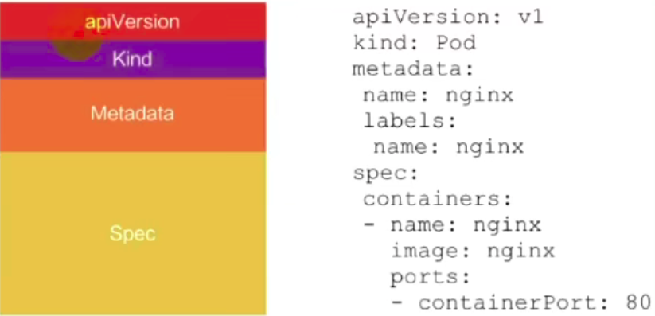
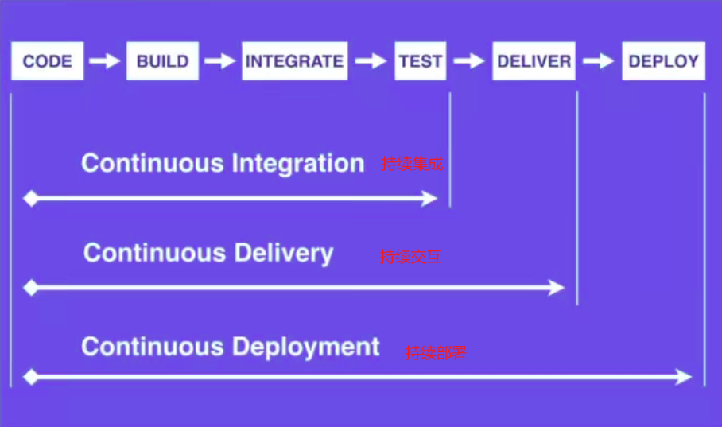
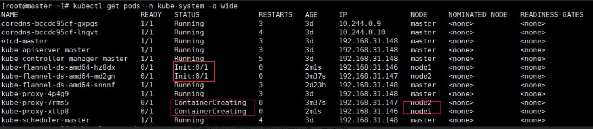
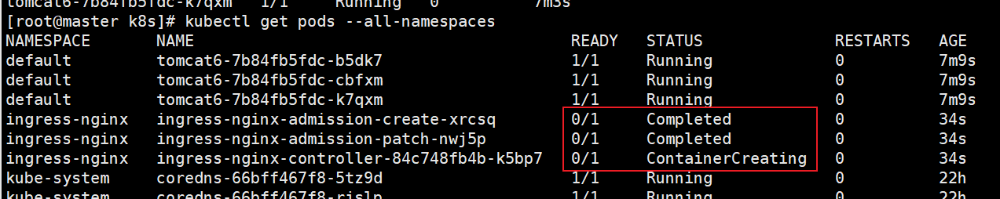

# Kubernetes

开源容器应用自动化部署技术，是一个容器编排引擎，用于自动化容器化应用程序的部署、规划、扩展和管理

目标：让部署容器化的应用简单并且高效，很多细节都不需要运维人员进行复杂的手工配置和处理

k8s就是一个管理和部署集群的东西，其他东西都不管(比如说日志等，如果想要日志，就部署elk组件就行了)

就是一个分布式的编排系统，能管理整个集群

## K8s整体架构


### Master

整体主从方式

Master(管理Node)和Node(做真正事情的)

所有的操作都是操作主节点，然后主节点调配从节点进行工作

kubectl：是输入操作命令到master节点的命令行工具

k8s集群控制节点，对集群进行调度管理，接受集群外用户去集群操作请求


kube-apiserver

* 对外暴露K8S的api接口，是外界进入资源操作的唯一入口（所有的请求都会先进入这里）
* 提供认证、授权、访问控制、API注册和发现等机制

etcd

* etcd是兼具一致性和高可用性的键值数据库，可以作为保存k8s所有集群数据的后台数据库
* k8s集群的etcd数据库通常需要有个备份计划

kube-scheduler

* 主节点上的组件，该主键监视那些新创建的未指定运行节点的pod，并选择节点让pod在上面运行(就是一个调度器)
* 所有对k8s的集群操作，都必须经过主节点进行调度

kube-controller-manager

* 主节点上运行控制器的组件，真正的创建pod
* 节点控制器(Node Controller)：复制在节点出现故障是进行通知和响应
* 副本控制器(Replication Controller)：负责为系统中的每个副本控制器对象维护正确数量的pod
* 端点控制器(Endpoints Controller)：填充端点(Endpoints)对象(即加入Service与pod)
* 服务账户和令牌控制器(Service Account & Token Controllers)：为新命名空间创建默认账户和API访问令牌

### Nodes

集群工作节点，运行用户业务应用容器

节点组件在每个节点上运行，维护运行的pod并提供k8s运行环境

kubelet

* 在集群中每个节点上运行的代理，保证容器都运行在pod中
* 负责维护容器的生命周期，同时也负责Volume(CSI)和网络(CNI)的管理

kube-proxy

* 负责为service提供cluster内部的服务发现和负载均衡

容器运行环境(Container Runtime)

* 容器运行环境是负责运行容器的软禁
* k8s支持多个容器运行环境:Docker、containerd、cri-o、rktlet以及任何实现k8s CRI(容器运行环境接口)的容器

fluentd

* 当前节点的日志收集，是一个守护进程，有助于提供集群层面日志

### Pod

* k8s用pod组织一组容器(docker 的容器)
* 一个pod中所有容器共享网络
* pod是k8s的最小容器单元

Controller控制器

创建和管理多个pod，管理副本和上线，并在集群范围内提供修复能力

deployment是保存在master节点的部署信息

Service是用来暴露pod的：相当于是对pod的负载均衡(统一应用的访问入口)

 ## K8s环境搭建

### 环境

1. minikube

可以在本地运行，可以在个人计算机(win/mac/linux)上运行单节点k8s集群；用于日常学习，一般不用

[在线地址](https://kubernetes.io/zh/docs/tutorials/hello-minikube/)

2. kubeadm

快速部署k8s的工具，使用`kubeadm init`和`kubeadm join`就可以快速部署一个k8s集群

kubeadm init :创建一个master节点

kubeadm join <Master 节点的IP和端口> ：将Node 节点加入Master集群中


> 安装

```bash
# centos系统配置
# 关闭防火墙
systemctl stop firewalld
systemctl disable firewalld
# 关闭selinux
sed -i 's/enforcing/disabled/' /etc/selinux/config  #永久
setenforce 0  
# 关闭swap（k8s禁止虚拟内存以提高性能）
sed -ri 's/.*swap.*/#&/' /etc/fstab #永久
swapoff -a #临时
free -g # 验证，swap必须为0
# 在master添加hosts
cat >> /etc/hosts << EOF
192.168.172.134 k8smaster
192.168.172.135 k8snode
EOF
# 设置网桥参数
cat > /etc/sysctl.d/k8s.conf << EOF
net.bridge.bridge-nf-call-ip6tables = 1
net.bridge.bridge-nf-call-iptables = 1
EOF
sysctl --system  #生效
# 时间同步(可选)
yum install ntpdate -y
ntpdate time.windows.com

# 安装docker
yum install wget -y
wget https://mirrors.aliyun.com/docker-ce/linux/centos/docker-ce.repo -O /etc/yum.repos.d/docker-ce.repo
安装指定版本的docker：
yum install docker-ce-19.03.13 -y

配置加速器加速下载 （https://cr.console.aliyun.com/）
/etc/docker/daemon.json
{
"registry-mirrors": ["https://registry.docker-cn.com"]
}

然后执行：
systemctl enable docker.service
```


```bash
# 添加k8s阿里云的yum源
cat > /etc/yum.repos.d/kubernetes.repo << EOF
[kubernetes]
name=Kubernetes
baseurl=https://mirrors.aliyun.com/kubernetes/yum/repos/kubernetes-el7-x86_64
enabled=1
gpgcheck=0
repo_gpgcheck=0
gpgkey=https://mirrors.aliyun.com/kubernetes/yum/doc/yum-key.gpg https://mirrors.aliyun.com/kubernetes/yum/doc/rpm-package-key.gpg
EOF

# 安装 kubeadm，kubelet 和 kubectl
yum install kubelet-1.19.4 kubeadm-1.19.4 kubectl-1.19.4 -y
yum install kubelet-1.17.3 kubeadm-1.17.3 kubectl-1.17.3 -y
yum install kubelet-1.22.0 kubeadm-1.22.0 kubectl-1.22.0 -y
# 打开docker和kubectl
systemctl start docker
systemctl enable kubelet	# 设置开机启动
systemctl start kubelet

# 随便是否执行，可以关闭警告
systemctl enable kubelet.service

# 检查是否安装成功
yum list installed | grep kubelet
yum list installed | grep kubeadm
yum list installed | grep kubectl
# 查看版本
kubelet --version
```

Kubelet：运行在cluster所有节点上，负责启动POD和容器

Kubeadm：用于初始化cluster

Kubectl：是k8s的命令行工具，通过这个可以部署、管理应用，查看各种资源、创建、删除和更新组件


> 初始化主节点

```bash
# 可以先运行这个
kubeadm config images pull

kubeadm init --apiserver-advertise-address=192.168.131.135 --image-repository registry.aliyuncs.com/google_containers --kubernetes-version v1.19.4 --service-cidr=10.96.0.0/16 --pod-network-cidr=10.244.0.0/16

kubeadm init --apiserver-advertise-address=192.168.131.135 --kubernetes-version v1.18.3 --service-cidr=10.96.0.0/16 --pod-network-cidr=10.244.0.0/16

# 主要是 docker拉取 master中的镜像：apiserver、etcd、controllers、scheduler等 和k8s的一些镜像

# 在master中执行
mkdir -p $HOME/.kube
sudo cp -i /etc/kubernetes/admin.conf $HOME/.kube/config
sudo chown $(id -u):$(id -g) $HOME/.kube/config

# 查看节点信息
kubectl get nodes
```


删除之后重启如果有问题

```
kubeadm reset
rm -rf $HOME/.kube/config
```


如果pull镜像失败，先pull镜像，重新打tag，再启动

```bash
docker pull mirrorgcrio/kube-apiserver:v1.18.3
docker pull mirrorgcrio/kube-controller-manager:v1.18.3
docker pull mirrorgcrio/kube-scheduler:v1.18.3
docker pull mirrorgcrio/kube-proxy:v1.18.3
docker pull mirrorgcrio/pause:3.2
docker pull mirrorgcrio/etcd:3.4.3-0
docker pull mirrorgcrio/coredns:1.6.7

# 打tag
docker tag mirrorgcrio/kube-apiserver:v1.18.3 k8s.gcr.io/kube-apiserver:v1.18.3
docker tag mirrorgcrio/kube-controller-manager:v1.18.3 k8s.gcr.io/kube-controller-manager:v1.18.3
docker tag mirrorgcrio/kube-scheduler:v1.18.3 k8s.gcr.io/kube-scheduler:v1.18.3
docker tag mirrorgcrio/kube-proxy:v1.18.3 k8s.gcr.io/kube-proxy:v1.18.3
docker tag mirrorgcrio/pause:3.2 k8s.gcr.io/pause:3.2
docker tag mirrorgcrio/etcd:3.4.3-0 k8s.gcr.io/etcd:3.4.3-0
docker tag mirrorgcrio/coredns:1.6.7 k8s.gcr.io/coredns:1.6.7
```


> node节点加入master节点

```
kubeadm join 192.168.131.131:6443 --token c2pf8y.zaqs61q1u7xfd4d5 \
    --discovery-token-ca-cert-hash sha256:c616957357f54aec139dd4dfa1608143c5de70465a8697326df79107073d1f51
  
  
# master的token过期怎么办(一般两个小时内有效)
kubeadm token create --print-join-command
kubeadm token create --ttl 0 --print-join-command	#永久有效

# 删除节点
kubectl drain node1 --delete-local-data --force --ignore-daemonsets
kubectl delete node  node1		# master
kubeadm reset  					# node
```

在master查看节点信息`kubectl get nodes`


> 在master部署网络插件

将master和node节点连通

```bash
# 下载
wget https://raw.githubusercontent.com/coreos/flannel/master/Documentation/kube-flannel.yml

# 应用
kubectl apply -f kube-flannel.yml
kubectl delete -f kube-flannel.yml	# 删除所有组件
# 等到一定时间查看节点
kubectl get nodes
kubectl get pods --all-namespaces # 查看pods

# 监控所有节点状态
watch kubectl get pod -n kube-system -o wide
```


尚硅谷的`kube-flannel.yml`见附录[1]


### 测试

查看k8s运行时容器系统的pod里面的容器(一个pod里可以运行多个docker容器)

```bash
# -n 表示name
kubectl get pods -n kube-system		# 得到指定namespace中的pod
watch kubectl get pod -n kube-system -o wide	# 监控pod状态
```

[Get的缩写](https://kubernetes.io/zh/docs/reference/kubectl/overview/#%e8%b5%84%e6%ba%90%e7%b1%bb%e5%9e%8b)

> 使用k8s部署“容器化应用”

就是使用docker打成一个镜像，使用k8s运行这个镜像

使用k8s部署tomcat

```bash
kubectl create deployment tomcat6 --image=tomcat:6.0.53-jre8	# 新建pod
kubectl get all			# 得到pod所有信息
kubectl get all -o wide	# 得到pod更多的信息，可以查看在哪个node运行了这个pod
kubectl get pods		# 查看创建的所有pod(在默认的namespace中的,default)，类似于docker ps
kubectl get pods -o wide	# 更多的信息
kubectl get pods --all-namespaces	# 查看所有namespace下的pod	
kubectl expose deployment tomcat6 --port=80 --target-port=8080 --type=NodePort	# 暴露端口(target-port:容器端口；port：pod端口)
kubectl get svc		# 查看service；获得service对外暴露的端口；master或者node都可以访问

kubectl scale --replicas=3 deployment tomcat6	# 动态扩容(缩容)
```


使用k8s部署nginx

```bash
# 新建pod
kubectl create deployment nginx01 --image=nginx
# 暴露端口	暴露一个端口相当于新建一个services  使用 kubectl get svc 查看
kubectl expose deployment nginx --port=80 --type=NodePort
# 查看pod
kubectl get pod  # s可有有无
# 得到node ip
kubectl get svc		# 也是 kubectl get service	或 services
# 实际上 最外层是deployment  然后 pod 然后 docker
# 查看控制器
kubectl get deployment		# 可以是deploy
# 删除控制器
kubectl delete deployment nginx
kubectl delete pod nginxxxx

# 查看pod详细信息
kubectl describe pod_name
# 通过docker ps 及 docker images 可知 pod里面的容器是运行在 node节点上的，master节点不会运行
```


使用k8s部署springboot项目

```bash
# --dry-run 表示空运行	会生成运行的 yaml文件	k8s是通过yaml文件运行的  这里面下面的 yaml(主要)也可以改成json	k8s支持两种格式
kubectl create deployment springboot-k8s --image=k8s-jar --dry-run -o yaml
# 将运行文件写入 deploy.yaml(也叫资源清单)
kubectl create deployment springboot-k8s --image=k8s-jar --dry-run -o yaml > deploy.yaml

# 通过yaml文件部署项目
kubectl apply -f boot-deploy.yaml	# 等价于  kubectl create deployment springboot-k8s --image=k8s-jar
```

注意：boot-deploy.yaml文件设置镜像从本地拉取；

```bash
containers:
	- name: k8sjar
	  image: k8sjar
	  imagePullPolicy: Never		# 这儿代表从本地拉取镜像
```

### 安装web管理UI

相当于下载一个镜像，运行在k8s的pod中，对外访问，管理k8s

```bash
# 直接搭建
kubectl apply -f https://raw.githubusercontent.com/kubernetes/dashboard/v2.0.4/aio/deploy/recommended.yaml

# 分两步
wget https://raw.githubusercontent.com/kubernetes/dashboard/v2.0.4/aio/deploy/recommended.yaml
kubectl apply -f recommended.yaml

# 查看启动是否成功
kubectl get pod -n kubernetes-dashboard
# 启动成功浏览器访问
https://ip:30001/ 
# 需要使用token登录	生成token
kubectl create serviceaccount dashboard-admin -n kube-system
kubectl create clusterrolebinding dashboard-admin --clusterrole=cluster-admin --serviceaccount=kube-system:dashboard-admin
kubectl describe secrets -n kube-system $(kubectl -n kube-system get secret | awk '/dashboard-admin/{print $1}')

```

可以修改recommended.yaml暴露的端口


### yaml规则



之后就是用yml编写配置文件

使用`kubectl apply -f example.xml`	替换 `kubectl create`

kubectl create后的参数

--dry-run：用于测试，并不运行(`kubectl create deployment tomcat6 --image=tomcat:6.0.53-jre8 --dry-run -o yaml`：部署tomcat6的定义信息，-o就是输出方式)

```bash
kubectl create deployment tomcat6 --image=tomcat:6.0.53-jre8 --dry-run -o yaml > tomcat6.yaml
kubectl apply -f tomcat6.yaml

kubectl create deployment tomcat6 --image=tomcat:6.0.53-jre8	# 这两个是一样的
```


[参考命令](https://kubernetes.io/docs/reference/generated/kubectl/kubectl-commands)

### 暴露端口

> NodePort

NodePort服务是在所有节点上开放指定的端口，所有发送到这个端口的请求都会直接转发到服务的pod里面

使用NodePort：在yaml文件中有`type: NodePort`，并使用nodePort指定端口，不知道就会随机一个30000以上的端口

 

port：k8s服务之间访问的端口

targetPort：容器的端口

nodePort：外部机器(浏览器)可以访问的端口


缺点：

* 一个端口只能供一个服务使用
* 只能使用30000-32767之间的端口
* 如果节点的IP发生变化，需要人工处理

> LoadBalancer

需要向云平台申请负载均衡器，相当于购买服务，具体如何实现需要看云提供商

#### Ingress 

尚硅谷的ingress.yaml文件见附录[2]


Ingress相当于一个集群网关，可以自定义路由规则来转发、管理、暴露服务(一组pod)

Ingress不是kubernetes内置的，需要单独安装：Ingress Nginx(官方)

```bash
# 运行pod
kubectl apply -f https://raw.githubusercontent.com/kubernetes/ingress-nginx/controller-v0.41.2/deploy/static/provider/baremetal/deploy.yaml
# 需要改成本地的话 就先下载，修改文件之后再运行
# 需要修改deploy.yaml中的镜像地址为阿里云的	332行	
registry.cn-hangzhou.aliyuncs.com/google_containers/nginx-ingress-controller:0.33.0
# 添加一个配置项	329的 hostNetwork: true

kubectl apply -f deploy.yaml

# 查看Ingress状态
kubectl get service -n ingress-nginx
kubectl get deploy -n ingress-nginx
kubectl get pods -n ingress-nginx
```

创建Ingress访问规则

```bash
# 类似于网关配置路由规则

# 查看路由配置
kubectl get ingress   # 或者 ing
kubectl delete ing name

# 运行自己配置的规则
kubectl apply -f ingress-rule.yaml
```

```xml
apiVersion: extensions/v1beta1
kind: Ingress
metadata:
  name: web
spec:
  rules:
  - host: tomcat6.smilve.com
    http:
       paths: 
          - backend: 
              serviceName: tomcat6
              servicePort: 80
```

### 安装KubeSphere

可以打通devops整个流水线部署链路

[安装](https://kubesphere.com.cn/docs/installing-on-kubernetes/)

配置默认**StorageClass**：`https://blog.51cto.com/zhangxueliang/2969983` `https://www.cnblogs.com/lfl17718347843/p/14131062.html`

需执行文件见附录[3]		最小化安装

完整安装：安装可插拔组件 `kubectl edit cc ks-installer -n kubesphere-system`(可开启devops、log等功能)

按照教程走完流程即可：`https://kubesphere.com.cn/docs/quick-start/create-workspace-and-project/`

#### DevOps

开发和运维

CICD：持续集成(CI)、持续交互(CD)  (主要是机器自动化)



## 错误记录

> 当node节点加入master节点时，pod的状态为ContainerCreating



node节点下载pause镜像即可

```bash
docker pull mirrorgcrio/pause:3.2
docker pull mirrorgcrio/kube-proxy:v1.18.3
docker tag mirrorgcrio/kube-proxy:v1.18.3 k8s.gcr.io/kube-proxy:v1.18.3
docker tag mirrorgcrio/pause:3.2 k8s.gcr.io/pause:3.2
```


> node宕机后的pod驱离问题

默认300s ：`kubectl describe pod  nginx-deployment|grep -i toleration -A 2`

设置部署pod的deployment文件(也就是`kubectl apply -f ***.xml`)

```yaml
tolerations:
      - key: "node.kubernetes.io/unreachable"
        operator: "Exists"
        effect: "NoExecute"
        tolerationSeconds: 2
      - key: "node.kubernetes.io/not-ready"
        operator: "Exists"
        effect: "NoExecute"
        tolerationSeconds: 2
```


```yaml
apiVersion: apps/v1
kind: Deployment
metadata:
  labels:
    app: tomcat6
  name: tomcat6
spec:
  replicas: 3
  selector:
    matchLabels:
      app: tomcat6
  template:
    metadata:
      labels:
        app: tomcat6
    spec:
	  # 下面这一段就是配置驱离时间的
      tolerations:
      - key: "node.kubernetes.io/unreachable"
        operator: "Exists"
        effect: "NoExecute"
        tolerationSeconds: 2
      - key: "node.kubernetes.io/not-ready"
        operator: "Exists"
        effect: "NoExecute"
        tolerationSeconds: 2

      containers:
      - image: tomcat:6.0.53-jre8
        name: tomcat
        resources: {}
```


> 部署ingress失败



```bash
# 在node节点pull ingress镜像
docker pull siriuszg/nginx-ingress-controller:0.20.0
```

> 部署kubesphere

pods的prometheus-k8s-0状态为pending

查看class.yaml中的provisioner是否和nfs-rbac.yaml的一样

## 附录

### [1] kube-flannel.yaml

```yml
cat <<EOF > kube-flannel.yml
---
apiVersion: policy/v1beta1
kind: PodSecurityPolicy
metadata:
  name: psp.flannel.unprivileged
  annotations:
    seccomp.security.alpha.kubernetes.io/allowedProfileNames: docker/default
    seccomp.security.alpha.kubernetes.io/defaultProfileName: docker/default
    apparmor.security.beta.kubernetes.io/allowedProfileNames: runtime/default
    apparmor.security.beta.kubernetes.io/defaultProfileName: runtime/default
spec:
  privileged: false
  volumes:
    - configMap
    - secret
    - emptyDir
    - hostPath
  allowedHostPaths:
    - pathPrefix: "/etc/cni/net.d"
    - pathPrefix: "/etc/kube-flannel"
    - pathPrefix: "/run/flannel"
  readOnlyRootFilesystem: false
  # Users and groups
  runAsUser:
    rule: RunAsAny
  supplementalGroups:
    rule: RunAsAny
  fsGroup:
    rule: RunAsAny
  # Privilege Escalation
  allowPrivilegeEscalation: false
  defaultAllowPrivilegeEscalation: false
  # Capabilities
  allowedCapabilities: ['NET_ADMIN']
  defaultAddCapabilities: []
  requiredDropCapabilities: []
  # Host namespaces
  hostPID: false
  hostIPC: false
  hostNetwork: true
  hostPorts:
  - min: 0
    max: 65535
  # SELinux
  seLinux:
    # SELinux is unused in CaaSP
    rule: 'RunAsAny'
---
kind: ClusterRole
apiVersion: rbac.authorization.k8s.io/v1beta1
metadata:
  name: flannel
rules:
  - apiGroups: ['extensions']
    resources: ['podsecuritypolicies']
    verbs: ['use']
    resourceNames: ['psp.flannel.unprivileged']
  - apiGroups:
      - ""
    resources:
      - pods
    verbs:
      - get
  - apiGroups:
      - ""
    resources:
      - nodes
    verbs:
      - list
      - watch
  - apiGroups:
      - ""
    resources:
      - nodes/status
    verbs:
      - patch
---
kind: ClusterRoleBinding
apiVersion: rbac.authorization.k8s.io/v1beta1
metadata:
  name: flannel
roleRef:
  apiGroup: rbac.authorization.k8s.io
  kind: ClusterRole
  name: flannel
subjects:
- kind: ServiceAccount
  name: flannel
  namespace: kube-system
---
apiVersion: v1
kind: ServiceAccount
metadata:
  name: flannel
  namespace: kube-system
---
kind: ConfigMap
apiVersion: v1
metadata:
  name: kube-flannel-cfg
  namespace: kube-system
  labels:
    tier: node
    app: flannel
data:
  cni-conf.json: |
    {
      "name": "cbr0",
      "cniVersion": "0.3.1",
      "plugins": [
        {
          "type": "flannel",
          "delegate": {
            "hairpinMode": true,
            "isDefaultGateway": true
          }
        },
        {
          "type": "portmap",
          "capabilities": {
            "portMappings": true
          }
        }
      ]
    }
  net-conf.json: |
    {
      "Network": "10.244.0.0/16",
      "Backend": {
        "Type": "vxlan"
      }
    }
---
apiVersion: apps/v1
kind: DaemonSet
metadata:
  name: kube-flannel-ds-amd64
  namespace: kube-system
  labels:
    tier: node
    app: flannel
spec:
  selector:
    matchLabels:
      app: flannel
  template:
    metadata:
      labels:
        tier: node
        app: flannel
    spec:
      affinity:
        nodeAffinity:
          requiredDuringSchedulingIgnoredDuringExecution:
            nodeSelectorTerms:
              - matchExpressions:
                  - key: beta.kubernetes.io/os
                    operator: In
                    values:
                      - linux
                  - key: beta.kubernetes.io/arch
                    operator: In
                    values:
                      - amd64
      hostNetwork: true
      tolerations:
      - operator: Exists
        effect: NoSchedule
      serviceAccountName: flannel
      initContainers:
      - name: install-cni
        image: quay.io/coreos/flannel:v0.11.0-amd64
        command:
        - cp
        args:
        - -f
        - /etc/kube-flannel/cni-conf.json
        - /etc/cni/net.d/10-flannel.conflist
        volumeMounts:
        - name: cni
          mountPath: /etc/cni/net.d
        - name: flannel-cfg
          mountPath: /etc/kube-flannel/
      containers:
      - name: kube-flannel
        image: quay.io/coreos/flannel:v0.11.0-amd64
        command:
        - /opt/bin/flanneld
        args:
        - --ip-masq
        - --kube-subnet-mgr
        resources:
          requests:
            cpu: "100m"
            memory: "50Mi"
          limits:
            cpu: "100m"
            memory: "50Mi"
        securityContext:
          privileged: false
          capabilities:
            add: ["NET_ADMIN"]
        env:
        - name: POD_NAME
          valueFrom:
            fieldRef:
              fieldPath: metadata.name
        - name: POD_NAMESPACE
          valueFrom:
            fieldRef:
              fieldPath: metadata.namespace
        volumeMounts:
        - name: run
          mountPath: /run/flannel
        - name: flannel-cfg
          mountPath: /etc/kube-flannel/
      volumes:
        - name: run
          hostPath:
            path: /run/flannel
        - name: cni
          hostPath:
            path: /etc/cni/net.d
        - name: flannel-cfg
          configMap:
            name: kube-flannel-cfg
---
apiVersion: apps/v1
kind: DaemonSet
metadata:
  name: kube-flannel-ds-arm64
  namespace: kube-system
  labels:
    tier: node
    app: flannel
spec:
  selector:
    matchLabels:
      app: flannel
  template:
    metadata:
      labels:
        tier: node
        app: flannel
    spec:
      affinity:
        nodeAffinity:
          requiredDuringSchedulingIgnoredDuringExecution:
            nodeSelectorTerms:
              - matchExpressions:
                  - key: beta.kubernetes.io/os
                    operator: In
                    values:
                      - linux
                  - key: beta.kubernetes.io/arch
                    operator: In
                    values:
                      - arm64
      hostNetwork: true
      tolerations:
      - operator: Exists
        effect: NoSchedule
      serviceAccountName: flannel
      initContainers:
      - name: install-cni
        image: quay.io/coreos/flannel:v0.11.0-arm64
        command:
        - cp
        args:
        - -f
        - /etc/kube-flannel/cni-conf.json
        - /etc/cni/net.d/10-flannel.conflist
        volumeMounts:
        - name: cni
          mountPath: /etc/cni/net.d
        - name: flannel-cfg
          mountPath: /etc/kube-flannel/
      containers:
      - name: kube-flannel
        image: quay.io/coreos/flannel:v0.11.0-arm64
        command:
        - /opt/bin/flanneld
        args:
        - --ip-masq
        - --kube-subnet-mgr
        resources:
          requests:
            cpu: "100m"
            memory: "50Mi"
          limits:
            cpu: "100m"
            memory: "50Mi"
        securityContext:
          privileged: false
          capabilities:
             add: ["NET_ADMIN"]
        env:
        - name: POD_NAME
          valueFrom:
            fieldRef:
              fieldPath: metadata.name
        - name: POD_NAMESPACE
          valueFrom:
            fieldRef:
              fieldPath: metadata.namespace
        volumeMounts:
        - name: run
          mountPath: /run/flannel
        - name: flannel-cfg
          mountPath: /etc/kube-flannel/
      volumes:
        - name: run
          hostPath:
            path: /run/flannel
        - name: cni
          hostPath:
            path: /etc/cni/net.d
        - name: flannel-cfg
          configMap:
            name: kube-flannel-cfg
---
apiVersion: apps/v1
kind: DaemonSet
metadata:
  name: kube-flannel-ds-arm
  namespace: kube-system
  labels:
    tier: node
    app: flannel
spec:
  selector:
    matchLabels:
      app: flannel
  template:
    metadata:
      labels:
        tier: node
        app: flannel
    spec:
      affinity:
        nodeAffinity:
          requiredDuringSchedulingIgnoredDuringExecution:
            nodeSelectorTerms:
              - matchExpressions:
                  - key: beta.kubernetes.io/os
                    operator: In
                    values:
                      - linux
                  - key: beta.kubernetes.io/arch
                    operator: In
                    values:
                      - arm
      hostNetwork: true
      tolerations:
      - operator: Exists
        effect: NoSchedule
      serviceAccountName: flannel
      initContainers:
      - name: install-cni
        image: quay.io/coreos/flannel:v0.11.0-arm
        command:
        - cp
        args:
        - -f
        - /etc/kube-flannel/cni-conf.json
        - /etc/cni/net.d/10-flannel.conflist
        volumeMounts:
        - name: cni
          mountPath: /etc/cni/net.d
        - name: flannel-cfg
          mountPath: /etc/kube-flannel/
      containers:
      - name: kube-flannel
        image: quay.io/coreos/flannel:v0.11.0-arm
        command:
        - /opt/bin/flanneld
        args:
        - --ip-masq
        - --kube-subnet-mgr
        resources:
          requests:
            cpu: "100m"
            memory: "50Mi"
          limits:
            cpu: "100m"
            memory: "50Mi"
        securityContext:
          privileged: false
          capabilities:
             add: ["NET_ADMIN"]
        env:
        - name: POD_NAME
          valueFrom:
            fieldRef:
              fieldPath: metadata.name
        - name: POD_NAMESPACE
          valueFrom:
            fieldRef:
              fieldPath: metadata.namespace
        volumeMounts:
        - name: run
          mountPath: /run/flannel
        - name: flannel-cfg
          mountPath: /etc/kube-flannel/
      volumes:
        - name: run
          hostPath:
            path: /run/flannel
        - name: cni
          hostPath:
            path: /etc/cni/net.d
        - name: flannel-cfg
          configMap:
            name: kube-flannel-cfg
---
apiVersion: apps/v1
kind: DaemonSet
metadata:
  name: kube-flannel-ds-ppc64le
  namespace: kube-system
  labels:
    tier: node
    app: flannel
spec:
  selector:
    matchLabels:
      app: flannel
  template:
    metadata:
      labels:
        tier: node
        app: flannel
    spec:
      affinity:
        nodeAffinity:
          requiredDuringSchedulingIgnoredDuringExecution:
            nodeSelectorTerms:
              - matchExpressions:
                  - key: beta.kubernetes.io/os
                    operator: In
                    values:
                      - linux
                  - key: beta.kubernetes.io/arch
                    operator: In
                    values:
                      - ppc64le
      hostNetwork: true
      tolerations:
      - operator: Exists
        effect: NoSchedule
      serviceAccountName: flannel
      initContainers:
      - name: install-cni
        image: quay.io/coreos/flannel:v0.11.0-ppc64le
        command:
        - cp
        args:
        - -f
        - /etc/kube-flannel/cni-conf.json
        - /etc/cni/net.d/10-flannel.conflist
        volumeMounts:
        - name: cni
          mountPath: /etc/cni/net.d
        - name: flannel-cfg
          mountPath: /etc/kube-flannel/
      containers:
      - name: kube-flannel
        image: quay.io/coreos/flannel:v0.11.0-ppc64le
        command:
        - /opt/bin/flanneld
        args:
        - --ip-masq
        - --kube-subnet-mgr
        resources:
          requests:
            cpu: "100m"
            memory: "50Mi"
          limits:
            cpu: "100m"
            memory: "50Mi"
        securityContext:
          privileged: false
          capabilities:
             add: ["NET_ADMIN"]
        env:
        - name: POD_NAME
          valueFrom:
            fieldRef:
              fieldPath: metadata.name
        - name: POD_NAMESPACE
          valueFrom:
            fieldRef:
              fieldPath: metadata.namespace
        volumeMounts:
        - name: run
          mountPath: /run/flannel
        - name: flannel-cfg
          mountPath: /etc/kube-flannel/
      volumes:
        - name: run
          hostPath:
            path: /run/flannel
        - name: cni
          hostPath:
            path: /etc/cni/net.d
        - name: flannel-cfg
          configMap:
            name: kube-flannel-cfg
---
apiVersion: apps/v1
kind: DaemonSet
metadata:
  name: kube-flannel-ds-s390x
  namespace: kube-system
  labels:
    tier: node
    app: flannel
spec:
  selector:
    matchLabels:
      app: flannel
  template:
    metadata:
      labels:
        tier: node
        app: flannel
    spec:
      affinity:
        nodeAffinity:
          requiredDuringSchedulingIgnoredDuringExecution:
            nodeSelectorTerms:
              - matchExpressions:
                  - key: beta.kubernetes.io/os
                    operator: In
                    values:
                      - linux
                  - key: beta.kubernetes.io/arch
                    operator: In
                    values:
                      - s390x
      hostNetwork: true
      tolerations:
      - operator: Exists
        effect: NoSchedule
      serviceAccountName: flannel
      initContainers:
      - name: install-cni
        image: quay.io/coreos/flannel:v0.11.0-s390x
        command:
        - cp
        args:
        - -f
        - /etc/kube-flannel/cni-conf.json
        - /etc/cni/net.d/10-flannel.conflist
        volumeMounts:
        - name: cni
          mountPath: /etc/cni/net.d
        - name: flannel-cfg
          mountPath: /etc/kube-flannel/
      containers:
      - name: kube-flannel
        image: quay.io/coreos/flannel:v0.11.0-s390x
        command:
        - /opt/bin/flanneld
        args:
        - --ip-masq
        - --kube-subnet-mgr
        resources:
          requests:
            cpu: "100m"
            memory: "50Mi"
          limits:
            cpu: "100m"
            memory: "50Mi"
        securityContext:
          privileged: false
          capabilities:
             add: ["NET_ADMIN"]
        env:
        - name: POD_NAME
          valueFrom:
            fieldRef:
              fieldPath: metadata.name
        - name: POD_NAMESPACE
          valueFrom:
            fieldRef:
              fieldPath: metadata.namespace
        volumeMounts:
        - name: run
          mountPath: /run/flannel
        - name: flannel-cfg
          mountPath: /etc/kube-flannel/
      volumes:
        - name: run
          hostPath:
            path: /run/flannel
        - name: cni
          hostPath:
            path: /etc/cni/net.d
        - name: flannel-cfg
          configMap:
            name: kube-flannel-cfg
EOF
```

### [2] ingress.yaml

```yaml
apiVersion: v1
kind: Namespace
metadata:
  name: ingress-nginx
  labels:
    app.kubernetes.io/name: ingress-nginx
    app.kubernetes.io/part-of: ingress-nginx

---

kind: ConfigMap
apiVersion: v1
metadata:
  name: nginx-configuration
  namespace: ingress-nginx
  labels:
    app.kubernetes.io/name: ingress-nginx
    app.kubernetes.io/part-of: ingress-nginx

---
kind: ConfigMap
apiVersion: v1
metadata:
  name: tcp-services
  namespace: ingress-nginx
  labels:
    app.kubernetes.io/name: ingress-nginx
    app.kubernetes.io/part-of: ingress-nginx

---
kind: ConfigMap
apiVersion: v1
metadata:
  name: udp-services
  namespace: ingress-nginx
  labels:
    app.kubernetes.io/name: ingress-nginx
    app.kubernetes.io/part-of: ingress-nginx

---
apiVersion: v1
kind: ServiceAccount
metadata:
  name: nginx-ingress-serviceaccount
  namespace: ingress-nginx
  labels:
    app.kubernetes.io/name: ingress-nginx
    app.kubernetes.io/part-of: ingress-nginx

---
apiVersion: rbac.authorization.k8s.io/v1beta1
kind: ClusterRole
metadata:
  name: nginx-ingress-clusterrole
  labels:
    app.kubernetes.io/name: ingress-nginx
    app.kubernetes.io/part-of: ingress-nginx
rules:
  - apiGroups:
      - ""
    resources:
      - configmaps
      - endpoints
      - nodes
      - pods
      - secrets
    verbs:
      - list
      - watch
  - apiGroups:
      - ""
    resources:
      - nodes
    verbs:
      - get
  - apiGroups:
      - ""
    resources:
      - services
    verbs:
      - get
      - list
      - watch
  - apiGroups:
      - "extensions"
    resources:
      - ingresses
    verbs:
      - get
      - list
      - watch
  - apiGroups:
      - ""
    resources:
      - events
    verbs:
      - create
      - patch
  - apiGroups:
      - "extensions"
    resources:
      - ingresses/status
    verbs:
      - update

---
apiVersion: rbac.authorization.k8s.io/v1beta1
kind: Role
metadata:
  name: nginx-ingress-role
  namespace: ingress-nginx
  labels:
    app.kubernetes.io/name: ingress-nginx
    app.kubernetes.io/part-of: ingress-nginx
rules:
  - apiGroups:
      - ""
    resources:
      - configmaps
      - pods
      - secrets
      - namespaces
    verbs:
      - get
  - apiGroups:
      - ""
    resources:
      - configmaps
    resourceNames:
      # Defaults to "<election-id>-<ingress-class>"
      # Here: "<ingress-controller-leader>-<nginx>"
      # This has to be adapted if you change either parameter
      # when launching the nginx-ingress-controller.
      - "ingress-controller-leader-nginx"
    verbs:
      - get
      - update
  - apiGroups:
      - ""
    resources:
      - configmaps
    verbs:
      - create
  - apiGroups:
      - ""
    resources:
      - endpoints
    verbs:
      - get

---
apiVersion: rbac.authorization.k8s.io/v1beta1
kind: RoleBinding
metadata:
  name: nginx-ingress-role-nisa-binding
  namespace: ingress-nginx
  labels:
    app.kubernetes.io/name: ingress-nginx
    app.kubernetes.io/part-of: ingress-nginx
roleRef:
  apiGroup: rbac.authorization.k8s.io
  kind: Role
  name: nginx-ingress-role
subjects:
  - kind: ServiceAccount
    name: nginx-ingress-serviceaccount
    namespace: ingress-nginx

---
apiVersion: rbac.authorization.k8s.io/v1beta1
kind: ClusterRoleBinding
metadata:
  name: nginx-ingress-clusterrole-nisa-binding
  labels:
    app.kubernetes.io/name: ingress-nginx
    app.kubernetes.io/part-of: ingress-nginx
roleRef:
  apiGroup: rbac.authorization.k8s.io
  kind: ClusterRole
  name: nginx-ingress-clusterrole
subjects:
  - kind: ServiceAccount
    name: nginx-ingress-serviceaccount
    namespace: ingress-nginx

---

apiVersion: apps/v1
kind: DaemonSet 
metadata:
  name: nginx-ingress-controller
  namespace: ingress-nginx
  labels:
    app.kubernetes.io/name: ingress-nginx
    app.kubernetes.io/part-of: ingress-nginx
spec:
  selector:
    matchLabels:
      app.kubernetes.io/name: ingress-nginx
      app.kubernetes.io/part-of: ingress-nginx
  template:
    metadata:
      labels:
        app.kubernetes.io/name: ingress-nginx
        app.kubernetes.io/part-of: ingress-nginx
      annotations:
        prometheus.io/port: "10254"
        prometheus.io/scrape: "true"
    spec:
      hostNetwork: true
      serviceAccountName: nginx-ingress-serviceaccount
      containers:
        - name: nginx-ingress-controller
          image: siriuszg/nginx-ingress-controller:0.20.0
          args:
            - /nginx-ingress-controller
            - --configmap=$(POD_NAMESPACE)/nginx-configuration
            - --tcp-services-configmap=$(POD_NAMESPACE)/tcp-services
            - --udp-services-configmap=$(POD_NAMESPACE)/udp-services
            - --publish-service=$(POD_NAMESPACE)/ingress-nginx
            - --annotations-prefix=nginx.ingress.kubernetes.io
          securityContext:
            allowPrivilegeEscalation: true
            capabilities:
              drop:
                - ALL
              add:
                - NET_BIND_SERVICE
            # www-data -> 33
            runAsUser: 33
          env:
            - name: POD_NAME
              valueFrom:
                fieldRef:
                  fieldPath: metadata.name
            - name: POD_NAMESPACE
              valueFrom:
                fieldRef:
                  fieldPath: metadata.namespace
          ports:
            - name: http
              containerPort: 80
            - name: https
              containerPort: 443
          livenessProbe:
            failureThreshold: 3
            httpGet:
              path: /healthz
              port: 10254
              scheme: HTTP
            initialDelaySeconds: 10
            periodSeconds: 10
            successThreshold: 1
            timeoutSeconds: 10
          readinessProbe:
            failureThreshold: 3
            httpGet:
              path: /healthz
              port: 10254
              scheme: HTTP
            periodSeconds: 10
            successThreshold: 1
            timeoutSeconds: 10

---
apiVersion: v1
kind: Service
metadata:
  name: ingress-nginx
  namespace: ingress-nginx
spec:
  #type: NodePort
  ports:
  - name: http
    port: 80
    targetPort: 80
    protocol: TCP
  - name: https
    port: 443
    targetPort: 443
    protocol: TCP
  selector:
    app.kubernetes.io/name: ingress-nginx
    app.kubernetes.io/part-of: ingress-nginx
```

### [3] nfs-rbac.yaml

```yaml
---
apiVersion: v1
kind: ServiceAccount
metadata:
  name: nfs-provisioner
---
kind: ClusterRole
apiVersion: rbac.authorization.k8s.io/v1
metadata:
   name: nfs-provisioner-runner
rules:
   -  apiGroups: [""]
      resources: ["persistentvolumes"]
      verbs: ["get", "list", "watch", "create", "delete"]
   -  apiGroups: [""]
      resources: ["persistentvolumeclaims"]
      verbs: ["get", "list", "watch", "update"]
   -  apiGroups: ["storage.k8s.io"]
      resources: ["storageclasses"]
      verbs: ["get", "list", "watch"]
   -  apiGroups: [""]
      resources: ["events"]
      verbs: ["watch", "create", "update", "patch"]
   -  apiGroups: [""]
      resources: ["services", "endpoints"]
      verbs: ["get","create","list", "watch","update"]
   -  apiGroups: ["extensions"]
      resources: ["podsecuritypolicies"]
      resourceNames: ["nfs-provisioner"]
      verbs: ["use"]
---
kind: ClusterRoleBinding
apiVersion: rbac.authorization.k8s.io/v1
metadata:
  name: run-nfs-provisioner
subjects:
  - kind: ServiceAccount
    name: nfs-provisioner
    namespace: default
roleRef:
  kind: ClusterRole
  name: nfs-provisioner-runner
  apiGroup: rbac.authorization.k8s.io
---
#vi nfs-deployment.yaml；创建nfs-client的授权
kind: Deployment
apiVersion: apps/v1
metadata:
   name: nfs-client-provisioner
spec:
   replicas: 1
   strategy:
     type: Recreate
   selector:
     matchLabels:
        app: nfs-client-provisioner
   template:
      metadata:
         labels:
            app: nfs-client-provisioner
      spec:
         serviceAccount: nfs-provisioner
         containers:
            -  name: nfs-client-provisioner
               image: 192.168.145.28:1603/kubesphere/nfs-client-provisioner:v3.1.0-k8s1.11
               volumeMounts:
                 -  name: nfs-client-root
                    mountPath:  /persistentvolumes
               env:
                 -  name: PROVISIONER_NAME #供应者的名字
                    value: storage.pri/nfs #名字虽然可以随便起，但需要和class中的provisioner一致
                 -  name: NFS_SERVER
                    value: 192.168.116.101
                 -  name: NFS_PATH
                    value: /nfs/data
         volumes:
           - name: nfs-client-root
             nfs:
               server: 192.168.116.101	# master host
               path: /nfs/data
```

storageclass-nfs.yaml

```yaml
apiVersion: storage.k8s.io/v1
kind: StorageClass
metadata:
  name: storage-nfs
provisioner: storage.pri/nfs
reclaimPolicy: Delete
```

