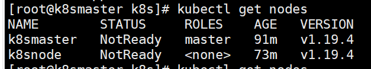
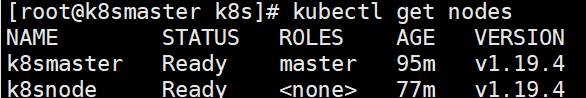
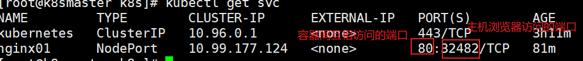
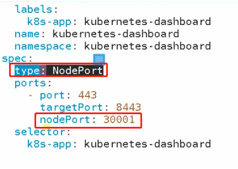
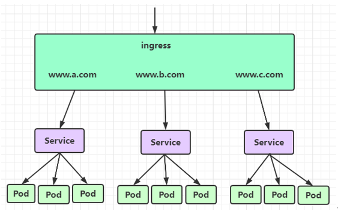

# Kubernetes

开源容器应用自动化部署技术，是一个容器编排引擎，用于自动化容器化应用程序的部署、规划、扩展和管理

目标：让部署容器化的应用简单并且高效，很多细节都不需要运维人员进行复杂的手工配置和处理

## K8s整体架构


### Master

k8s集群控制节点，对集群进行调度管理，接受集群外用户去集群操作请求

### Nodes

集群工作节点，运行用户业务应用容器

 ## K8s环境搭建

### 环境


1. minikube

可以在本地运行，可以在个人计算机(win/mac/linux)上运行单节点k8s集群；用于日常学习，一般不用

[在线地址](https://kubernetes.io/zh/docs/tutorials/hello-minikube/)

2. kubeadm

快速部署k8s的工具，使用`kubeadm init`和`kubeadm join`就可以快速部署一个k8s集群

kubeadm init :创建一个master节点

kubeadm join <Master 节点的IP和端口> ：将Node 节点加入Master集群中


> 安装

```bash
# centos系统配置
# 关闭防火墙
systemctl stop firewalld
systemctl disable firewalld
# 关闭selinux
sed -i 's/enforcing/disabled/' /etc/selinux/config  #永久
setenforce 0  #临时
# 关闭swap（k8s禁止虚拟内存以提高性能）
sed -ri 's/.*swap.*/#&/' /etc/fstab #永久
swapoff -a #临时
# 在master添加hosts
cat >> /etc/hosts << EOF
192.168.172.134 k8smaster
192.168.172.135 k8snode
EOF
# 设置网桥参数
cat > /etc/sysctl.d/k8s.conf << EOF
net.bridge.bridge-nf-call-ip6tables = 1
net.bridge.bridge-nf-call-iptables = 1
EOF
sysctl --system  #生效
# 时间同步
yum install ntpdate -y
ntpdate time.windows.com

# 安装docker
yum install wget -y
wget https://mirrors.aliyun.com/docker-ce/linux/centos/docker-ce.repo -O /etc/yum.repos.d/docker-ce.repo
安装指定版本的docker：
yum install docker-ce-19.03.13 -y

配置加速器加速下载 （https://cr.console.aliyun.com/）
/etc/docker/daemon.json
{
"registry-mirrors": ["https://registry.docker-cn.com"]
}

然后执行：
systemctl enable docker.service
```


```bash
# 添加k8s阿里云的yum源
cat > /etc/yum.repos.d/kubernetes.repo << EOF
[kubernetes]
name=Kubernetes
baseurl=https://mirrors.aliyun.com/kubernetes/yum/repos/kubernetes-el7-x86_64
enabled=1
gpgcheck=0
repo_gpgcheck=0
gpgkey=https://mirrors.aliyun.com/kubernetes/yum/doc/yum-key.gpg https://mirrors.aliyun.com/kubernetes/yum/doc/rpm-package-key.gpg
EOF

# 安装 kubeadm，kubelet 和 kubectl
yum install kubelet-1.19.4 kubeadm-1.19.4 kubectl-1.19.4 -y

# 打开docker和kubectl
systemctl start docker
systemctl start kubelet

# 随便是否执行，可以关闭警告
systemctl enable kubelet.service

# 检查是否安装成功
yum list installed | grep kubelet
yum list installed | grep kubeadm
yum list installed | grep kubectl
# 查看版本
kubelet --version

```

Kubelet：运行在cluster所有节点上，负责启动POD和容器

Kubeadm：用于初始化cluster

Kubectl：是k8s的命令行工具，通过这个可以部署、管理应用，查看各种资源、创建、删除和更新组件


> 初始化主节点

```bash
kubeadm init --apiserver-advertise-address=192.168.131.131 --image-repository registry.aliyuncs.com/google_containers --kubernetes-version v1.19.4 --service-cidr=10.96.0.0/12 --pod-network-cidr=10.244.0.0/16

# 主要是 docker拉取 master中的镜像：apiserver、etcd、controllers、scheduler等 和k8s的一些镜像

# 在master中执行
mkdir -p $HOME/.kube
sudo cp -i /etc/kubernetes/admin.conf $HOME/.kube/config
sudo chown $(id -u):$(id -g) $HOME/.kube/config

# 查看节点信息
kubectl get nodes
```


删除之后重启如果有问题

```
kubeadm reset
rm -rf $HOME/.kube/config
```


> node节点加入master节点

```
kubeadm join 192.168.131.131:6443 --token c2pf8y.zaqs61q1u7xfd4d5 \
    --discovery-token-ca-cert-hash sha256:c616957357f54aec139dd4dfa1608143c5de70465a8697326df79107073d1f51
    
```

在master查看节点信息`kubectl get nodes`



> 在master部署网络插件

将master和node节点连通

```bash
# 下载
wget https://raw.githubusercontent.com/coreos/flannel/master/Documentation/kube-flannel.yml
# 应用
kubectl apply -f kube-flannel.yml
# 等到一定时间查看节点
kubectl get nodes
```




### 测试

查看k8s运行时容器系统的pod里面的容器(一个pod里可以运行多个docker容器)

```bash
# -n 表示name
kubectl get pods -n kube-system
```

> 使用k8s部署“容器化应用”

就是使用docker打成一个镜像，使用k8s运行这个镜像


使用k8s部署nginx

```bash
# 新建pod
kubectl create deployment nginx01 --image=nginx
# 暴露端口	暴露一个端口相当于新建一个services  使用 kubectl get svc 查看
kubectl expose deployment nginx --port=80 --type=NodePort
# 查看pod
kubectl get pod  # s可有有无
# 得到node ip
kubectl get svc		# 也是 kubectl get service	或 services
# 实际上 最外层是deployment  然后 pod 然后 docker
# 查看控制器
kubectl get deployment		# 可以是deploy
# 删除控制器
kubectl delete deployment nginx
kubectl delete pod nginxxxx

# 查看pod详细信息
kubectl describe pod_name
# 通过docker ps 及 docker images 可知 pod里面的容器是运行在 node节点上的，master节点不会运行
```




使用k8s部署springboot项目

```bash
# --dry-run 表示空运行	会生成运行的 yaml文件	k8s是通过yaml文件运行的  这里面下面的 yaml(主要)也可以改成json	k8s支持两种格式
kubectl create deployment springboot-k8s --image=k8s-jar --dry-run -o yaml
# 将运行文件写入 deploy.yaml(也叫资源清单)
kubectl create deployment springboot-k8s --image=k8s-jar --dry-run -o yaml > deploy.yaml

# 通过yaml文件部署项目
kubectl apply -f boot-deploy.yaml	# 等价于  kubectl create deployment springboot-k8s --image=k8s-jar
```

注意：boot-deploy.yaml文件设置镜像从本地拉取；

```bash
containers:
	- name: k8sjar
	  image: k8sjar
	  imagePullPolicy: Never		# 这儿代表从本地拉取镜像
```

### 安装web管理UI

相当于下载一个镜像，运行在k8s的pod中，对外访问，管理k8s

```bash
# 直接搭建
kubectl apply -f https://raw.githubusercontent.com/kubernetes/dashboard/v2.0.4/aio/deploy/recommended.yaml

# 分两步
wget https://raw.githubusercontent.com/kubernetes/dashboard/v2.0.4/aio/deploy/recommended.yaml
kubectl apply -f recommended.yaml

# 查看启动是否成功
kubectl get pod -n kubernetes-dashboard
# 启动成功浏览器访问
https://ip:30001/ 
# 需要使用token登录	生成token
kubectl create serviceaccount dashboard-admin -n kube-system
kubectl create clusterrolebinding dashboard-admin --clusterrole=cluster-admin --serviceaccount=kube-system:dashboard-admin
kubectl describe secrets -n kube-system $(kubectl -n kube-system get secret | awk '/dashboard-admin/{print $1}')

```

可以修改recommended.yaml暴露的端口



### 暴露端口

> NodePort

NodePort服务是在所有节点上开放指定的端口，所有发送到这个端口的请求都会直接转发到服务的pod里面

使用NodePort：在yaml文件中有`type: NodePort`，并使用nodePort指定端口，不知道就会随机一个30000以上的端口

 

port：k8s服务之间访问的端口

targetPort：容器的端口

nodePort：外部机器(浏览器)可以访问的端口


缺点：

* 一个端口只能供一个服务使用
* 只能使用30000-32767之间的端口
* 如果节点的IP发生变化，需要人工处理

> LoadBalancer

需要向云平台申请负载均衡器，相当于购买服务，具体如何实现需要看云提供商

> Ingress



Ingress相当于一个集群网关，可以自定义路由规则来转发、管理、暴露服务(一组pod)

Ingress不是kubernetes内置的，需要单独安装：Ingress Nginx(官方)

```bash
# 运行pod
kubectl apply -f https://raw.githubusercontent.com/kubernetes/ingress-nginx/controller-v0.41.2/deploy/static/provider/baremetal/deploy.yaml
# 需要改成本地的话 就先下载，修改文件之后再运行
# 需要修改deploy.yaml中的镜像地址为阿里云的	332行	
registry.cn-hangzhou.aliyuncs.com/google_containers/nginx-ingress-controller:0.33.0
# 添加一个配置项	329的 hostNetwork: true

kubectl apply -f deploy.yaml

# 查看Ingress状态
kubectl get service -n ingress-nginx
kubectl get deploy -n ingress-nginx
kubectl get pods -n ingress-nginx
```

创建Ingress访问规则

```bash
# 类似于网关配置路由规则

# 查看路由配置
kubectl get ingress   # 或者 ing
kubectl delete ing name

# 运行
kubectl apply -f ingress-nginx-rule.yaml
```


