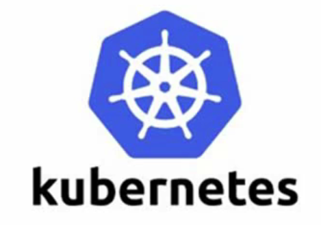
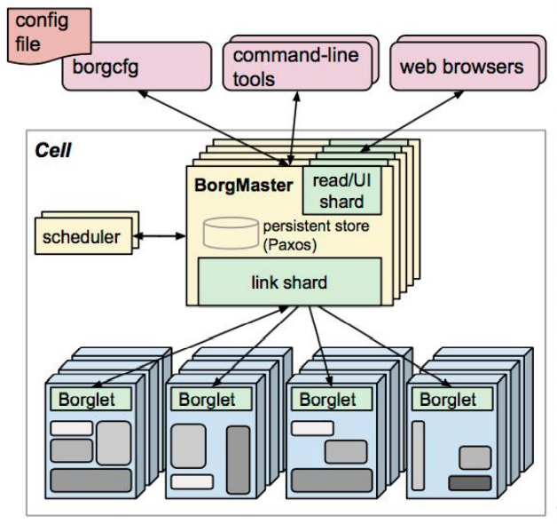

# Kubernetes

特点：

轻量级：消耗资源小

开源

弹性伸缩

负载均衡：IPVS

Pod：kubernetes中管理的最小单位，可以在一个Pod里面运行多个容器，相当于一个子节点

## 课程介绍

> 知识图谱

基础概念：什么事pod   控制器类型	k8s	网络通讯模式

Kubernetes： 构建k8s集群

资源清单：资源	掌握资源清单的语法	编写pod	**掌握pod的生命周期**

Pod控制器：掌握各种控制器的特点及使用定义方式

服务发现：掌握SVC	原理及其构建方式

储存：掌握多种存储类型的特点

并且能够在不同环境中选择合适的存储方案(有自己的理解)

调度器：掌握调度器原理	能根据要求把pod定义到想要的节点运行

安全：集群的认证	鉴权	访问控制	原理及其流程

HELM：Linux yum 	掌握HELM原理	HELM模板自定义	HELM部署一些常用插件

运维：修改kubeadm	达到证书可用期限为10年	构建高可用k8s集群

服务分类

​	有状态分类(数据库)

​	无状态分类：没有对应的存储需要实时保留(docker)

## 简介

### 概述

k8s的前身是borg系统

对于高可用集群来说，高可用节点最好保持在三个以上的奇数

在节点数量是奇数个的情况下， 集群总能对外提供服务（即使损失了一部分节点）；如果节点数量是偶数个，会存在集群不能用的可能性（**脑裂**成两个均等的子集群的时候）。

> borg架构

> k8s架构

etcd定位为可信赖(本身可以完成读写分离等操作，不会发生单节点故障)的分布式键值储存服务(k->v)，在borg中类似于Paxos

1. master节点

APISERVER：所有服务访问统一入口
ControllerManager：维持副本期望数目
Scheduler：负责接受任务，选择合适的节点进行分配任务
ETCD：键值对数据库  储存K8S集群所有重要信息（持久化）

2. node节点

Kubelet：直接跟容器引擎(docker)交互实现容器的生命周期管理
Kube-proxy：负责写入规则至 IPTABLES、IPVS 实现服务映射访问

3. 其他插件

COREDNS：可以为集群中的SVC创建一个域名IP的对应关系解析(访问集群中pod的时候不用ip地址，而用这个域名ip)
DASHBOARD：给 K8S 集群提供一个 B/S 结构访问体系
INGRESS CONTROLLER：官方只能实现四层代理，INGRESS 可以实现七层代理
FEDERATION：提供一个可以跨集群中心多K8S统一管理功能
PROMETHEUS：提供K8S集群的监控能力
ELK：提供 K8S 集群日志统一分析介入平台

### 基础概念 

> Pod概念

只要是新建了一个pod，pod里面就会启动一个pause容器；然后还可以启动很多自己的容器；

自己启动的容器会共用pod的网络栈和存储卷

* 可以在容器内使用localhost:port 就可以访问其他的容器，注意，由这里可知，容器间的端口不能冲突
* 在pause的存储也是共享的，容器内都可以访问

> 分类

* 自主式Pod：不是被控制器管理的pod
* 控制器管理的Pod

> 网络通讯方式

