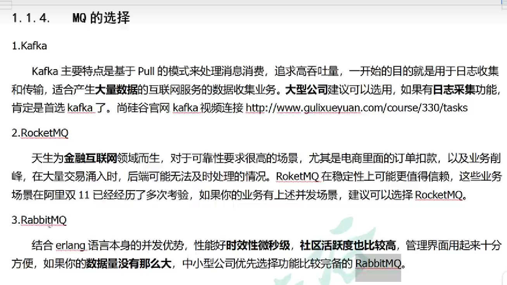

## RabbitMQ

消息队列；用于上下游传递消息，就是逻辑解耦+物理解耦的消息通信服务，消息发送上游只需要依赖MQ，不需要依赖其他东西

### 应用场景

**异步处理**

> 串行


> 并行(线程池)


> 消息队列


写入数据库就返回注册成功，并不关心邮件和短信是否发送成功

**应用解耦**

> 传统场景


当库存系统出现故障后，下订单就会失败

> 消息队列


将下单信息写入消息队列，就算库存系统出现故障，消息队列也能保证消息的可靠投递，不会导致消息丢失

**流量控制(削峰)**


比如说秒杀活动，就算请求很多，系统也可以全部接受，放入消息队列，应用程序只需要按自己最大的处理能力获取订单，达到削峰的作用

也可以控制阀值，超过阀值的直接丢掉

可以缓解短时间内的高流量压垮应用

**异步处理**





### 概述

> **重要概念**

* **消息代理**(message broker)：就是安装了消息中间件的服务器，发消息和接收消息都要连接这个服务器
* **目的地**(destination)：就是消息将要发给哪 

当消息发送者发送消息后，将由消息代理接管，消息代理保证消息传递到指定目的地

> 目的地

* 队列(queue)：点对点消息通信(point to point)
* 主题(topic)：发布(publish)/订阅(subscribe)消息通信

> 点对点模式

消息发送者发送消息，消息代理将其放入一个队列中，消息接受者从中获取内容，消息读取后被移出队列

消息只有唯一的发送者和接受者，但是接收者可以有多个 (就是可以有很多个应用订阅这个队列，但是最后只有一个会抢到)

> 发布订阅式

在消息被放入topic时，多个接收者(订阅了这个topic的)会同时收到这个消息；类似于b占关注up主，然后up主发视频后，粉丝同时收到消息

> JMS(Java Message Service)

基于jvm消息代理的规范(ActiveMQ和HornetMQ是JMS实现)

> AMQP(Advanced Message Queuing Protocol)

高级消息队列协议，消息代理的规范，兼容JMS

RabbitMQ是AMQP的实现


#### **RabbitMQ概念**

* Message：消息，没有名字，由消息头和消息体组成，消息体不透明，消息头：routing-key(路由键)、priority(相对于其他消息的优先权)、delivery-mode(指出该消息是否永久存储)等
* Publisher：消息生产者，也是向交换器发布消息的客户端应用程序(发消息是发给交换机)
* Exchange：交换器，接受生产者发送的消息并将消息路由给服务器的队列；exchange四种类型：direct(默认)、fanout、topic、headers，不同类型的消息转发策略不同
* Queue：消息队列，用来保存消息知道发送给消费者，它是消息的容器。一个消息可以投入一个或多个队列，消息一致在队列里，等待消费者取走消息
* Binging：绑定，一个绑定就是基于路由键将交换器和消息队列连起来的路由规则，可以把交换器理解为一个由绑定构成的路由表
* Connection：网络连接，TCP等；(一个客户端建立一个Connection，有多个Channel进行操作)
* Channel：信道，多路复用中一条独立的双向数据流通道。信道是建立在真实的TCP连接内的虚拟连接，AMQP命令都是由信道发出去的(发布或接受消息、订阅队列)。主要是对于操作系统来说建立和销毁TCP都是非常昂贵的开销，所以引入信道复用TCP连接

* Consumer：消费者，从消息队列获取消息的客户端程序(接受消息是监听队列)
* Virtual Host：虚拟主机，表示一批交换器、消息队列和相关对象；虚拟主机共享相同的身份认证和加密环境的独立服务器域；每个vhost本质是一个mini版的RabbitMQ服务器，拥有自己的队列、交换器、绑定和权限机制，RabbitMQ默认的vhost是/
* Broker：表示消息队列服务器实体


一个Connection多个Channel，相当于高速公路上多条道，

vhost可以用于不同环境(java和php)的隔离、也可以用于生产环境和开发环境的隔离

> 测试


#### Exchange交换器类型

direct、fanout、topic、headers(匹配消息的header，而不是路由，并且与direct完全一致，但性能差很多，基本用不到)

**direct**：点对点

将消息直接交给一个指定的队列，路由键按照绑定关系（Routing key）精确匹配，如果多个绑定的Routing key相同，就和广播是差不多的

**fanout**：广播(发布订阅)

广播类型，不处理或匹配路由键，只要队列绑定到该交换器，消息就会传到该交换器的所有队列（不用设置Routing key）

**topic**：发布订阅

部分广播模式，在广播模式的基础上可以挑给谁发消息

路由键需要和某个模式匹配，队列需要绑定一个模式，比如说：usa.*  可以匹配  usa.test 和 usa.dadad

单词之间用`.`隔开，`#` 匹配0个或多个单词，`*`匹配一个单词

`*.origin.*`:匹配第二个单词是origin的绑定

`lazy.#`：匹配第一个单词是lazy的绑定  

在topic交换机中：绑定routing key只有一个#类似广播，没有#和*类似直连点对点

#### 消费者消息不公平分发

多个消费者监听同一个队列默认是轮询发送的

可以设置按消息消费的速率进行不公平分发节约资源（防止一个消费者浪费资源进行等待，另一个消费者一直在消费容易出故障）

设置每个消费者的预取值

```java
channel.basicQos(1); # 1为不公平分发，默认值是0表示轮询；设置大于1表示预取值 
```

#### 发布确认

消息生产者保证消息一定能存在rabbitmq的磁盘上，需要rabbit进行确认回调

1. 单个发布确认，同步，很慢
2. 批量发布确认，发布一定数量的消息再确认，可以收到消息没有存在队列中，但是不能知道是哪条消息
3. 异步确认，设置一个确认回调监听器，在发送前将消息的key和消息体存入concurrentmap中，确认回调只会返回消息的Key信息不会返回消息；调用错误回调时通过map获取对应消息重新发


### 延时队列

发到这个队列的消息需要30分钟以后才能被人收到

实现定时任务的效果，比如订单30分钟后(扫描数据库)未支付，关闭订单；库存 40分钟后订单不存在或取消，解锁库存

如果使用定时任务，会消耗系统内存，增加数据库压力，存在较大的时间误差(失效问题，比如刚扫描完后1分钟的时候下单，下次扫描订单生成29分钟，要再下一次扫描才会扫到)

解决：使用rabbitmq的消息TTL和死信Exchange

Rabbitmq可以对队列和消息都指定TTL

TTL：消息存活时间

**死信**：消息在一定时间里没有被人消费

* 一个消息被consumer拒收了，并且reject方法里面的参数requeue为false，就是不会再次放入队列里
* 消息的TTL到了，消息过期
* 队列的长度限制满了，排在最前面的消息会被丢弃或扔到死信路由上

我们可以控制消息在一段时间后变成死信，可以控制变成死信的消息路由到指定的交换机，结合两者，就实现了延时队列

#### 实现

可以设置消息的过期时间、也可以设置队列的过期时间(队列里面消息的过期时间)


**建议设置队列过期**，因为rabbitmq使用惰性检查的，比如说发了两个消息进队列，第一个过期时间是5分钟，第二个是1分钟，当服务器进行检查的时候发现第一个是5分钟，就放进队列了，等五分钟后再来检查，把第一个丢掉，再看第二个

订单实现见 **分布式事务.RabbitMQ延时队列**

#### 场景

1. 订单创建十分钟之后未支付则自动取消
2. 用户注册成功后，如果三天内没有登录则进行短信提醒
3. 用户退款三天内没处理则通知运维人员
4. 预定会议后，在预定的时间点前10分钟通知各个人员参与会议

### 安装

> docker安装

```bash
docker run -d -e RABBITMQ_DEFAULT_USER=admin -e RABBITMQ_DEFAULT_PASS=admin -p 5671:5671 -p 5672:5672 -p 4369:4369 -p 25672:25672 -p 15671:15671 -p 15672:15672  -v /home/rabbitmq/data:/var/lib/rabbitmq --restart=always --name rabbitmq rabbitmq:management
```

4369,25672：erlang发现&集群端口

5672,5671：AMQP端口

15672：web管理后台端口

61613,61614：STOMP端口

1883,8883：MQTT端口

### SpringBoot整合RabbitMQ

```xml
<dependency>
    <groupId>org.springframework.boot</groupId>
    <artifactId>spring-boot-starter-amqp</artifactId>
</dependency>
```

```yml
@EnableRabbit

spring:
  rabbitmq:
 	host: @spring.rabbit.host@
    port: 5672
    username: admin
    password: admin
    virtual-host: /
```

```java
 * 使用RabbitMQ
 * 1.引入amqp场景，RabbitAutoConfiguration自动生效
 * 2.给容器中自动配置了
 *      RabbitTemplate、AmqpAdmin、CachingConnectionFactory、RabbitMessagingTemplate
 * 3.@EnableRabbit 开启RabbitMQ的功能
 * 4.@RabbitListener  监听队列消息，得到消息(队列必须存在)；必须开启@EnableRabbit
     
     * 参数可以写的参数
     * 1.Message:原生消息详细信息，头+体
     *  T : 直接是发送消息的实体内容
     *  Channel channel: 当前传输数据的通道
     *
     * 2.可以有很多人来监听这个队列；只要收到消息，队列就会删除这个消息，而且只能有一个能收到消息
     *  1)订单服务启动多个，同一个消息，只能有一个客户端收到
     *  2)只有一个消息完全处理完，方法运行结束，才会接收到下一个消息
     * 3.@RabbitListener(queues = {"hello-java-queue"})：可以放在类、方法上  @RabbitHandler放在方法上
     *  当@RabbitListener放在类上，使用@RabbitHandler 该方法就监听队列，多个方法加这个注解 类似重载，处理不同的实体，区分不同的场景
 
         
// test
public class GulimallOrderApplicationTests {

    @Autowired
    AmqpAdmin amqpAdmin;

    @Autowired
    RabbitTemplate rabbitTemplate;

    @Test
    public void testSendMessage(){
        // 如果发送的消息是一个对象，实体需要实现Serializable接口
        // 默认使用自己的编码，在RabbitConfig中配置了 转成json的编码器
        for (int i=0;i<10;i++){
            OrderReturnReasonEntity orderReturnReasonEntity = new OrderReturnReasonEntity();
            orderReturnReasonEntity.setName("name："+i);
            rabbitTemplate.convertAndSend("hello-java-exchange","hello.java",orderReturnReasonEntity, new CorrelationData(UUID.randomUUID().toString()));  // new CorrelationData() 是消息的唯一id

        }
    }

    /**
     * 创建Exchange、Queue、Binding
     *
     * 收发消息
     */
    @Test
    public void createExchange(){
        //  public DirectExchange(String name, boolean durable, boolean autoDelete)
        //  durable:是否持久化   autoDelete:是否自动删除 没有队列和该交换机绑定的时候就会自动删除
        DirectExchange directExchange = new DirectExchange("hello-java-exchange", true, false);
        amqpAdmin.declareExchange(directExchange);
        log.info("Exchange[{}]创建成功","hello-java-exchange");
    }

    @Test
    public void createQueue(){
        // public Queue(String name, boolean durable, boolean exclusive, boolean autoDelete, Map<String, Object> arguments)
        //  durable:是否持久化 exclusive:是否排它(只要有一条连接连上了这个队列，其他连接都连不上这个队列，一般false) autoDelete:是否自动删除
        Queue queue = new Queue("hello-java-queue", true,false,false);
        amqpAdmin.declareQueue(queue);
        log.info("Queue[{}]创建成功","hello-java-queue");
    }

    @Test
    public void createBinding(){
        // public Binding(String destination, Binding.DestinationType destinationType, String exchange, String routingKey, Map<String, Object> arguments) {
        // destination:目的地 destinationType:目的地类型 exchange:交换机 routingKey:路由Key
        Binding binding = new Binding("hello-java-queue",Binding.DestinationType.QUEUE,
                "hello-java-exchange","hello.java",null);
        amqpAdmin.declareBinding(binding);
        log.info("Binding[{}]创建成功","hello-java-binding");
    }
}
         

@Service("orderItemService")
@RabbitListener(queues = {"hello-java-queue"})
public class OrderItemServiceImpl{

    @RabbitHandler
    public void recieveMessage(Message message, OrderReturnReasonEntity orderReturnReasonEntity){
        System.out.println("接收到消息："+orderReturnReasonEntity);
    }
}
```

#### Rabbit消息确认机制---可靠抵达

* **保证消息**不丢失，可靠抵达，可以使用事务消息，性能下降250倍 ；为此引入确认机制

* publisher  confirmCallback   确认模式
* publisher  returnCallback    未投递到queue 退回模式
* consumer   ack机制


> 确认回调--ConfirmCallback   

spring.rabbitmq.publisher-confirms=true


> 错误回调--returnCallback

触发时机--消息投递失败(未投递到队列里面的消息就会触发这个)

spring.rabbitmq.publisher-returns=true

spring.rabbitmq.template.mandatory=true


> 可靠抵达--ack(手动确认)

消费者获取消息，成功处理，可以回复ack给broker；开启手动确认ack

spring.rabbitmq.listener.simple.acknowledge-mode=manual    

* basic.ack：用于肯定确认，broker将移除此消息
* basic.nack：用于否定确认，可以指定broker是否丢弃此消息，可以批量
* basic.reject：用于否定确认，同上，但不能批量


消息可靠抵达配置

```java
package com.lvboaa.gulimall.order.config;

import org.springframework.amqp.core.Message;
import org.springframework.amqp.rabbit.connection.CorrelationData;
import org.springframework.amqp.rabbit.core.RabbitTemplate;
import org.springframework.amqp.support.converter.Jackson2JsonMessageConverter;
import org.springframework.amqp.support.converter.MessageConverter;
import org.springframework.beans.factory.annotation.Autowired;
import org.springframework.context.annotation.Bean;
import org.springframework.context.annotation.Configuration;

import javax.annotation.PostConstruct;
@Configuration
public class RabbitConfig {

    @Autowired
    RabbitTemplate rabbitTemplate;

    @Bean
    public MessageConverter messageConverter(){
        return new Jackson2JsonMessageConverter();
    }

    /**
     * 定制RabbitTemplate
     * 1.服务器收到消息就回调
     *      1.spring.rabbitmq.publisher-confirms=true
     *      2.设置消息回调ConfirmCallback
     * 2.消息正确抵达队列进行回调
     *      1.spring.rabbitmq.publisher-returns=true
     *        spring.rabbitmq.template.mandatory=true
     *      2.设置投递失败异步回调ReturnCallback
     * 3.消费端确认(保证每个消息正确被消费，此时消息才可以被broker删除)
     *      1.默认是自动确认的，只要消息接收到，客户端自动确认，服务端就会移除这个消息
     *      问题：我们收到很多消息，自动回复给服务器ack,只有一个消息处理成功，然后宕机，就会发生消息丢失
     *      解决：手动确认，设置spring.rabbitmq.listener.direct.acknowledge-mode=manual
     *          (不进行手动确认(消息状态一直为unacked)，队列就不会移除这个消息，宕机消息也不会丢失，状态变为ready)
     *      2.如何签收
     *         签收：channel.basicAck(deliveryTag,false);  业务成功完成
     *         退回(拒签)：channel.basicNack(deliveryTag,false,true); channel.basicReject();  业务处理失败
     */
    @PostConstruct  // RabbitConfig对象创建完成以后，执行构造方法以后就执行这个方法
    public void initRabbitTemplate(){

        //设置确认回调
        rabbitTemplate.setConfirmCallback(new RabbitTemplate.ConfirmCallback() {
            /**
             *
             * @param correlationData  当前消息的唯一关联数据(这个是消息的唯一id)
             * @param b     (消息是否成功)   只要消息抵达Broker(服务代理)，这个就为true
             * @param s     (失败的原因)
             */
            @Override
            public void confirm(CorrelationData correlationData, boolean b, String s) {
//                System.out.println("confirmcallback:"+correlationData+" "+b+" "+s);
            }
        });

        //设置消息抵达队列的确认回调
        rabbitTemplate.setReturnCallback(new RabbitTemplate.ReturnCallback() {
            /**
             *  只有消息没有投递给指定的队列才会触发这个失败回调
             * @param message   投递失败的消息的详细信息
             * @param i         回复的状态码
             * @param s         回复的文本内容
             * @param s1        当时消息发给哪个交换机
             * @param s2        当时消息使用哪个路由键
             */
            @Override
            public void returnedMessage(Message message, int i, String s, String s1, String s2) {
//                System.out.println("Fail Message:"+message+" "+i+" "+s+" "+s1+" "+s2);
            }
        });
    }
}

// 消费者手动ack，确认接受或退回
@RabbitHandler
public void recieveMessage(Message message, OrderReturnReasonEntity orderReturnReasonEntity, Channel channel){
    System.out.println("接收到消息："+orderReturnReasonEntity);

    // channel内按顺序自增的
    long deliveryTag = message.getMessageProperties().getDeliveryTag();

    // 签收货物 multiple代表是否批量签收
    try {
        if (deliveryTag % 2 == 0){
            channel.basicAck(deliveryTag,false);
            System.out.println("签收了货物..."+deliveryTag);
        }else {
            // 退货  channel.basicReject();
            // requeue 拒收了消息是否重新入队  true:入队 false:丢弃
            channel.basicNack(deliveryTag,false,true);

            System.out.println("退回了货物..."+deliveryTag);
        }

    } catch (IOException e) {
        // 网络中断异常信息
        e.printStackTrace();
    }
}
```

#### 保证消息可靠性--消息丢失、重复、积压等

> 消息丢失

消息发送出去，由于网络问题没有抵达服务器

* 做好容错方法(try-catch)，发送消息时可能有网络问题，失败后要有重试机制，可记录到数据库，采用定期扫描重发的方式
* 做好日志记录，每个消息状态是否被服务器收到都应该做记录
* 做好定期重发、如果消息没有发送成功，定期扫描数据库对未成功发送的消息重发

消息抵达broker，broker要将消息写入磁盘(持久化)才算成功，此时broker尚未完成持久化，宕机

* publisher也需要加入确认回调机制，确认成功的消息，再修改数据库消息状态

自动ack状态下，消费者收到消息，但没来得及消费然后宕机

* 一定要开启手动ACK，消费成功才移除，失败或没来得及处理就noack并重新入队

**总结**：

1. 做好消息确认机制(publisher的ConfirmCallback，consumer的手动ack)
2. 每一个发送的消息都保存在数据库；定期将失败的消息再发一遍

> 消息重复

消息消费成功，由于重试机制，自动将消息发送出去(允许)

消息消费成功，事务已经提交，ack时，机器宕机，导致没有ack成功，Broker的消息重新由unack变为ready，并发送给其他消费者

* 消费者的业务消费接口应设计为**幂等性**的，比如扣库存有工作单的状态标签
* 使用**防重表**(redis/mysql)，发送消息每一个都要业务的唯一标识，处理过就不处理
* rabbitmq每一个消息都有redelivered字段，可以获取**是否是被重新投递过来的**

> 消息积压

消费者宕机积压

消费者消费能力不足积压

发送者发送流量太大

* 上线更多的消费者，进行正常消费
* 上线专门的队列消费服务，将消息先批量取出来，记录数据库，离线慢慢处理