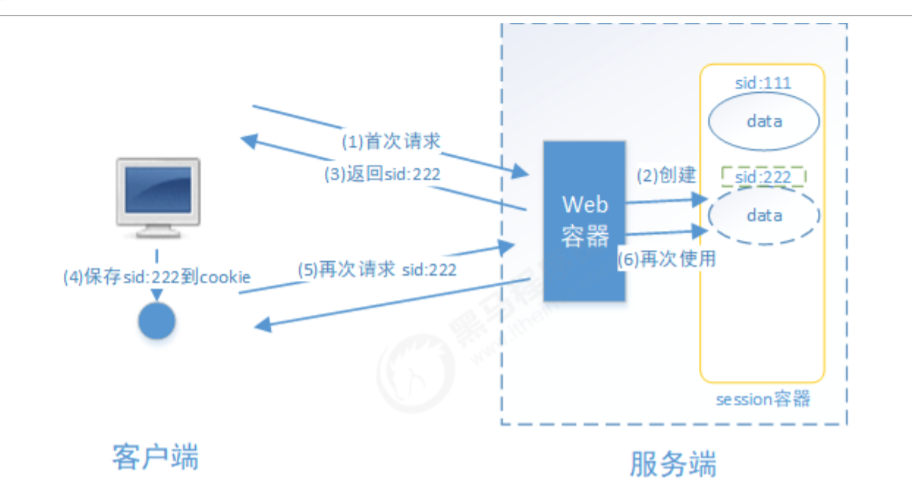
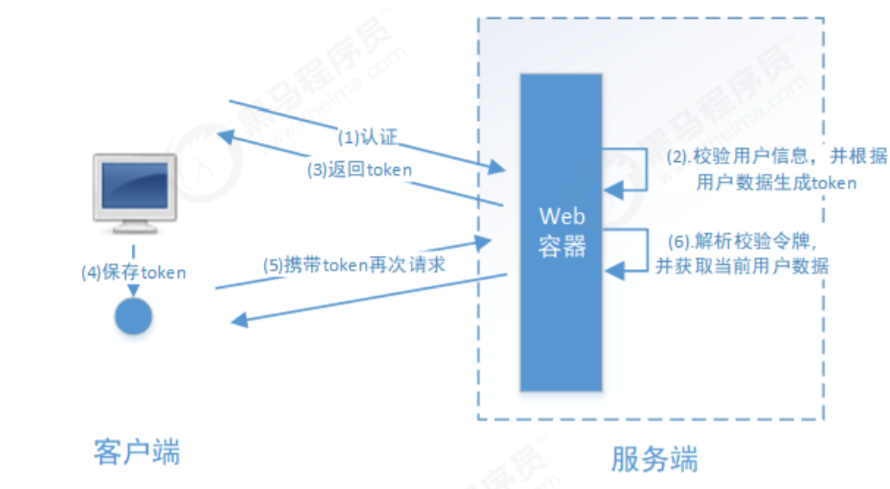
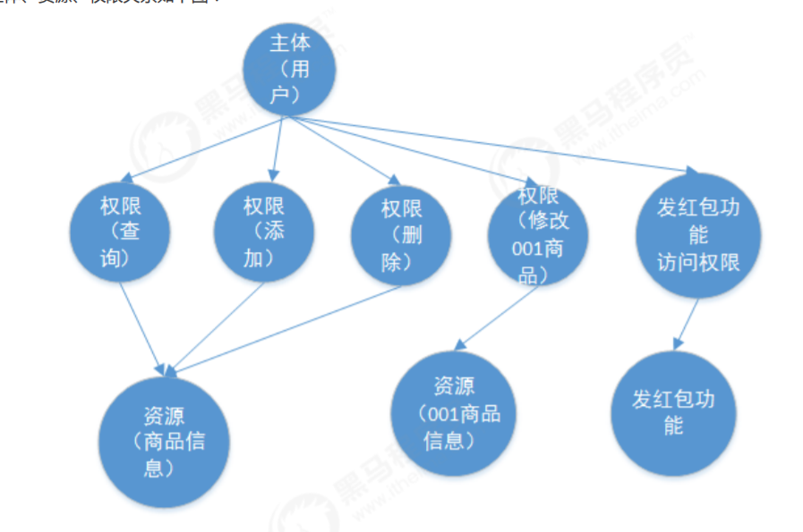
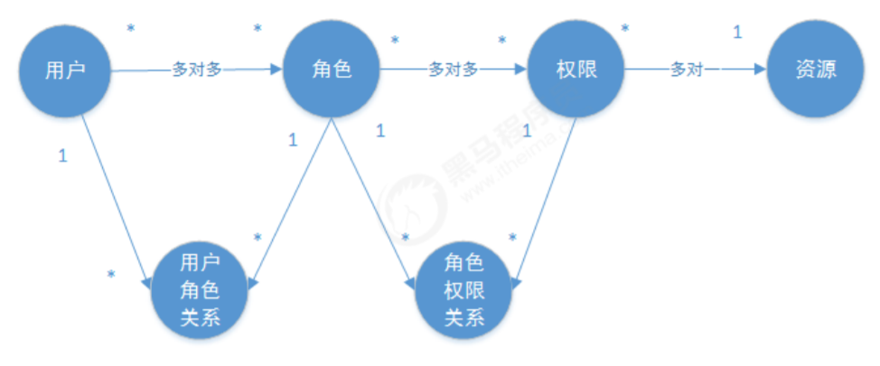
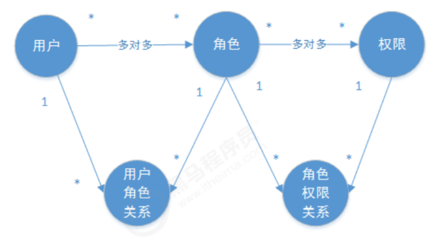
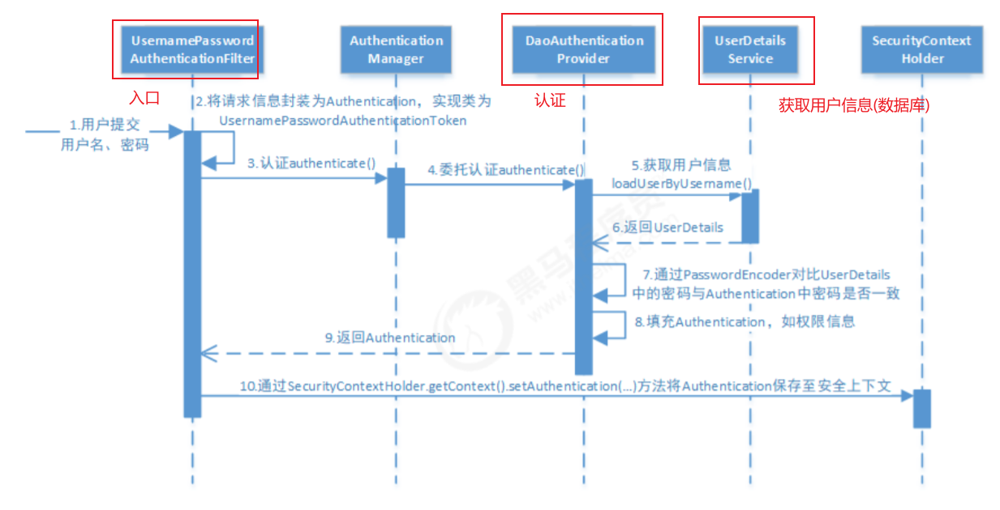
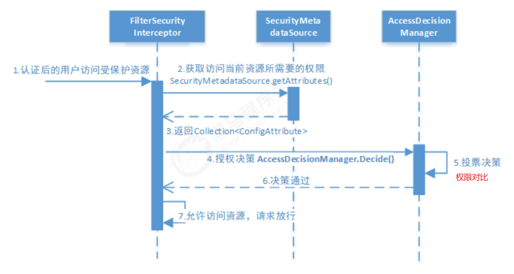
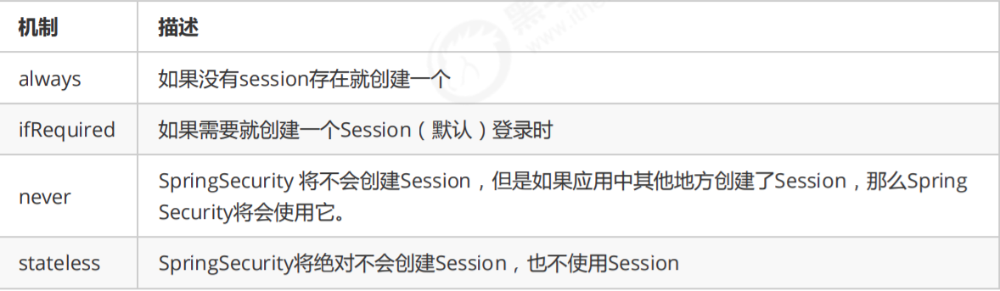

# 单点登录

## SpringSecurity

### 简介

打开浏览器访问网站到关闭浏览器就是一次会话，用户认证通过后，为了避免用户的每次操作都进行认证可将用户的信息保证在会话中。会话就是系统为了保持当前 用户的登录状态所提供的机制，常见的有基于session方式、基于token方式等。 

**基于session的认证方式**： 它的交互流程是，用户认证成功后，在服务端生成用户相关的数据保存在session(当前会话)中，发给客户端的 sesssion_id 存放到 cookie 中，这样用户客户端请求时带上 session_id 就可以验证服务器端是否存在 session 数 据，以此完成用户的合法校验，当用户退出系统或session过期销毁时,客户端的session_id也就无效了。



**基于token方式**： 它的交互流程是，用户认证成功后，服务端生成一个token发给客户端，客户端可以放到 cookie 或 localStorage 等存储中，每次请求时带上 token，服务端收到token通过验证后即可确认用户身份。



**认证和授权**

输入账号和密码 登录微信的过程就是认证。

认证是为了保证用户身份的合法性，授权则是为了更细粒度的对隐私数据进行划分，**授权是在认证通过后发生的， 控制不同的用户能够访问不同的资源。** 授权： 授权是用户认证通过根据用户的权限来控制用户访问资源的过程，拥有资源的访问权限则正常访问，没有权限则拒绝访问。

> 授权数据模型

授权可简单理解为Who对What(which)进行How操作

用户、资源和权限关系图：



对应的数据模型(E-R图)：

主体（用户id、账号、密码、...） 

资源（资源id、资源名称、访问地址、...） 

权限（权限id、权限标识、权限名称、资源id、...）

 角色（角色id、角色名称、...） 

角色和权限关系（角色id、权限id、...） 

主体（用户）和角色关系（用户id、角色id、...）



通常企业开发中将资源和权限表合并为一张权限表，如下： 

资源（资源id、资源名称、访问地址、...）

 权限（权限id、权限标识、权限名称、资源id、...） 

合并为：

 权限（权限id、权限标识、权限名称、资源名称、资源访问地址、...）



**主要是：把权限赋予角色，把角色分给用户**

### 认证授权流程

spring Security功能的实现主要是由一系列过滤器链相互配合完成，认证和授权主要是Authentication Manager和AccessDecision Manager进行处理

* SecurityContextPersistenceFilter：是整个拦截过程的入口和出口（也就是第一个和最后一个拦截 器）

* UsernamePasswordAuthenticationFilter：处理来自表单的提交，主要进行认证
* FilterSecurityInterceptor：主要进行授权
* ExceptionTranslationFilter：捕获过滤链的异常进行处理，只能捕获AuthenticationException和AccessDeniedException，其它的异常它会继续抛出

#### 认证



DaoAuthenticationProvider的职责最大：完成完整的认证流程，同时会把UserDetails填充至Authentication。

UserDetailsService负责从特定 的地方（通常是数据库）加载用户信息

可以通过自定义 UserDetailsService 从数据库中获取用户信息

```java
@Service
public class SpringDataUserDetailsService implements UserDetailsService {

    @Autowired
    UserDao userDao;

    //根据 账号查询用户信息
    @Override
    public UserDetails loadUserByUsername(String username) throws UsernameNotFoundException {

        //将来连接数据库根据账号查询用户信息
        UserDto userDto = userDao.getUserByUsername(username);
        if(userDto == null){
            //如果用户查不到，返回null，由provider来抛出异常
            return null;
        }
        //根据用户的id查询用户的权限 数据库中获取
        List<String> permissions = userDao.findPermissionsByUserId(userDto.getId()); 
        //将permissions转成数组
        String[] permissionArray = new String[permissions.size()];
        permissions.toArray(permissionArray);
        UserDetails userDetails = 						User.withUsername(userDto.getUsername()).password(userDto.getPassword()).authorities(permissionArray).build();
        return userDetails;
    }
}
```

#### 授权



决策机制：有三个状态：赞成、反对、弃权

* AffirmativeBased：有一个通过就算通过、全部弃权也表示通过
* ConsensusBased：赞成数大于反对数就通过、相同且不等于零就看allowIfEqualGrantedDeniedDecisions是否为true，为true就通过，都弃权也是这样
* UnanimousBased：有反对就不通过；没有反对票有赞成通过；全部弃权看allowIfEqualGrantedDeniedDecisions是否为true，

#### 会话控制



配置

```java
@Override
protected void configure(HttpSecurity http) throws Exception {
	http.sessionManagement().sessionCreationPolicy(SessionCreationPolicy.IF_REQUIRED)
}
```

使用stateless，则说明Spring Security对登录成功的用户不会创建Session，应用程序也不允许新建 session。并且它会暗示不使用cookie，所以每个请求都需要重新进行身份验证。这种无状态架构适用于REST API 及其无状态认证机制（也就是token验证）。

## 分布式系统认证

用户名密码认证、短信验证码、二维码、人脸识别 等认证

#### Spring-Security-OAuth2

OAuth2.0的服务提供方涵盖两个服务，即授权服务 (Authorization Server，也叫认证服务) 和资源服务 (Resource Server)


