# Docker
弱小和无知不是生存的障碍，傲慢才是。
## Docker概述
问题：项目在我的电脑可以运行，在你的电脑不能运行
解决：项目带上环境打包（不再需要配置麻烦的环境）

Docker提出解决方案，打包的环境称为镜像 ---（Docker仓库有所有镜像，直接下载）


docker的思想来源于集装箱

原来JRE 多个应用端口交叉 产生冲突

隔离：docker核心思想，打包装箱，每个箱子是相互隔离的，可以将服务器利用到极致

> DevOps(开发、运维)

**应用更快地交付和部署**
docker打包镜像发布测试，一键运行
**更便捷的升级和扩缩容**
 部署应用就像搭积木一样，扩展直接运行镜像
**更简单的系统运维**
在容器化之后，开发和测试环境是高度一致的
**更高效的计算资源利用**
Docker是内核级别的虚拟化，可以在一个物理机上运行多个容器，可以把服务器的性能压榨到极限

## Docker安装
### Docker基本组成


**镜像（image）:**
docker镜像好比是一个模板（java类），通过这个模板创建多个容器（实例对象），tomcat镜像-->run-->tomcat01容器
**容器（container）:**
docker利用容器技术，独立运行一个或一组应用，通过镜像创建
启动、停止、删除、基本命令，可以把容器理解为一个简易的linux系统
**仓库（repository）:**
存放镜像的地方，
仓库分为公有仓库和私有仓库
Docker Hub，默认是国外的，阿里云....都有自己的仓库

### 安装Docker
[帮助文档](https://docs.docker.com/)：
```bash
# 1.卸载原来的版本
yum remove docker \
                  docker-client \
                  docker-client-latest \
                  docker-common \
                  docker-latest \
                  docker-latest-logrotate \
                  docker-logrotate \
                  docker-engine
# 2.需要的安装包
yum install -y yum-utils

# 3.安装docker 阿里云镜像 默认国外的 贼慢
yum-config-manager \
    --add-repo \
    http://mirrors.aliyun.com/docker-ce/linux/centos/docker-ce.repo	

# 4.更新yum软件包索引
yum makecache fast

# 5.安装docker ce社区版（推荐使用） ee企业版
yum install docker-ce docker-ce-cli containerd.io

# 6.启动docker 
systemctl start docker

# 7.查看docker版本 测试docker是否安装成功
docker version

# 8.测试hello-world
docker run hello-world
docker images #查看所有镜像

# 9.卸载docker
yum remove docker-ce docker-ce-cli containerd.io #卸载依赖
rm -rf /var/lib/docker
rm -rf /var/lib/containerd #删除资源
```

### 阿里云镜像加速

```bash
# 依次执行命令 加速就配置完成了
sudo mkdir -p /etc/docker

sudo tee /etc/docker/daemon.json <<-'EOF'
{
  "registry-mirrors": ["https://wx5qlxgn.mirror.aliyuncs.com"]
}
EOF

sudo systemctl daemon-reload

sudo systemctl restart docker
```

**docker run hello-world 流程**


### 底层原理
**Docker是怎么工作的**
Docker是一个Client-Server结构的系统，Docker的守护进程运行在主机上，通过socket从客户端访问。
DockerServer接收到Docker-Client的指令，就执行这个命令

**Docker为什么比VM快**
1、Docker有着比虚拟机更少的抽象层
2、Docker利用宿主机的内核，VM使用Guest OS

Docker在新建容器的时候，不需要像虚拟机重新加载一个虚拟机内核，避免引导。虚拟机是分钟级别的，Docker省略了加载内核这个操作，是秒级的。

## Docker常用命令
### 帮助命令
```bash
docker version #显示docker的信息
docker info #docker更详细的命令 包括镜像和容量的数量
docker 命令 --help #帮助命令
```
### 镜像命令
```bash
docker images #展示所有镜像
------------- -a #列出所有镜像
------------- -q #只显示镜像的id

docker search 镜像名#搜索镜像
docker search mysql --filter=STARS=3000 #搜索STARS不小于3000的镜像
# 可以使用docker search --help 查看增强命令
```
**docker pull**下载镜像
```bash
docker pull 镜像名[:tag]#下载镜像 tag是版本 默认是最新版

[root@iZwz9c60vngef9soia3dgpZ ~]# docker pull mysql
Using default tag: latest  #不写版本 默认
latest: Pulling from library/mysql
69692152171a: Pull complete #分层下载，docker image的核心 联合文件系统
1651b0be3df3: Pull complete 
951da7386bc8: Pull complete 
0f86c95aa242: Pull complete 
37ba2d8bd4fe: Pull complete 
6d278bb05e94: Pull complete 
497efbd93a3e: Pull complete 
f7fddf10c2c2: Pull complete 
16415d159dfb: Pull complete 
0e530ffc6b73: Pull complete 
b0a4a1a77178: Pull complete 
cd90f92aa9ef: Pull complete 
Digest: sha256:d50098d7fcb25b1fcb24e2d3247cae3fc55815d64fec640dc395840f8fa80969 #签名
Status: Downloaded newer image for mysql:latest
docker.io/library/mysql:latest #真实地址

# 下面两个等价
docker pull mysql 
docker.io/library/mysql:latest

#指定版本
[root@iZwz9c60vngef9soia3dgpZ ~]# docker pull mysql:5.7
5.7: Pulling from library/mysql
69692152171a: Already exists #文件系统的好处，相同的共用，不用下载
1651b0be3df3: Already exists 
951da7386bc8: Already exists 
0f86c95aa242: Already exists 
37ba2d8bd4fe: Already exists 
6d278bb05e94: Already exists 
497efbd93a3e: Already exists 
a023ae82eef5: Pull complete 
e76c35f20ee7: Pull complete 
e887524d2ef9: Pull complete 
ccb65627e1c3: Pull complete 
Digest: sha256:a682e3c78fc5bd941e9db080b4796c75f69a28a8cad65677c23f7a9f18ba21fa
Status: Downloaded newer image for mysql:5.7
docker.io/library/mysql:5.7
```
**docker rmi**删除镜像
```bash
docker rmi -f 镜像id #删除指定容器
docker rmi -f id1,id2,id3 #删除多个容器
docker rmi -f $(docker images aq) #删除全部容器
```

### 容器命令
说明：有了镜像才可以创建容器
下载centos测试一下：`docker pull centos`
**新建容器并启动**
```bash
docker run [可选参数] image
#参数说明
--name="Name" #取名字 tomcat1,tomcat2 区分容器
-d 			  #后台方式运行 相比前台减少交互 类似于 jar 的nohup
-it 		  #使用交互方式运行，进入容器查看内容
-p			  #指定容器端口 -p 8080:8080 只有-P 会随机指定端口
	-p ip:主机端口:容器端口
	-p 主机端口:容器端口（常用）
	-p 容器端口
	容器端口

#测试，启动并进入容器 /bin/bash表示使用bash格式进入控制台
[root@iZwz9c60vngef9soia3dgpZ ~]# docker run -it centos /bin/bash
[root@f838880aae6d /]# ls #容器内的centos，但是很多命令不是很完善
bin  dev  etc  home  lib  lib64  lost+found  media  mnt  opt  proc  root  run  sbin  srv  sys  tmp  usr  var
exit #退出容器
```

**列出运行的容器**
```bash
docker ps #列出正在运行的容器
-a #列出当前运行的容器及历史运行过的容器
-n=数字 #显示指定数量的容器
-q #显示容器的编号
```

**退出容器**
```bash
exit 		 #直接停止容器并退出
Ctrl + P + Q #不停止容器退出
```

**删除容器**
```bash
docker rm 容器id 			    #删除指定的容器，不能删除正在运行的容器 前置删除使用 rm -f   rm -r是递归删除
docker rm -f $(docker ps -aq)   #删除所有的容器
docker ps -a -q|xargs docker rm #删除所有容器  linux命令版
```

**启动和停止容器**
```bash
docker start    #启动容器
docker restart  #重启容器
docker stop     #停止正在运行的容器
docker kill		#强制停止容器
```

### 常用其他命令
**后台启动容器**
```bash
docker run -d 镜像名
# 问题，使用docker ps 发现镜像停止
# 坑 docker 后台运行 必须要有一个前台进程，docker发现没有应用，就会自动停止
# nginx也是这样  tomcat可以后台启动
```


**进入当前正在运行的容器**
```bash
docker exec -it 容器id /bin/bash #打开新的终端
docker attach 容器id    #进入之前的终端，不会启动新的终端
```

**从容器内拷贝文件到主机上**
```bash
docker cp 容器id:容器内路径 主机路径
docker cp 9d3ea528a548:/home/test.java /home
```

**日志**
```bash
docker logs 容器id #打印日志

# 骚操作，因为docker run -d centos 后台启动会直接关掉，使用shell脚本编程 无限循环打野kuangshen 不会关闭
docker run -d centos /bin/sh -c "while true;do echo kuangshen;sleep 1;done"

docker logs -f -t --tail 10 5c23626bb915 #打印十条日志并更新最新日志
docker logs -ft --tail 10 5c23626bb915   #和上面相同
docker logs -ft  5c23626bb915			 #打印全部日志
```

**查看容器中的进程**
```bash
docker top 容器id
```
查看容器元数据
```bash
docker inspect 容器id
```

### 作业练习
> docker部署nginx

```bash
docker search nginx #搜索镜像 建议在docker hub搜  可以看帮助文档
docker pull nginx   #下载镜像
docker images		#查看是否下载成功
docker run -d --name nginx01 -p 4433:80 nginx 
#-d后台运行  --name 取名  -p 主机端口:容器内部端口
curl localhost:3344  #测试是否能成功，成功的话 外网就能访问了

#进入容器
[root@smilve ~]# docker exec -it nginx01 /bin/bash
root@21c034078a1e:/# whereis nginx
nginx: /usr/sbin/nginx /usr/lib/nginx /etc/nginx /usr/share/nginx
root@21c034078a1e:/# cd /etc/nginx/
root@21c034078a1e:/etc/nginx# ls
conf.d	fastcgi_params	mime.types  modules  nginx.conf  scgi_params  uwsgi_params

```
端口暴露的概念
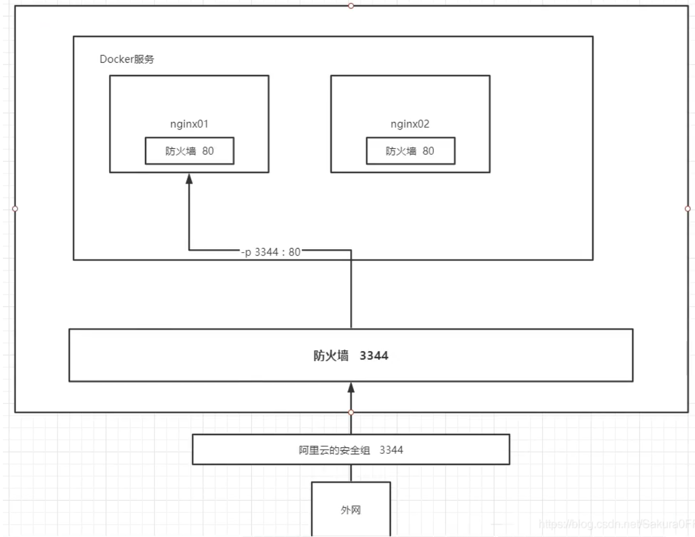
思考：每次改动nginx配置文件，都需要进入容器内部，十分麻烦，要是可以在容器外部提供一个映射，达到在容器外修改文件内容，容器内自动修改？使用 -v 数据卷挂载！

>docker部署tomcat

```bash
#官方部署tomcat 
docker run -it --rm tomcat:9.0  # --rm 一般用来测试，用完关闭容器就被删除了

docker pull tomcat  #下载最新版
docker run -d -p 8080:8080 --name tomcat01 tomcat   #启动运行

#测试访问没有问题

docker exec -it tomcat01 /bin/bash    #进入运行的tomcat01容器
#发现问题 linux命令少了  并且tomcat的webapps目录下没有文件
#阿里云镜像的原因，默认是最小的镜像，保证最小可运行的环境，所有不需要的都剔除
#文件在webapps.dist下面，执行`cp -r webapps.dist/* webapps`即可成功访问
```

>部署es + kibana

```bash
# es 暴露的端口很多
# es 十分耗资源
# es 数据应该放在安全目录！挂载

# 官方的不设置内存参数
docker run -d --name elasticsearch01 -p 9200:9200 -p 9300:9300 -e "discovery.type=single-node" elasticsearch:7.6.2
# 启动之后服务器直接爆炸，很卡 es十分耗内存

docker stats  	#查看docker 容器使用的cpu 内存等信息 一直刷新

# 设置内存参数启动，增加内存限制  -e ES_JAVA_OPS="-Xms64m -Xmx512m"
docker run -d --name elasticsearch02 -p 9200:9200 -p 9300:9300 -e "discovery.type=single-node" -e ES_JAVA_OPS="-Xms64m -Xmx512m" elasticsearch:7.6.2
curl localhost:9200  #测试运行成功
```

使用kibana连接es？思考网络如何连接
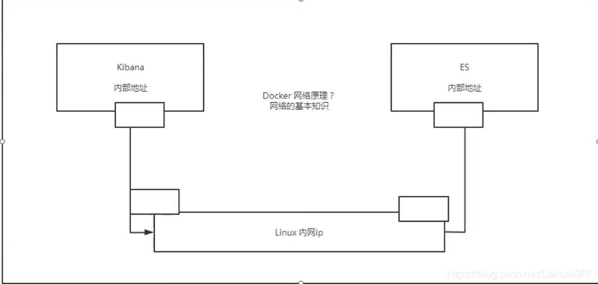
### 可视化工具
下着玩 还是用命令行

* portainer(先用这个)
```bash
# 图形化界面 提供一个后台面板操作docker
docker run -d -p 8080:9000 --restart=always -v /var/run/docker.sock:/var/run/docker.sock --privileged=true portainer/portainer
```
* Rancher(CI/CD再用)

## Docker镜像讲解
### 镜像是什么
镜像是一种轻量级、可执行的独立软件包，用来打包软件运行环境和基于运行环境开发的软件，包含运行某个软件所需的所有内容，包括代码、运行的库、环境变量和配置文件
所有的应用，直接打包docker镜像可以直接运行

如何得到镜像：
* 远程仓库下载
* 朋友拷给你
* 自己制作一个镜像：DockerFile

### Docker镜像加载原理
>UnionFS(联合文件系统)

联合文件系统：一种分层、轻量并高性能的文件系统，支持对文件系统的修改座位一次提交来一层层的叠加，同时将不同目录挂载到同一个虚拟文件系统下。Union文件系统是Docker镜像的基础。镜像可以通过分层来进行继承（类似于java类之间的继承），基于基础镜像（没有父镜像），可以制作各种具体的应用镜像。
特性：一次同时加载多个文件系统，但是从外面看，只能看到一个文件系统，联合加载把各层文件系统叠加起来，最终的文件系统包含所有底层的文件和目录。
下载时看到一层层的东西就是这个

>Docker镜像加载原理

docker的镜像实际是由一层一层的文件系统组成的，层级系统的文件系统是UnionFS

bootfs(boot file system)主要包含bootloader和kernel，bootloader主要引导加载kernel，Linux刚启动会加载bootfs文件系统，在Docker镜像的最底层是bootfs。这一层与我们典型的Linux/Unix系统一样，包含boot加载器和内核。当boot加载完成之后整个内核都在内存中了，此时内存的使用权已经由bootfs转交给内核，系统会卸载bootfs。

rootfs(root file system)，在bootfs之上，包含的就是Linux系统中的/dev,/proc,/bin等标准目录和文件，rootfs就是各种不同的操作系统发行版，如Ubuntu，Centos等。

平时安装的CentOS都是好几个G，为什么docker这里只有200M？
对于一个精简的OS，rootfs可以很小，只包含最基本的命令、工具和程序库就可以了，因为底层直接用Host的kernel，自己只需要提供rootfs就可以了。由此可见不同的linux发行版，bootfs基本一直，rootfs可能会有差别，不同的操作系统发行版可以公用bootfs。
虚拟机是分钟级、容器是秒级。

>分层理解

相当于一个把镜像分为多个文件，每次下载的时候，如果有相同的文件就直接复用，不用下载，没有找到相同的才会下载文件。

>特点：

Docker镜像都是只读的，当容器启动时，一个新的可写层被加载到镜像的顶部！这一次就是我们所说的容器层，容器层之下的都叫镜像层！

我们可以把加了自己东西的容器发布成一个新的镜像。

如何提交一个镜像到自己的本地？
### commit镜像
如果需要保存一个容器的状态，就可以使用commit提交一个镜像，类似于虚拟机的快照
```bash
docker commit #提交一个容器成为一个镜像

#命令和git类似 
docker commit -m="描述信息" -a="作者" 容器id 目标镜像名:[TAG]
```

>测试
```bash
# 启动一个tomcat镜像
docker run -d -it --name=tomcat01 -p 4433:8080 tomcat
#进入镜像
docker exec -it tomcat01 /bin/bash
#由于tomcat镜像webapps下默认没有东西，在webapps.dist中 拷贝文件
cp -r webapps.dist/* webapps
# 退出容器 ctrl+p+q
# 测试是否成功 curl localhost:4433

#提交我们修改的容器至本地
commit -a="smilve" -m="add webapps" tomcat01 tomcat01:1.0
# 第一个tomcat01是容器名 可以使用id
#下图可以看到已经成功提交至本地并比基础镜像大了一点
```

学习方式：概念可以模糊，但是必须实践，最后实践和概念相结合。

**docker入门完毕**

## 容器数据卷
### 什么是容器数据卷
**docker的理念回顾**
将应用和环境打包成一个镜像！
数据？如果数据都在容器中，那么我们删除了容器，数据就会丢失！
需求：**数据需要持久化**  MySQL:容器删了，数据就没了，删库跑路，需要**MySQL数据保存在本地**
容器之间可以有数据共享的技术！将Docker容器中产生的数据，同步到本地，这就是卷技术！目录挂载，将我们容器内的目录，挂载到Linux上面

**总结**：**容器的持久化和同步操作**，容器间也可以数据共享

### 使用数据卷
>方式一：使用命令来挂载 -v
```bash
docker run -it -v 主机目录:容器内目录

#测试
docker run -it -v /home/test:/home centos /bin/bash

#启动之后可以通过docker inspect 容器id  查看挂载信息

#然后我们在主机/home/test目录下做的操作都可以映射到容器内/home目录下，在容器内/home目录下做的所有操作都可以映射到/home/test目录下
#就算容器停止了在主机目录下做相关操作，在启动容器之后也会将相关修改映射进容器
```

### 实战：安装MySQL
MySQL的数据持久化的问题
```bash
docker pull mysql:8.0.13 #下载镜像

# 运行容器，做数据挂载   运行mysql容器需要配置密码，注意
# 官网：docker run --name some-mysql -e MYSQL_ROOT_PASSWORD=my-secret-pw -d mysql:tag  

#启动自己的
#可以挂载多个目录 -v
docker run -d -p 4433:3306 --name mysql01 -e MYSQL_ROOT_PASSWORD=123456 -v /home/mysql/conf:/etc/mysql/conf.d -v /home/mysql/data:/var/lib/mysql  mysql:8.0.13

#启动成功之后，使用navicat测试一下
#新建一个数据库，发现主机/home/mysql/data下面新增了相关的文件
#这个时候就算把容器强制删除了，主机里面的数据也还在，实现了数据库持久化，也不会出现删库跑路了
```

### 具名和匿名挂载
```bash
#匿名挂载 -v 容器目录  不设置主机目录，值设置容器目录
# -P 随机映射端口  匿名挂载
docker run -d -P --name nginx01 -v /etc/nginx nginx
#查看所有的挂载目录情况
docker volume ls
local     6667fad19c273a1d0f404748d326c1b27b10a92f77682d8afe61d34a9a644ee2

# 具名挂载 -v 卷名:容器内目录
docker run -d -P --name nginx02 -v test-nginx:/etc/nginx nginx
# 查看volume
DRIVER    VOLUME NAME
local     test-nginx

#查看挂载目录
docker volume inspect test-nginx
```

在没有指定路径的时候，所有docker的目录都是挂载到`/var/lib/docker/volumes/xxxxx/_data`上的
可以通过具名挂载方便找到我们的卷，大多数情况都使用`具名挂载`
```bash
#挂载路径
-v 容器内路径			#匿名挂载
-v 卷名:容器内目录		#具名挂载
-v 主机目录:容器目录		#指定路径挂载
```

扩展
```bash
#设置权限 -v 主机目录:容器目录:ro rw 改变读写权限
ro readonly		#只读
rw readwrite	#可读可写

#设置权限之后，容器对我们挂载的内容就有限制了
docker run -d -P --name nginx01 -v /home/nginx:/etc/nginx:ro nginx
docker run -d -P --name nginx01 -v /home/nginx:/etc/nginx:rw nginx
#ro表示这个路径只能通过主机来操作，容器内部无法操作，即容器内文件的修改不会映射到主机上
```

### 初识DockerFile
DockerFile 就是用来构建docker镜像的构建文件，命令脚本，先体验一下
通过这个脚本可以生成镜像，镜像一层一层的，脚本是一个个的命令，每个命令都是一层
```bash
#创建一个dockerfile文件
#文件内容 指令大写 参数
FROM centos

VOLUME ["volume01","volume02"]

CMD echo "-------end------"

CMD /bin/bash
# 这里的每个命令，都是镜像的一层
# -f 是写的脚本文件，可以相对路径也可绝对路径，-t 是镜像名和版本号 .
docker build -f dockerfile1 -t lvbo/centos:1.0 .
```


启动生成的容器，在生成脚本写的卷只写了容器内路径，是匿名挂载

可以在容器内的volume添加文件，使用`inspect`命令查看挂载路径

### 数据卷容器
多个mysql同步数据

```bash
# 测试
#启动一个容器 建议匿名挂载
docker run -it --name docker01 lvbo/centos:1.0

# 将docker02挂载到docker01上  使用 --volumes-from 数据卷
docker run -it --name docker02 --volumes-from docker01 lvbo/centos:1.0
#可以看到在docker01挂载的路径下添加的文件在docker02中同步
#创建新的容器发现也会同步
#使用 --volumes-from 数据卷 就可以实现容器间数据共享
#并且容器docker01删了其他容器的数据也不会丢失  
```
数据卷容器本事就是几个容器的卷都挂载到同一个本地路径，修改一个容器的内容，其他容器也会同步

多个mysql实现数据共享
```bash
#实现数据共享 将第一个容器变成数据卷容器
docker run -d -p 4433:3306 --name mysql01 -e MYSQL_ROOT_PASSWORD=123456 -v /etc/mysql/conf.d -v /var/lib/mysql  mysql:8.0.13

docker run -d -p 4433:3306 --name mysql02 -e MYSQL_ROOT_PASSWORD=123456 --volumes-from mysql01  mysql:8.0.13
```
**总结：**
容器之间配置信息、数据的传递，数据卷容器的生命周期一直持续到没有使用容器为止。
但是一旦你持久化到了本地，这个时候，本地的数据是不会删除的
## DockerFile
dockerfile就是构建镜像的脚本文件
### DockerFile构建过程
基础知识：
* 每个关键字（指令）都是大写
* 执行顺序为从上到下
* #表示注释
* 每个指令都会创建提交一个新的镜像层

dockerfile面向开发，以后发布项目，做镜像的时候就需要编写dockerfile文件
docker镜像逐渐成为企业交互的标准，必须要掌握
DockerFile：构建文件，定义了一切步骤，源代码
DockerImages：通过DockerFile构建生成的镜像，最终发布和运行的产品
Docker容器：容器就是运行镜像提供服务

### DockerFile的指令
以前使用别人的，现在自己来写这些命令
```bash
FROM				# 基础镜像，从这里开始
MAINTAINER			# 镜像是谁写的，姓名+邮箱
RUN					# 镜像构建的时候需要运行的命令
ADD					# 添加东西，是一个压缩包 会自动解压
WORKDIR				# 镜像的工作目录，进入容器时的目录
VOLUME				# 挂载的目录
EXPOSE				# 指定对外暴露的端口 类似于  -p 中容器的端口
CMD 				# 指定这个容器启动的时候要运行的命令，只有最后一个CMD会生效，只能被替代，不能追加 追加会报错
ENTRYPOINT			# 指定这个容器启动的时候要运行的命令，可以追加命令
ONBUILD				# 当构建一个被继承的DockerFile时就会运行ONBUILD指定
COPY				# 类似ADD，将我们的文件拷贝到镜像中
ENV					# 构建的时候设置环境变量
```
> CMD 和 ENTRYPOINT 区别

测试CMD
```bash
[root@smilve docker-test-volume]# cat dockerfile-cmd-test 
FROM centos
CMD ["ls","-a"]
[root@smilve docker-test-volume]# docker build -f dockerfile-cmd-test -t cmd-test .

[root@smilve docker-test-volume]# docker run -it cmd-test
.   .dockerenv	dev  home  lib64       media  opt   root  sbin	sys  usr
..  bin		etc  lib   lost+found  mnt    proc  run   srv	tmp  var
[root@smilve docker-test-volume]# docker run -it cmd-test -l
docker: Error response from daemon: OCI runtime create failed: container_linux.go:367: starting container process caused: exec: "-l": executable file not found in $PATH: unknown.
ERRO[0000] error waiting for container: context canceled 

# CMD 下新的命令 -l 替换了CMD ["ls","-a"] 命令，所以报错
```
测试ENTRYPOINT
```bash
vim dockerfile-enterpoint-test 
[root@smilve docker-test-volume]# cat dockerfile-enterpoint-test 
FROM centos
ENTRYPOINT ["ls","-a"]
[root@smilve docker-test-volume]# docker build -f dockerfile-enterpoint-test -t enterpoint-test .

[root@smilve docker-test-volume]# docker run -it enterpoint-test
.   .dockerenv	dev  home  lib64       media  opt   root  sbin	sys  usr
..  bin		etc  lib   lost+found  mnt    proc  run   srv	tmp  var
# 可以追加命令 直接拼接在 ENTERPOINT 的后面
[root@smilve docker-test-volume]# docker run -it enterpoint-test -l
total 56
drwxr-xr-x   1 root root 4096 Jun 16 15:35 .
drwxr-xr-x   1 root root 4096 Jun 16 15:35 ..
-rwxr-xr-x   1 root root    0 Jun 16 15:35 .dockerenv
# 都执行成功
```
Dockerfile 中很多命令都十分相似，我们需要了解他们的区别，最好的学习就是学习之后测试他们的区别

### 实战测试
#### centos镜像
>创建自己的centos
```bash
[root@smilve docker-test-volume]# cat mydockerfile 
FROM centos
MAINTAINER lvboaa<2482220621@qq.com>

ENV MYPATH /usr/local
WORKDIR $MYPATH

RUN yum -y install vim
RUN yum -y install net-tools

EXPOSE 80

CMD echo $MYPATH
CMD echo "----end----"
CMD /bin/bash

# 编译自己的镜像
[root@smilve docker-test-volume]# docker build -f mydockerfile -t mycentos:0.1 .

# 使用docker images 查看编译好的镜像
docker run -it mycentos:0.1  #运行镜像，进入容器后发现相比原始镜像多了vim 和 net 相关的命令 并且第一次进入的目录是工作目录（WORKDIR）
```
#### tomcat镜像
编译文件目录
```bash
[root@smilve tomcat]# ll
total 171748
-rw-r--r-- 1 root root  11496577 Jun 17 11:08 apache-tomcat-9.0.46.tar.gz
-rw-r--r-- 1 root root       626 Jun 17 11:20 Dockerfile
-rw-r--r-- 1 root root 164364288 Jun 17 11:20 jdk-8u231-linux-x64.tar.gz
-rw-r--r-- 1 root root        38 Jun 17 11:11 readme.txt

```
`Dockerfile`文件，在build的时候不用指定`-f` 可以直接执行
```bash
FROM centos
MAINTAINER lvboaa<2484420621@qq.com>

COPY readme.txt /usr/local/readme.txt

ADD jdk-8u231-linux-x64.tar.gz /usr/local
ADD apache-tomcat-9.0.46.tar.gz /usr/local

RUN yum -y install vim

ENV MYPATH /usr/local
WORKDIR $MYPATH

ENV JAVA_HOME /usr/local/jdk1.8.0_231
ENV CLASSPATH $JAVA_HOME/lib/dt.jar:$JAVA_HOME/lib/tools.jar
ENV CATALINA_HOME /usr/local/apache-tomcat-9.0.46
ENV CATALINA_BASE /usr/local/apache-tomcat-9.0.46
ENV PATH $PATH:$JAVA_HOME/bin:$CATALINA_HOME/lib:$CATALINA_HOME/bin

EXPOSE 8080

CMD /usr/local/apache-tomcat-9.0.46/bin/startup.sh && tail -F /usr/local/apache-tomcat-9.0.46/bin/logs/catalina.out
```
`ADD` 命令添加压缩包到容器内，容器会自动解压
注意`JAVA_HOME`路径

测试
```bash
# 打包镜像
docker build -t diytomcat .

# 运行自定义镜像   挂载的路径可以放入我们的项目
docker run -d -p 4433:8080 --name t1 -v /home/tomcat/test:/usr/local/apache-tomcat-9.0.46/webapps/test -v /home/tomcat/tomcatlogs:/usr/local/apache-tomcat-9.0.46/logs diytomcat 
# 进入容器内部
docker exec -it t1 /bin/bash

# 测试是否成功
curl localhost:8080
```
### 发布自己的镜像
> 发布到docker hub上

1. 在docker hub上注册账号
2. 在linux中的docker 登录账号 `docker login -u smilve` ，然后输入密码
3. push镜像
```bash
docker push hello-world # 一般docker hub会拒绝 因为是外网

docker tag hello-world hw:1.0  # 可以给镜像打个标签，取别名
# 发布的时候一般要带版本号
# push的时候也是分层提交的
```
> 发布到阿里云镜像服务

登录阿里云，找到容器镜像服务
创建命令空间和仓库
按照官方文档即可发布容器

> 小结


## Docker网络
**docker精髓**


### 测试

清空所有容器和镜像
>测试

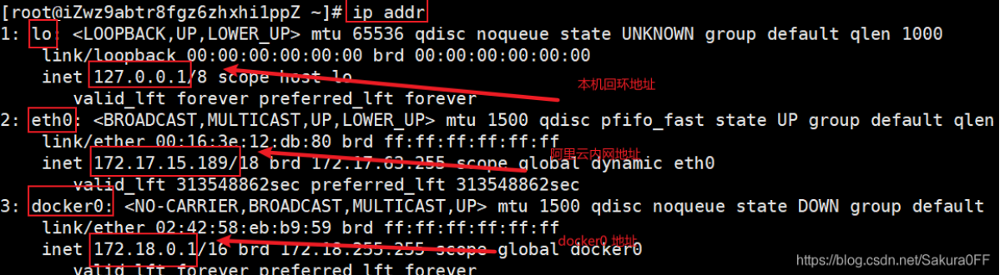

三个网络
>问题：docker 如何处理容器间的网络访问的？

```bash
# 启动一个容器
docker run -d -P --name tomcat01 tomcat

# 查看容器内部的网络地址  ip addr ,发现容器启动的时候会得到一个 eth0@if25 ip 地址，docker 分配的
[root@iZwz9abtr8fgz6zhxhi1ppZ ~]# docker exec -it tomcat01 ip addr
1: lo: <LOOPBACK,UP,LOWER_UP> mtu 65536 qdisc noqueue state UNKNOWN group default qlen 1000
    link/loopback 00:00:00:00:00:00 brd 00:00:00:00:00:00
    inet 127.0.0.1/8 scope host lo
       valid_lft forever preferred_lft forever
24: eth0@if25: <BROADCAST,MULTICAST,UP,LOWER_UP> mtu 1500 qdisc noqueue state UP group default 
    link/ether 02:42:ac:12:00:02 brd ff:ff:ff:ff:ff:ff link-netnsid 0
    inet 172.18.0.2/16 brd 172.18.255.255 scope global eth0
       valid_lft forever preferred_lft forever

# 测试linux 主机能不能ping 通容器
[root@iZwz9abtr8fgz6zhxhi1ppZ ~]# ping 172.18.0.2
PING 172.18.0.2 (172.18.0.2) 56(84) bytes of data.
64 bytes from 172.18.0.2: icmp_seq=1 ttl=64 time=0.125 ms
64 bytes from 172.18.0.2: icmp_seq=2 ttl=64 time=0.080 ms
^C
--- 172.18.0.2 ping statistics ---
2 packets transmitted, 2 received, 0% packet loss, time 999ms
rtt min/avg/max/mdev = 0.080/0.102/0.125/0.024 ms

# linux可以ping通容器内部
```
> 原理

1、我们每启动一个docker容器，docker都会给docker容器分配一个ip，只要我们安装了docker，就会有一个网卡docker0，使用桥接模式，使用技术`evth-pair`技术
再次测试 `ip addr`

2、再启动一个容器，发现又多了一对网卡

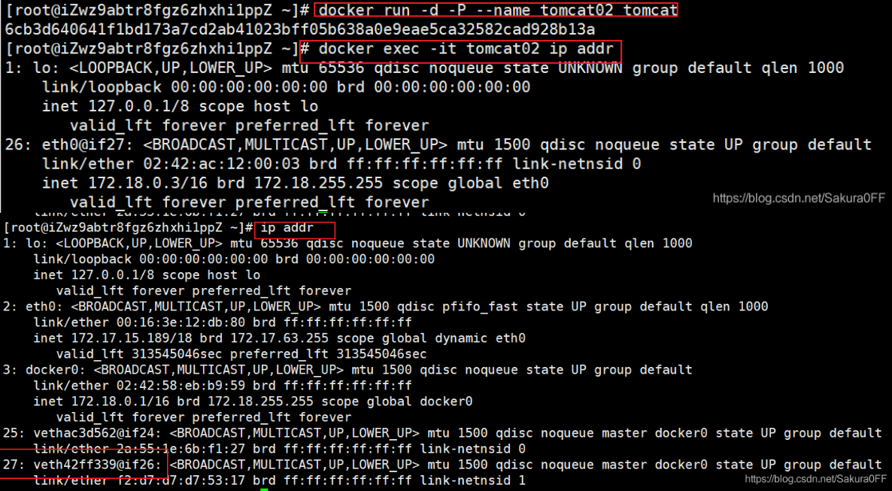


evth-pair就是一对虚拟设备接口，成对出现，一端连接协议，一端彼此相连，evth-pair充当一个桥梁，连接各种虚拟网络设备
3、测试tomcat01和tomcat02之间是否可以ping通
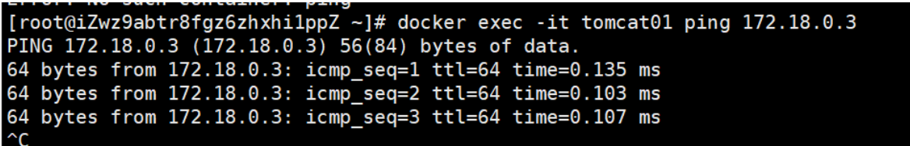
结论：可以ping通

>网络模型图


所有容器不指定网络的情况下，都是使用docker0路由的，docker会给我们的容器分配一个默认的可用IP

>小结

Docker使用Linux的桥接，linux主机中是一个Docker容器的网桥docker0
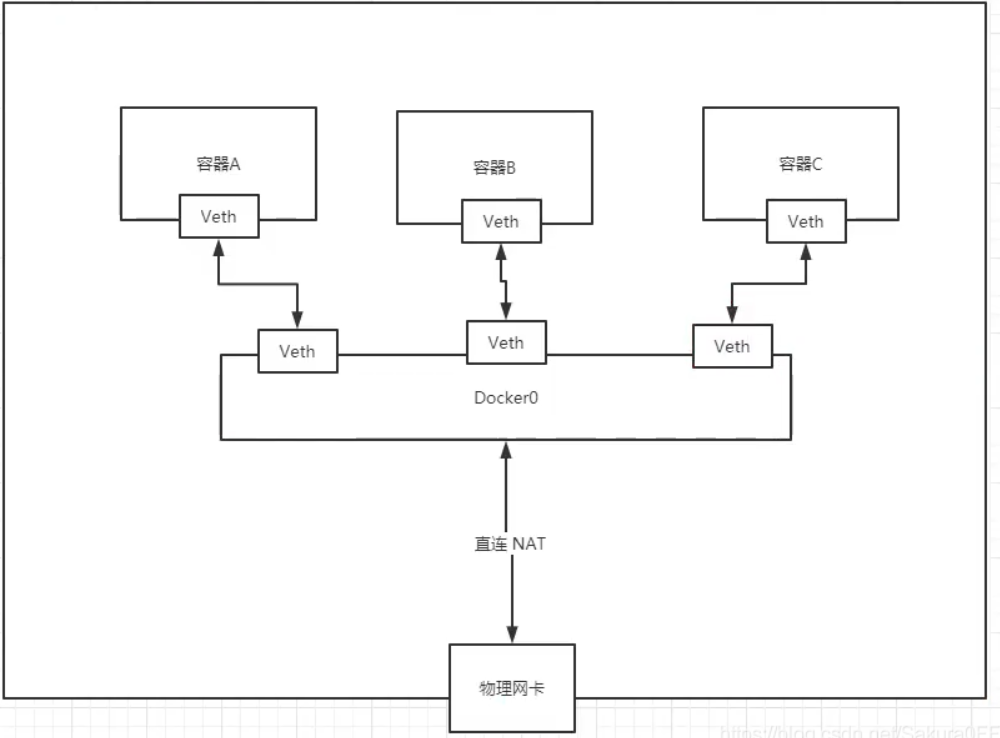
Docker 中所有的网络接口都是虚拟的，虚拟的转发效率高（内网传递文件，非常快）。
只要容器删除，对应的一对网桥也会被删除。

### --link
```bash
# 不同容器之间可以使用名字ping 通吗 不行
[root@iZwz9abtr8fgz6zhxhi1ppZ ~]# docker exec -it tomcat02 ping tomcat01
ping: tomcat01: Name or service not known

# 使用--link 连接 就可以ping 通了  但是反过来不行
[root@iZwz9abtr8fgz6zhxhi1ppZ ~]# docker run -d -P --name tomcat03 --link tomcat02 tomcat
fa2ad0ff8bf52c0265c733e9e773ce806f25b677d6288fb0482586ac8327d823
[root@iZwz9abtr8fgz6zhxhi1ppZ ~]# docker exec -it tomcat03 ping tomcat02
PING tomcat02 (172.18.0.3) 56(84) bytes of data.
64 bytes from tomcat02 (172.18.0.3): icmp_seq=1 ttl=64 time=0.162 ms
^C
--- tomcat02 ping statistics ---
1 packets transmitted, 1 received, 0% packet loss, time 0ms
rtt min/avg/max/mdev = 0.162/0.162/0.162/0.000 ms
[root@iZwz9abtr8fgz6zhxhi1ppZ ~]# docker exec -it tomcat02 ping tomcat03
ping: tomcat03: Name or service not known
```
查看tomcat03的hosts文件
hosts:配置了东西就可以本地访问了
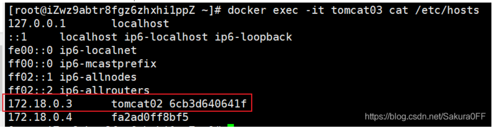
--link本质就是在hosts文件增加了一对映射配置文件
现在用docker不建议使用--link了 ，自定义网络不适用于docker0，因为docker0不支持容器名连接访问

### 自定义网络
>查看所有的网络`docker network ps`

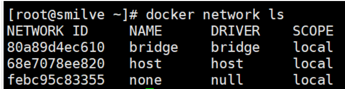
**网络模式**
bridge:	桥接 docker（默认，自己创建的也使用桥接模式）
none:	不配置网络
host:	和宿主机共享网络
container:	容器网络连通（用的少，局限很大）
**测试**

```bash
# 我们之间启动的命令 默认 有 --net bridge 这就是docker0 网络
docker run -d -P --name tomcat01 tomcat
docker run -d -P --name tomcat01 --net bridge tomcat

# docker0特点，默认，域名不能访问 --link可以打通连接
```


>自定义网络

```bash
docker network  create --driver bridge --subnet 192.168.0.0/16 --gateway 192.168.0.1 mynet

# 使用自定义网络启动两个容器
docker run -d -P --name tomcat-net01 --net mynet tomcat
docker run -d -P --name tomcat-net02 --net mynet tomcat

# 测试 发现多了两个容器
docker network inspect mynet

# 容器之间相互ping 发现使用ip或者容器名都可以ping通
docker exec -it tomcat-net01 ping 192.168.0.3
docker exec -it tomcat-net01 ping tomcat-net02
```
查看信息`docker network inspect mynet`
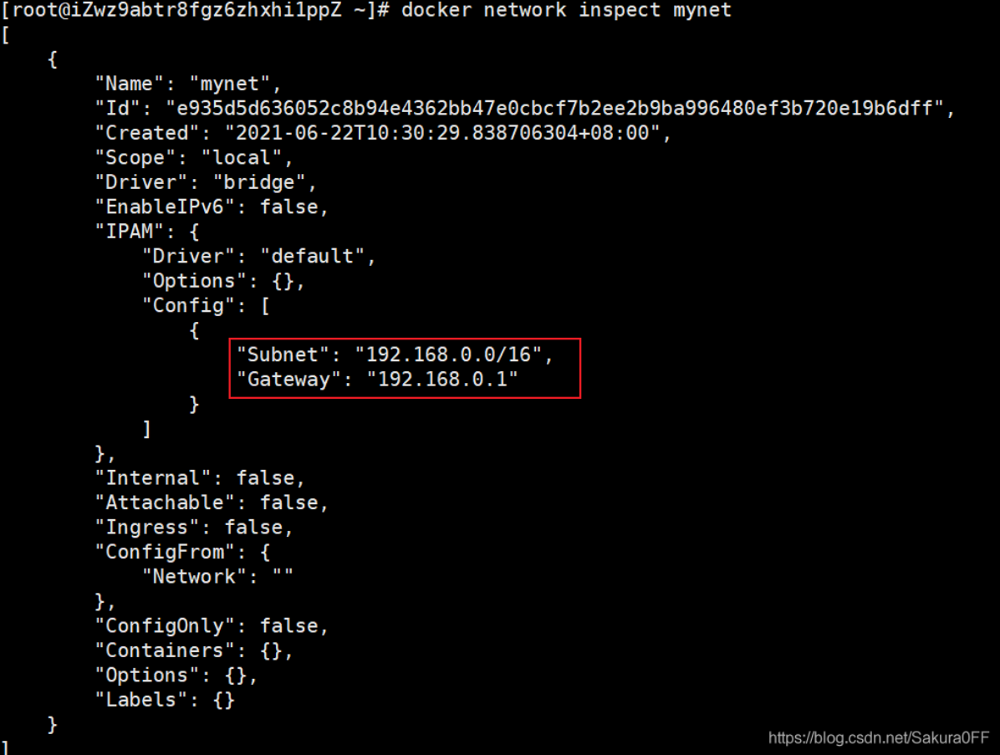

推荐这样使用自定义网络
好处：不同的集群使用不同的网络，保证集群之间是安全和健康的，保证集群之内是可以互相访问的

### 网络连通
打通不同集群的网络，不同网段之间连通
```bash
# 运行两个mynet网络的容器加默认网络的容器
[root@iZwz9abtr8fgz6zhxhi1ppZ ~]# docker ps
CONTAINER ID   IMAGE     COMMAND             CREATED              STATUS              PORTS                                         NAMES
bf54bc1a8ab5   tomcat    "catalina.sh run"   56 seconds ago       Up 55 seconds       0.0.0.0:49162->8080/tcp, :::49162->8080/tcp   tomcat02
384f1e5e60ba   tomcat    "catalina.sh run"   59 seconds ago       Up 58 seconds       0.0.0.0:49161->8080/tcp, :::49161->8080/tcp   tomcat01
9992d0b42a29   tomcat    "catalina.sh run"   About a minute ago   Up About a minute   0.0.0.0:49160->8080/tcp, :::49160->8080/tcp   tomcat-net02
65f8cb8f4fa4   tomcat    "catalina.sh run"   About a minute ago   Up About a minute   0.0.0.0:49159->8080/tcp, :::49159->8080/tcp   tomcat-net01
# 容器间相互ping 失败
docker exec -it tomcat01 ping tomcat-net01

# 测试打通 tomcat01 和 mynet  ，也就是容器和网络之间打通
docker network connect mynet tomcat01

# 查看信息 
docker network inspect mynet
# 连通之后就是把tomcat01放到了mynet网络下
# 也就是一个容器，两个ip ，这个容器在 mynet 和 docker默认的 bridge下都有ip
# 类似于阿里云服务器:一个公网ip、一个私网ip


# 测试 都可以ping 通 ，但是使用tomcat02就不行，因为没有没有打通网路
docker exec -it tomcat01 ping tomcat-net01
docker exec -it tomcat01 ping tomcat-net02
```
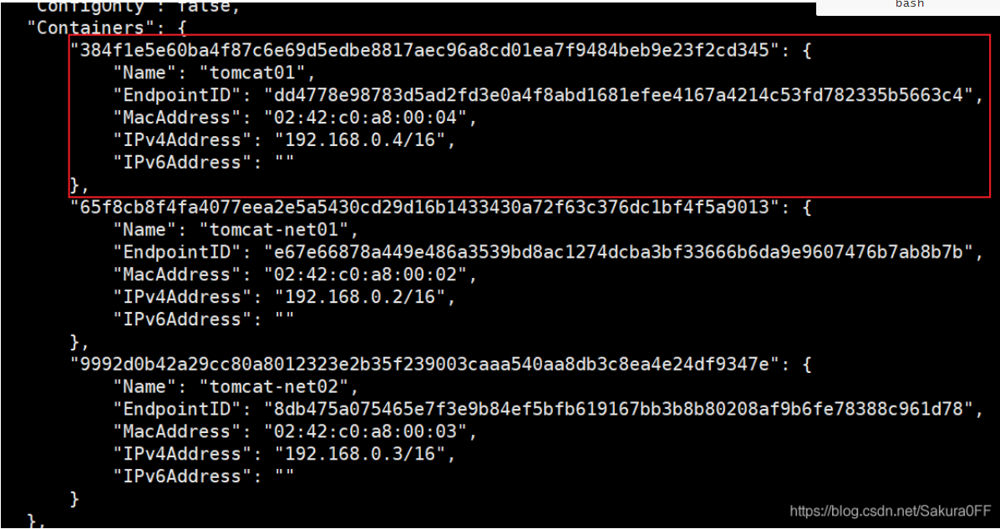
### 实战：部署Redis集群
三台主机，三台从机，当主机挂了的时候从机替换主机
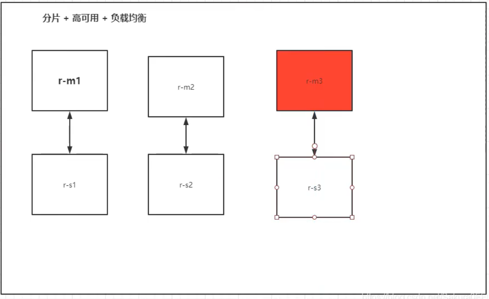

```bash
# 创建网卡
docker network create redis --subnet 172.38.0.0/16

# 用shell脚本创建6个redis配置文件
for port in $(seq 1 6); \
do \
mkdir -p /mydata/redis/node-${port}/conf
touch /mydata/redis/node-${port}/conf/redis.conf
cat  << EOF >/mydata/redis/node-${port}/conf/redis.conf
port 6379 
bind 0.0.0.0
cluster-enabled yes 
cluster-config-file nodes.conf
cluster-node-timeout 5000
cluster-announce-ip 172.38.0.1${port}
cluster-announce-port 6379
cluster-announce-bus-port 16379
appendonly yes
EOF
done

# 运行6个redis容器
docker run -p 6371:6379 -p 16371:16379 --name redis-1 \
-v /mydata/redis/node-1/data:/data \
-v /mydata/redis/node-1/conf/redis.conf:/etc/redis/redis.conf \
-d --net redis --ip 172.38.0.11 redis:5.0.9-alpine3.11 redis-server /etc/redis/redis.conf

docker run -p 6372:6379 -p 16372:16379 --name redis-2 \
-v /mydata/redis/node-2/data:/data \
-v /mydata/redis/node-2/conf/redis.conf:/etc/redis/redis.conf \
-d --net redis --ip 172.38.0.12 redis:5.0.9-alpine3.11 redis-server /etc/redis/redis.conf

docker run -p 6373:6379 -p 16373:16379 --name redis-3 \
-v /mydata/redis/node-3/data:/data \
-v /mydata/redis/node-3/conf/redis.conf:/etc/redis/redis.conf \
-d --net redis --ip 172.38.0.13 redis:5.0.9-alpine3.11 redis-server /etc/redis/redis.conf

docker run -p 6374:6379 -p 16374:16379 --name redis-4 \
-v /mydata/redis/node-4/data:/data \
-v /mydata/redis/node-4/conf/redis.conf:/etc/redis/redis.conf \
-d --net redis --ip 172.38.0.14 redis:5.0.9-alpine3.11 redis-server /etc/redis/redis.conf

docker run -p 6375:6379 -p 16375:16379 --name redis-5 \
-v /mydata/redis/node-5/data:/data \
-v /mydata/redis/node-5/conf/redis.conf:/etc/redis/redis.conf \
-d --net redis --ip 172.38.0.15 redis:5.0.9-alpine3.11 redis-server /etc/redis/redis.conf

docker run -p 6376:6379 -p 16376:16379 --name redis-6 \
-v /mydata/redis/node-6/data:/data \
-v /mydata/redis/node-6/conf/redis.conf:/etc/redis/redis.conf \
-d --net redis --ip 172.38.0.16 redis:5.0.9-alpine3.11 redis-server /etc/redis/redis.conf

# 随便进入一个容器
docker exec -it redis-1 /bin/sh

# 创建集群
redis-cli --cluster create 172.38.0.11:6379 172.38.0.12:6379 172.38.0.13:6379 172.38.0.14:6379 172.38.0.15:6379 172.38.0.16:6379 --c
luster-replicas 1

# 进入集群的redis-cli
redis-cli -c  	# redis-cli  进入单机的redis-cli
cluster info   	# 查看集群信息
cluster nodes	# 查看结点信息

# 存入一个值 set a b   ；然后关掉存入的主机，得到这个值 get a ;发现主机挂了之后，从机会替换主机，并且数据都存在，也就是主机的数据复制给了从机
```
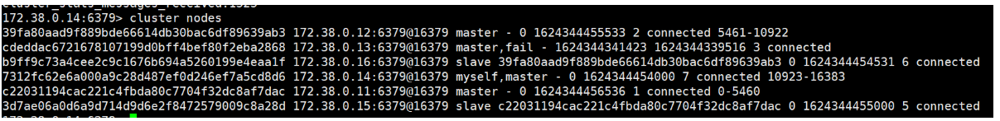
### SpringBoot微服务打包Docker镜像
1、构建SpringBoot项目
2、打包应用
3、编写Dockerfile文件

```bash
FROM java:8

MAINTAINER lvboaa<**@qq.com>

COPY *.jar /app.jar

CMD ["--server.port=9000"]

EXPOSE 9000

ENTRYPOINT ["java","-jar","/app.jar"]
```
4、构建镜像
5、运行

以后我们给别人交付直接给镜像，而不是给jar包

## 