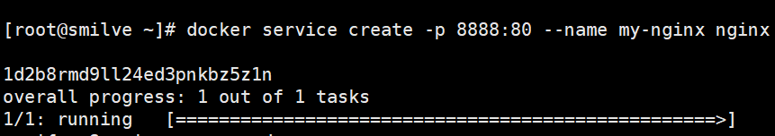
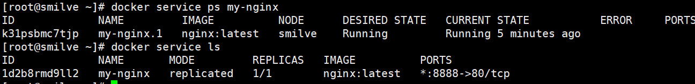
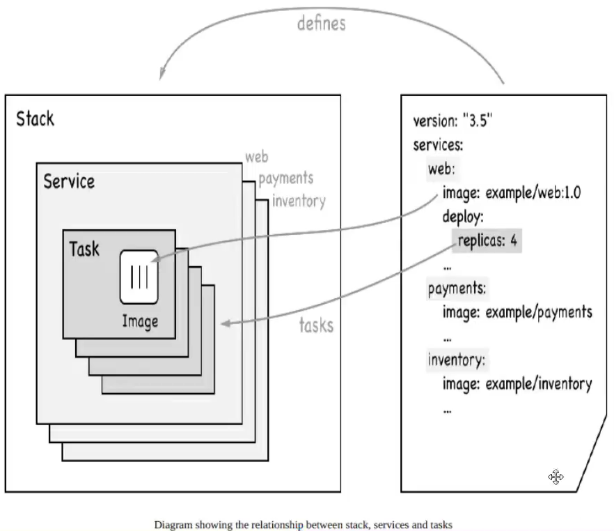
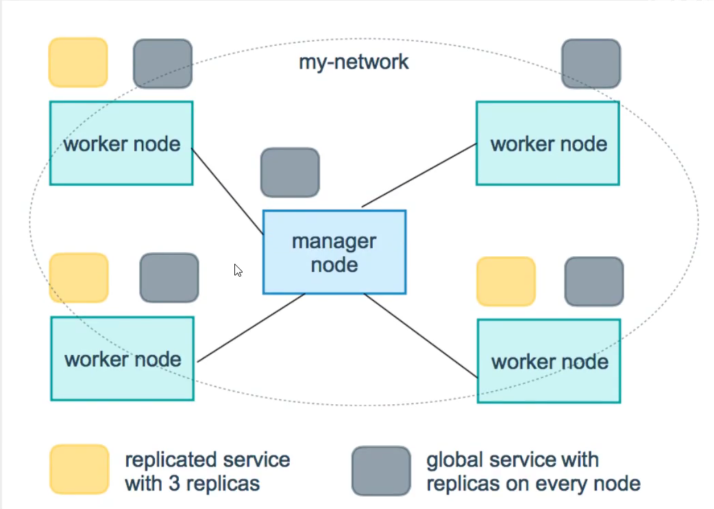

# Docker进阶

## Docker Compose

docker compose可以轻松高效地管理容器，定义运行多个容器。因为对于多个微服务容器，不可能每个都去docker build

### 简介

> 官方介绍

定义、运行多个容器；使用yaml文件配置；可以使用一个命令启动所有的服务

Compose is a tool for defining and running multi-container Docker applications. With Compose, you use a YAML file to configure your application’s services. Then, with a single command, you create and start all the services from your configuration. To learn more about all the features of Compose, see [the list of features](https://docs.docker.com/compose/#features).

所有环境都可以使用 compose

Compose works in all environments: production, staging, development, testing, as well as CI workflows. You can learn more about each case in [Common Use Cases](https://docs.docker.com/compose/#common-use-cases).

Using Compose is basically a three-step process:		三个步骤

1. Define your app’s environment with a `Dockerfile` so it can be reproduced anywhere.			
   * dockerfile保证我们的项目在任何地方运行
2. Define the services that make up your app in `docker-compose.yml` so they can be run together in an isolated environment.   
   * services:什么是服务
   * docker-compose.yml :怎么写
3. Run `docker compose up` and the [Docker compose command](https://docs.docker.com/compose/cli-command/) starts and runs your entire app. You can alternatively run `docker-compose up` using the docker-compose binary.
   * 启动项目

作用：批量容器编排。

> 理解

Compose是docker官方的开源项目，需要安装

`dockerfile`是让程序在任何地方运行，web服务、redis、mysql、nginx多个容器

compose

```yml
version: "3.9"  # optional since v1.27.0
services:
  web:
    build: .
    ports:
      - "5000:5000"
    volumes:
      - .:/code
      - logvolume01:/var/log
    links:
      - redis
  redis:
    image: redis
volumes:
  logvolume01: {}
```

Compose：重要的概念

* 服务services：容器，应用(web、redis、mysql....)
* 项目project：一组关联的容器，一组服务跑起来对外就是一个项目

### 安装

下载

```bash
sudo curl -L "https://github.com/docker/compose/releases/download/1.29.2/docker-compose-$(uname -s)-$(uname -m)" -o /usr/local/bin/docker-compose

# 用这个可能会快点
curl -L https://get.daocloud.io/docker/compose/releases/download/1.25.5/docker-compose-`uname -s`-`uname -m` > /usr/local/bin/docker-compose

# 授权
sudo chmod +x /usr/local/bin/docker-compose
# 创建软链
sudo ln -s /usr/local/bin/docker-compose /usr/bin/docker-compose
# 验证是否安装成功
docker-compose --version
```

### 体验

[地址](https://docs.docker.com/compose/gettingstarted/)

python应用，计数器


1. 编写应用  app.py
2. Dockerfile 应用打包为镜像
3. Docker-compose.yml 文件(定义整个服务，需要的环境，web，redis)
4. 启动compose项目：`docker-compose up`      后台启动：`docker-compose up -d`

```bash
# 创建文件夹
mkdir composetest
cd composetest

# 新建 app.py  (vim app.py)
import time

import redis
from flask import Flask

app = Flask(__name__)
cache = redis.Redis(host='redis', port=6379)

def get_hit_count():
    retries = 5
    while True:
        try:
            return cache.incr('hits')
        except redis.exceptions.ConnectionError as exc:
            if retries == 0:
                raise exc
            retries -= 1
            time.sleep(0.5)

@app.route('/')
def hello():
    count = get_hit_count()
    return 'Hello World! I have been seen {} times.\n'.format(count)

if __name__== "__main__":
    app.run(host="0.0.0.0",debug=True)
    
# 新建requirements.txt  (vim requirements.txt)
flask
redis

# 新建 Dockerfile (vim Dockerfile)
FROM python:3.6-alpine
ADD . /code
WORKDIR /code
RUN pip install -r requirements.txt
CMD ["python", "app.py"]

# 新建 docker-compose.yml (vim docker-compose.yml)
version: "3.8"
services:
  web:
    build: .
    ports:
      - "5000:5000"
    volumes:
      - .:/code
  redis:
    image: "redis:alpine"
    
# 运行
docker-compose up

# 测试
curl localhost:5000
# 出现  Hello World! I have been seen 1 times.   表示运行成功
```


流程：

1. 创建网络
2. 执行Docker-compose.yml
3. 启动服务

Creating composetest_web_1   ... done
Creating composetest_redis_1 ... done


停止：`docker-compose down`、`ctrl+c`(需要在docker-compose.yml的文件夹下)


#### yaml规则

docker-compose.yml  核心

https://docs.docker.com/compose/compose-file/compose-file-v3/

```bash
# 3层
version: ''		# 跟docker 版本对应
services:		# 服务
  服务1: web
    # 配置
    images
    build
    network
    ...
  服务2: redis
    ...
  服务3: redis
# 其他配置 网络、卷、全局规则
volumes:
networks:
configs:
```

> 例子

depends_on：

```bash
version: "3.9"
services:
  web:
    build: .
    depends_on:				# 这里表示web容器依赖于 db和redis，所以docker 会先启动 db和redis
      - db
      - redis
  redis:
    image: redis
  db:
    image: postgres
```


deploy

```bash
version: "3.9"
services:
  redis:
    image: redis:alpine
    deploy:							# deploy下面的是集群的配置，后面都用k8s替代
      replicas: 6
      placement:
        max_replicas_per_node: 1
      update_config:
        parallelism: 2
        delay: 10s
      restart_policy:
        condition: on-failure
```

### 开源项目搭建

[wordpress博客一键部署](https://docs.docker.com/samples/wordpress/)


### 实战

1. 编写微服务项目
2. dockerfile构建镜像
3. docker-compose.yml 编排项目
4. 丢到服务器：docker-compose up

```bash
# application.properties
server.port=8080
spring.redis.host=redis

# Dockerfile
FROM java:8
COPY *.jar /app.jar
CMD ["--server.port=8080"]

EXPOSE 8080

ENTRYPOINT ["java","-jar","/app.jar"]

# docker-compose.yml
version: '3.8'
services:
  smilveapp:
    build: .
    image: smilveapp
    depends_on:
      - redis
    ports:
      - "8080:8080"
  redis:
    image: "redis:alpine"

# 将写的微服务打包的jar包和Dockerfile和docker-compose.yml放到服务器上启动

# 重新打包项目
docker-compose up --build		# 重新构建
```


## Docker Swarm

集群部署，了解一下，一般都用k8s部署

### 工作模式


### 部署集群

```bash
# 新建一个节点   如果是外网搭建集群   需要配置端口 2377  开启
docker swarm init --advertise-addr ip		# 这个ip可以是公网、可以是私网  私网ip通过  ip addr  获取

# 加入一个节点
docker swarm join							# 使用上一条命令可以生成这条命令
# 获取令牌	获取manager或worker的   这是在创建的节点上运行
docker swarm join-token manager			# 在manager节点(只要是这种节点上就可以生成)运行生成的  命令
docker swarm join-token worker			# 在worker节点运行生成的  命令

# 查看节点信息
docker node ls							# 只能manager节点
# 节点离开集群
docker swarm leave
```

一般需要三个主节点


### Raft协议(高可用)

一致性算法协议

假设二主二从一个节点挂了，其他节点是否可用

**Raft协议：保证大多数节点存活才可以使用，高可用**；二主停了一台另一条就不能使用了；对于三主来说，down一台服务器另外两台还可以使用，但停掉两台的话另外一台就不能使用了。需要 >1 台管理节点存活

实验：

1. 二主二从，将docker1主机点停止，宕机；对于二主来说，另外一个主节点也不能使用了


2. worker节点离开主节点：`docker swarm leave`     会出现down的状态
3. work就是工作的，管理节点进行操作、执行命令

### 体会

> CAP理论

for分布式

1. Consistency 一致性：保证在一个节点更新了数据，所有节点在同一时间得到数据完全一致(主要是考虑并发读写)
2. Availability 可用性：在正常响应时间内，服务一直可用
3. Partition Tolerance分区容错性：即分布式系统在遇到某节点或网络分区故障的时候，仍然能够对外提供满足一致性和可用性的服务

对于分布式系统来说，P是一定需要的，所以只能在CP和AP之间权衡。


弹性、扩缩容

灰度发布：金丝雀发布



```bash
docker run  	# 启动容器，不具备扩缩容
# 启动服务，具有扩缩容，可以灰度发布，滚动更新	需要在docker swarm集群下才可以使用
docker service create -p 8888:80 --name my-nginx nginx
```

查看服务命令：并且服务是随机运行在某个节点的，不一定在本机




当访问人数过多，服务器不行的时候 				查看命令(docker service --help)

```bash
docker service update --replicas 3 my-nginx   # 更新一共有三个副本服务  随机运行在节点上
docker service scale my-nginx=3				  # 效果一样 
```

在集群中的任一个节点运行了一个服务，在任意节点都可以进行访问，服务可以更新多个副本实现扩缩容及高可用

当服务不许要这么多了，也可以动态回滚到一个(可随时进行弹性扩缩容，也就是可以随时减少和增加服务)；实现服务和服务器的高可用

```bash
docker service update --replicas 1 my-nginx
docker service scale my-nginx=1					  # 效果一样 
```

### 总结

**Swarm**

集群管理和编号，docker可以初始化一个swarm集群，其他节点可以加入(manager、worker)

**Node**
就是一个docker节点，多个节点组成一个网络集群

**Service**
任务，可以管理节点或工作节点来运行，核心，用户访问的

**Task**
容器内的命令，细节任务



命令->管理->api->调度->工作节点(创建Task容器维护创建)

> 服务副本与全局服务



管理节点和工作节点都可以跑项目

但是可以调整service以什么方式运行，只能在副本上运行或全局都可以

```bash
--mode string
service mode (replicated or global) (default replicated)

docker service create --mode replicated --name mytom tomcat:8     # 默认
docker service create --mode global --name ***
```

## Docker Stack

docker-compose 单机部署项目(玩具)

docker stack  集群部署项目	：`docker stack --help`

```bash
# 单机
docker-compose up -d wordpress.yml
# 集群
docker stack deploy wordpress.yml
# 这个yml文件找一些案例就可以了
```


## Docker Secret

安全，配置密码加密，证书

`docker secret --help`

## Docker Config

统一配置 ： `docker config --help`

