# 项目背景

> 微服务架构图


谷粒商城就是一个B/C模式的电商平台，销售自营商品给客户。


分布式中的每一个节点，都可以做集群，而集群不一定是分布式的。

节点：集群中的一个服务器


> 微服务划分图

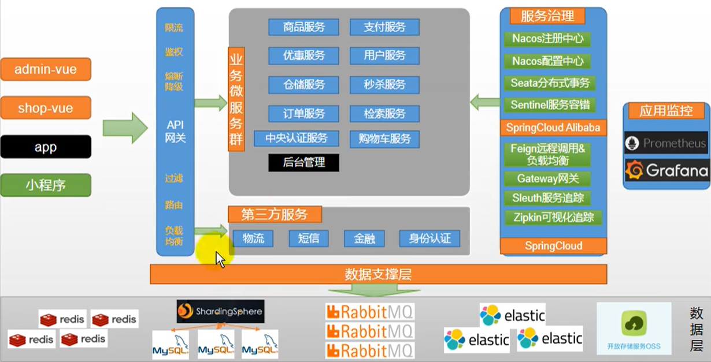

# 代码实现

> @RequestBody

获取请求体，必须发送POST请求，GET或者其他的请求都没有请求体

SpringMVC自动将请求体的数据（json）转成对应的对象

Ajax发送的Get请求会被缓存，Post请求不会

> 在分布式项目开发时，很容易造成bean的重复定义

`spring.main.allow-bean-definition-overriding=true`就是解决bean重复定义的。设置为true时，后定义的bean会覆盖之前定义的相同名称的bean。


> JSR303校验后端数据


### Object划分

> TO:数据传输对象

不同微服务之间传输的数据

> DTO:数据传输对象

view层及service层之间的传输对象

> VO:视图对象

接收页面传递的数据，封装对象

将业务处理完成的对象，封装成页面要用的数据

> POJO:传统意义上的Java对象

POJO是DO/DTO/BO/VO的统称

> DAO:数据访问对象

操作数据库的对象


### mysql连接group的多列参数

```bash
group_concat(column)	# column表示group by有多列的c
```

### 视图映射

```java
@Configuration
public class GulimallWebConfig implements WebMvcConfigurer {

    /**
     * 视图映射，就不用写controller进行空方法视图映射了
     * @param registry
     */
    @Override
    public void addViewControllers(ViewControllerRegistry registry) {

        registry.addViewController("/").setViewName("login");
        registry.addViewController("/login.html").setViewName("login");
        registry.addViewController("/reg.html").setViewName("reg");
    }
}

// 等价于
@Controller
public class Index1Controller {

    @Autowired
    CategoryService categoryService;

    @GetMapping({"/","/login.html"})
    public String login(){
       return "login2";
    }
}
```


### MD5&MD5盐值加密

> MD5

信息摘要算法

* 最大特点：不可逆

* 压缩性：任意长度的数据，算出的MD5值长度都是固定的
* 容易计算：从原数据计算MD5很容易
* 抗修改性：从原数据进行任何改动，哪怕只改动一个字节，所得到的MD5值都要很大区别
* 强抗碰撞：想找到两个不同的数据，使他们具有相同的MD5值，是非常困难的

> 加盐

* 通过生成随机数与MD5生成字符串进行组合
* 数据库同时存储MD5值与salt值，验证正确性使用salt进行MD5即可

> 使用Spring的解决方案

spring的盐值加密 加随机盐加密：会根据加盐的密码自己解析出盐值 再进行比较

```java
// 加密
BCryptPasswordEncoder passwordEncoder = new BCryptPasswordEncoder();
String encode = passwordEncoder.encode(vo.getPassword());
// 解密
boolean isPass = passwordEncoder.matches("原密码","加密的密码");
```


# 问题及解决方案

### 解决maven刷新java编译版本变化

```xml
# 在pom.xml加上这个
<properties>
   <project>UTF-8</project>          
   <project>UTF-8</project>
   <java>1.8</java>
   <maven>1.8</maven>
   <maven>1.8</maven>
   <encoding>UTF-8</encoding>
</properties>
```

### 解决java.lang.UnsupportedOperationException 异常

```java
//因为 Arrays.asList返回的 ArrayList是Arrays的内部类 而不是java.util.ArrayList；没有add 和 remove这些方法，所以会抛出异常
//如果不转的话会报 java.lang.UnsupportedOperationException 的异常
new ArrayList<>(Arrays.asList(catIds))
```


### 在多线程下使用ArrayList报错java.util.ConcurrentModificationException

使用`CopyOnWriteArrayList`替换`ArrayList`


### SpringBoot项目单元测试没有开始按钮

```java
@RunWith(value= SpringJUnit4ClassRunner.class)
@SpringBootTest(classes={GulimallOrderApplication.class})
```

然后给类加上关键字public就行了

> 单元测试启动报自动注入的实体空指针异常,并未启动SpringBoot

在测试类上加`@RunWith(SpringRunner.class)`


### 使用maven的profiles进行环境配置

```xml
<profiles>
    <!--本地调试库-->
    <profile>
        <id>local</id>
        <properties>
            <log.root.path>/LOGS</log.root.path>
            <nacos-server-addr>192.168.131.132:8848</nacos-server-addr>
            <nacos-config-namespace></nacos-config-namespace>
            <spring.datasource.url>jdbc:mysql://47.98.137.243:3306</spring.datasource.url>
            <spring.datasource.username>root</spring.datasource.username>
            <spring.datasource.password>xxxxx</spring.datasource.password>
            <spring.redis.host>xxx</spring.redis.host>
            <spring.redis.port>6379</spring.redis.port>
        </properties>
    </profile>
</profiles>
```

**检查项目，需要子项目的配置**（最重要的一步，不然使用@@取值会报错）

```xml
<parent>
    <groupId>com.lvboaa.gulimall</groupId>
    <artifactId>gulimall</artifactId>
    <version>0.0.1-SNAPSHOT</version>
</parent>

<build>
    <resources>
        <resource>
            <!-- 打开资源过滤功能        -->
            <filtering>true</filtering>
            <!--  resources插件处理哪个目录下的资源文件-->
            <directory>src/main/resources/</directory>
        </resource>
    </resources>
    <plugins>
        <plugin>
            <groupId>org.apache.maven.plugins</groupId>
            <version>2.6</version>
            <artifactId>maven-resources-plugin</artifactId>
            <configuration>
                <encoding>UTF-8</encoding>
            </configuration>
        </plugin>
    </plugins>
</build>
```

在yml文件中就可以使用`@nacos-server-addr@`获取properties中的值了


### Feign远程调用丢失请求头

远程调用带上cookie等信息

```java
@Configuration
public class GuliFeignConfig {

    @Bean("requestInterceptor")
    public RequestInterceptor requestInterceptor() {

        RequestInterceptor requestInterceptor = new RequestInterceptor() {
            @Override
            public void apply(RequestTemplate template) {
                //1、使用RequestContextHolder拿到刚进来的请求数据
                ServletRequestAttributes requestAttributes = (ServletRequestAttributes) RequestContextHolder.getRequestAttributes();

                if (requestAttributes != null) {
                    //老请求
                    HttpServletRequest request = requestAttributes.getRequest();

                    if (request != null) {
                        //2、同步请求头的数据（主要是cookie）
                        //把老请求的cookie值放到新请求上来，进行一个同步
                        String cookie = request.getHeader("Cookie");
                        template.header("Cookie", cookie);
                    }
                }
            }
        };

        return requestInterceptor;
    }

}
```

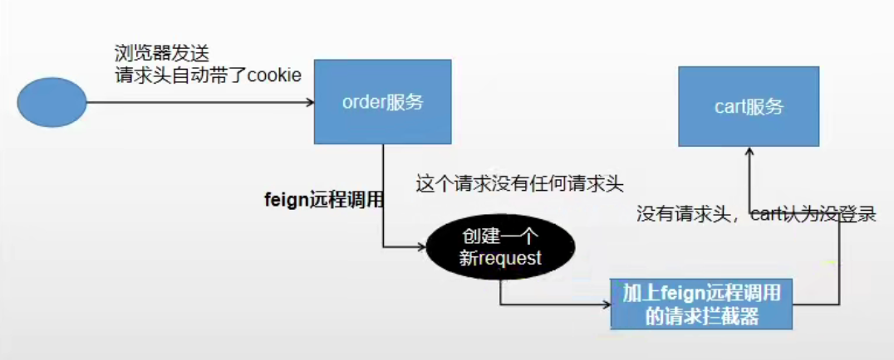

### Feign异步调用丢失请求头

使用异步编排发起远程调用，RequestContextHolder类似于ThreadLocal，一个线程共享数据，异步编排的时候其他线程获取不到ThreadLocal，也就导致获取不到请求头了

给每一个线程都加上请求头数据

```java
//获取当前线程请求头信息(解决Feign异步调用丢失请求头问题)
RequestAttributes requestAttributes = RequestContextHolder.getRequestAttributes();

//每一个线程都来共享之前的请求数据
RequestContextHolder.setRequestAttributes(requestAttributes);
```


### MySQL分组后取前N条数据

group by 之后取每组的前N条数据

```bash
select * from emp as a where 1> (select count(*) from emp where deptno = a.deptno and sal > a.sal  )
```


### 安全会话Cookie

我们可以使用httpOnly和secure标签来保护我们的会话cookie：

* httpOnly：如果为true，那么浏览器脚本将无法访问cookie 
* secure：如果为true，则cookie将仅通过HTTPS连接发送

```properties
server.servlet.session.cookie.http‐only=true
server.servlet.session.cookie.secure=true

server.servlet.session.timeout=3600s	# session过期时间
```


# 环境搭建

## 安装docker

> docker 安装mysql

```bash
# 设置docker开机自启
systemctl enable docker

# docker运行mysql5.7容器
docker run -p 3306:3306 --name mysql01 -v /home/mysql/log:/var/log/mysql -v /home/mysql/data:/var/lib/mysql -v /home/mysql/conf:/etc/mysql -e MYSQL_ROOT_PASSWORD=roottoor -d mysql:5.7

# 在linux目录下 配置mysql编码为utf-8 默认为拉丁 新建my.cnf文件
vi my.cnf
# 在my.cnf中加入以下配置
[client]
default-character-set=utf8

[mysql]
default-character-set=utf8

[mysqld]
character-set-server=utf8

# 进入mysql容器
docker exec -it mysql01 /bin/bash

# 设置mysql随着docker的启动启动
docker update mysql01 --restart=always
```

> docker 安装redis 

```bash
# 新建问价
mkdir -p /home/redis/conf 	# 创建多级目录
cd /home/redis/conf
touch redis.conf			# 创建配置文件，因为redis镜像默认没有redis.conf文件 需要我们添加上

# docker 运行redis容器
docker run -p 6379:6379 --name redis01 -v /home/redis/data:/data -v /home/redis/conf/redis.conf:/etc/redis/redis.conf -d redis redis-server /etc/redis/redis.conf

# 进入docker-cli
docker exec -it redis01 redis-cli

# 配置redis持久化 （redis是内存数据库，断电即失）
vi redis.conf
appendonly yes #添加内容
# 或者在docker run时添加命令
docker run ...... redis-server --appendonly yes

# 设置redis随着docker的启动启动
docker update redis01 --restart=always
```

[redis配置文件](https://raw.githubusercontent.com/redis/redis/6.0/redis.conf)

## 创建项目目录

1. 新建git仓库
2. clone到本地
3. 创建微服务模块-->商品服务、仓储服务、订单服务、优惠券服务、用户服务
4. 使用逆向代码生成器生成每个模块简单的增删改查

## 微服务配置

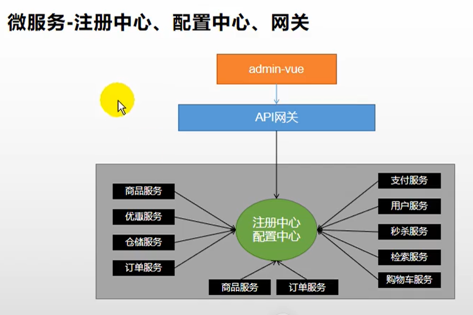

> SpringCloud Alibaba

SpringCloud Alibaba - Nacos:注册中心（服务注册与发现） 替换（Ereka）

SpringCloud Alibaba：配置中心（动态配置管理）

SpringCloud - Ribbon: 负载均衡

SpringCloud - Feign: 声明式Http客户端（调用远程服务）

SpringCloud Alibaba - Sentinal: 服务容错（限流、降级、熔断）替换  Netflix(Hystrix)

SpringCloud - Gateway: API网关 替换 （Zuul）

SpringCloud - Sleuth: 调用链监视 整合Zipkin

SpringCloud Alibaba - Seata: 原 Fescar，即分布式事务解决方案


```xml
<!--  SpringCloud Alibaba-->
<!--  dependencyManagement统一管理项目版本，子模块中使用该依赖不需指定版本号    -->
<dependencyManagement>
    <dependencies>
        <dependency>
            <groupId>com.alibaba.cloud</groupId>
            <artifactId>spring-cloud-alibaba-dependencies</artifactId>
            <version>2.1.0.RELEASE</version>
            <type>pom</type>
            <scope>import</scope>
        </dependency>
    </dependencies>
</dependencyManagement>
```

[Nacos Discovery](https://github.com/alibaba/spring-cloud-alibaba/blob/master/spring-cloud-alibaba-examples/nacos-example/nacos-discovery-example/readme-zh.md)	==> 注册中心


SpringCloud Fegin ==> 远程调用

整合了Ribben(负载均衡)和Hystrix(服务熔断)

```xml
<dependency>
    <groupId>org.springframework.cloud</groupId>
    <artifactId>spring-cloud-starter-openfeign</artifactId>
</dependency>
```


[Nacos Config](https://github.com/alibaba/spring-cloud-alibaba/blob/master/spring-cloud-alibaba-examples/nacos-example/nacos-config-example/readme-zh.md) ==> 配置中心


[SpringCloud GateWay](https://docs.spring.io/spring-cloud-gateway/docs/current/reference/html/#glossary) ==> 路由转发、权限校验、限流控制(取代了Zuul网关)

当我们请求到达网关，网关利用断言（Predicate）判定请求是不是符合某个路由规则，如果符合就按路由规则路由到指定地方，去这个指定地方就会经过一系列的过滤器（Filter）进行过滤


## 前端知识

ECMAScript是浏览器脚本语言的规范，是一种标准，而JavaScript则是规范的具体实现。

```javascript
//解构表达式
let arr = [1, 2, 3];
let [a, b, c] = arr;
console.log(a, b, c);
//字符串模板
let ss = `
qweeeeeeeeeeeeeeee
qweeeeee
`;
function fun() {
    return "真的牛皮";
}
let name = `我是${a}+${b + 10}，说${fun()}`
console.log(name)

//箭头函数 箭头函数不能使用 this.  获取当前对象的信息
var print = obj => console.log(obj);
print("hello");
var sum = (a, b) => a + b;

//实战 箭头函数打印名字
const person = {
    name: "jack",
    age: 21,
    language: ['java', 'js']
}
var hello = obj => console.log("hello " + obj.name);
hello(person);
//融合解构表达式
var hello = ({ name }) => console.log("hello " + name);
hello(person);

//深拷贝
let someone = { ...person }
//合并对象，将两个对象拆开，把属性合并到s1中
let s1 = { ...person, ...a }

//map方法
let arr = ['1', '30', '-5']
arr = arr.map(item => item * 2)

// reduce
// promise 异步编排 
// 模块化 导入 导出  export import

```

### Vue基础使用

* v-bind 缩写 : ,单向绑定，data变，元素变；元素变，data不会变
* v-model，双向绑定，常用于表单数据
* 阻止事件冒泡，`@click.stop`，使用事件修饰符解决
* 监听键盘事件，`@keyup.up`，按键修饰符
* v-for遍历数据时，使用`:key`区分不同数据，提高Vue渲染效率===>细节
* v-if 判断为true ==>渲染元素，v-show 判断为true ==>显示元素 (使用`display:none`隐藏)
  * v-if的优先级低于v-for  ，等遍历完了再判断是否显示
* computed计算属性（只要有一个值变了就会重新计算）
* watch：监听属性
* filters：局部过滤器，使用管道服`|`过滤数据，可以用在`{{}}`和`v-bind`上；   Vue.filter :全局过滤器

> 跨域问题

浏览器对javascript施加的一种安全限制（协议、域名、端口一个不一样都会产生跨域问题）

### 上传图片文件


# 框架、工具及业务实现

本项目：SpringBoot版本：2.1.8.RELEASE

## ES

虽然浏览器可以通过页面调用ES服务器获取值，但是ES是后端服务器，一般不暴露给前端，不然容易被恶意利用。

需要基于9200端口操作es服务器，因为官方不建议使用9300操作，并且8以后的版本会移除基于9300的操作

## 压力测试

### 性能指标

需要下载[jmeter](http://jmeter.apache.org/download_jmeter.cgi)的apache-jmeter-5.4.1.zip解压后打开jmeter.bat

* 响应时间：指用户从客户端发出请求开始，到客户端收到从服务器返回的响应结果，整个过程所耗费的时间

* HPS(Hits Per Second)：每秒点击次数，单位是次/秒

* TPS(Transaction Per Second)：系统每秒处理交易数，单位是笔/秒(这个处理交易也就是一个业务流程，每秒处理多少个业务)

* QPS(Query Per Second)：每秒处理查询次数，单位是次/秒

  一般来说HPS没什么用，TPS衡量整个业务流程，QPS衡量接口查询次数

* 最大响应时间：用户发出请求到系统响应的最大时间

* 最少响应时间

* 90%响应时间：将所有用户响应时间排序，第90%的响应时间

* 从外部看，性能测试一般只关注三个指标

  * 吞吐量：每秒系统处理的请求数、任务数
  * 响应时间：服务处理一个请求或一个任务的耗时
  * 错误率：一批请求中出错的请求所占比例

影响性能考虑点

* 数据库、应用程序、中间件(tomcat、nginx)、网络和操作系统等方面
* 考虑自己的应用是属于CPU密集型还是IO密集型

多线程测试，windows提供给TCP/IP的链接端口为1024-5000，并需要四分钟循环回收他们，导致在短时间内大量请求就将端口占满了(报错`JMeter Address Already in use`)

可以修改注册表设置回收时间

### 性能监控

#### 简介

> JVM内存模型

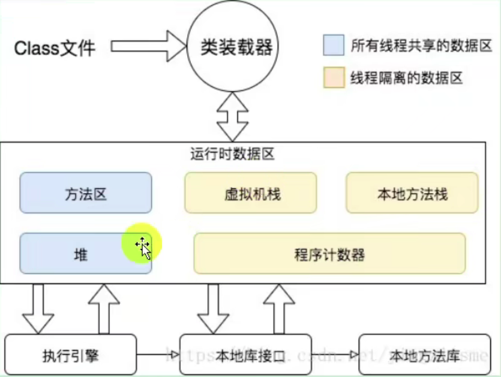


优化更多的是在堆这一块

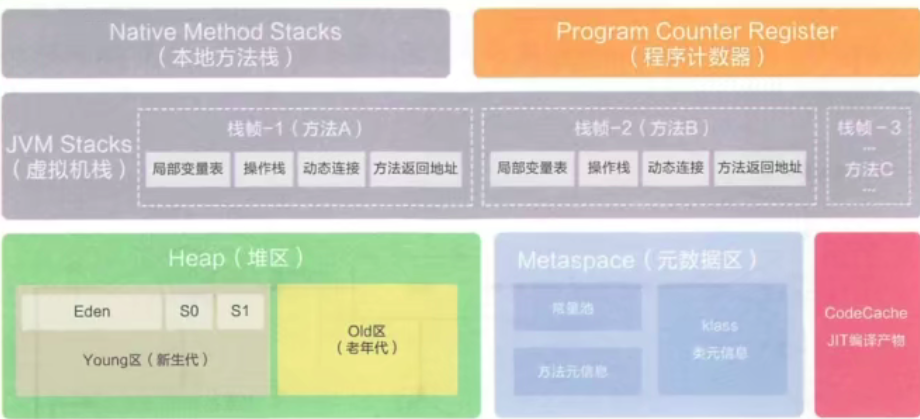

Java8及之后，HotSpot完全将永久代移除，使用元空间(metaspace)代替，可以自己操作物理内存


新对象

一个新对象和数组创建的生命周期，首先判断Eden区(默认是堆的1/15)内存是否够，够的话直接分配内存空间，不够进行一次YGC(也是MinorGC)，会清理新生代的一些对象， 能放的下就分配内存，如果还是放不下，jvm就认为这个对象是一个大对象，尝试放在老年代，老年代空间够的话就分配内存空间，不够的话就进行一次FULL GC(整个堆的 GC 耗费时间多)，GC完如果还不能放下就报OOM的错误(eden区和survival区比例：8:1:1)

旧对象

survival区，YGC会把Eden区存活的对象放入Survival区，分为from和to区，总会时刻保持一个空的区间，在survival区的对象，每经过一次gc年龄就会加1，默认是年龄为15的对象会进入到老年代

#### 工具

jconsole或jvisualvm(jdk1.6之后jconsole的升级版)，可监控远程和本地

启动，安装了java的话直接在终端敲`jconsole`即可

jvisualvm一样的(推荐使用)：比jconsole功能强大


jvisualvm:

监控内存泄漏，跟踪垃圾回收，执行时内存情况、cpu分析、线程分析


运行：正在运行的

休眠：sleep的

等待：wait的

驻留：线程池里面的空闲线程

监视：阻塞的线程

下载工具visual gc(图形化查看gc过程)：https://visualvm.github.io/pluginscenters.html 根据自己jdk版本替换地址 然后下载工具，一定要复制updates.xml.gz的地址，不要html的地址

> 优化

* 中间件越多，性能损失越大，大多都损失在网络交互了(优化中间件和网络交互)

* Nginx动静分离：动态请求(数据块请求)和静态请求(静态资源请求)分开，动态请求交给gateway，静态资源直接返回(需要将静态资源放在nginx中)

```sh
# 配置访问静态资源都有一个前缀，并映射到nginx的静态资源，直接返回
location /static/ {
	root    /home/nginx/html;
} 
```

* 如果发现eden和老年区容易爆满，经常gc，就可以对jvm参数进行调优

```sh
# -Xmx1024m  ：堆最大值为1024m
# -Xms1024m  ：堆初始化大小为1024m
# -Xmn512m	：年轻代大小为512m(包括eden+survival)
-Xmx1024m -Xms1024m -Xmn512m
```

## 缓存与分布式锁

### 缓存

#### 简介

为了提高系统性能，我们会将一部分数据放入缓存中，加速访问，db承担数据落盘工作(就是持久化工作)

> 适合放在缓存的数据

* 即时性、数据一致性要求不高的
* 访问量大且更新频率不高的数据(读多、写少)

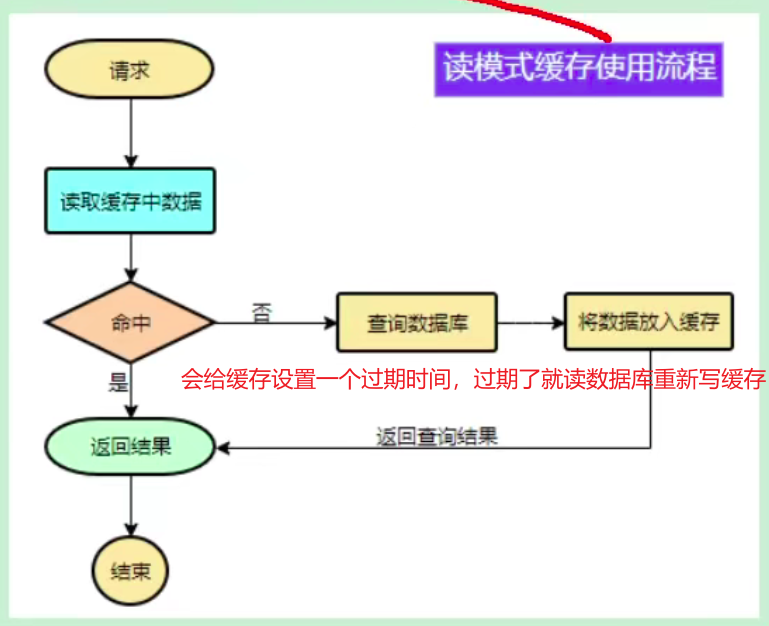

本地缓存可以直接使用Map的数据结构缓存数据，但不适用于分布式系统

分布式缓存一般使用缓存中间件(redis数据库)

```java
public List<CategoryEntity> listWithTree() {
    // 存入redis使用json格式字符串，可以跨平台兼容

    /**
         *  1.空结果缓存：解决缓存穿透
         *  2.设置过期时间(加随机值)：解决缓存雪崩
         *  3.加锁：解决缓存击穿  最难实现
         */
    List<CategoryEntity> entities;
    String list = redisTemplate.opsForValue().get("listWithTree");
    if (StringUtils.isEmpty(list)) {
        System.out.println("缓存不命中，将要查询数据库......");
        return getListWithTreeWithRedisLock(); // 查询出来的数据存入redis并设置过期时间
    }
    System.out.println("缓存命中，直接返回........");
    entities = JSON.parseObject(list, new TypeReference<List<CategoryEntity>>() {
    });

    return entities;
}
```


> 过程

进来的时候先读缓存，缓存中有，直接获取json字符串`JSON.parseObject(list,new TypeReference<R>(){});`，转成对象，返回数据

没有的话就读数据库，并把相应对象转成json格式字符串(可以跨平台兼容)`JSON.toJSONString(Object):fastjson中的`

也就是序列化和反序列化的过程

> 压力测试报错

进行压力测试的时候，redis会报`堆外内存溢出：OutOfDirectMemoryError`的异常

1. Springboot2.0以后默认使用lettuce作为操作redis的客户端，使用netty进行网络通信
2. 但是lettuce没做好，主要是lettuce的bug导致netty的堆外溢出
3. 设置`-Xmx300m`：netty如果没有指定堆外内存，默认使用-Xmx的大小 ，这个参数调大也只是延缓报错，(可以通过`-Dio.netty.maxDirectMemory`进行设置)

解决方案：不能直接使用调参命令设置大小

1. 升级lettuce客户端(但也没有完全解决这个问题)
2. 切换使用jedis客户端

#### 缓存穿透、击穿、雪崩

> 缓存穿透

指查询一个一定不存在的数据，由于缓存不命中，将去查询数据库，但是数据库中也没有，并且没有把这次查询的null结果写入缓存，当高并发时，数据库瞬间压力增大，容易导致崩溃

解决办法：

1. null结果时缓存一个数据，并设置短暂的过期时间(因为后面可能数据库会查询成功，然后进行缓存)，保护后端数据源

2. 布隆过滤器：一种数据结构，将所有可能查询的参数以hash形式存储，在控制层进行校验，不符合就丢弃这次查询，避免了底层存储系统的查询压力

> 缓存击穿

对于一些设置了过期时间的key，在某些时间点被超高并发地访问(热点数据)，然后这个key在大量请求同时进来的时候正好失效，所有查询都落在数据库上(比如说微博热搜导致服务器宕机)

解决办法：

1. 设置热点数据永不过期

1. 加锁，大量并发只让一个人去查，其他人等待，查到以后释放，下一个人就可以查到缓存了；这时候压力来到了分布式锁上面

> 缓存雪崩

指我们设置缓存的key使用了相同的过期时间，导致缓存在某一时刻同时失效或者redis服务器宕机(缓存数据大量消失)，请求全部转发到数据库，数据库瞬间压力过重崩溃

解决办法：

1. 如果是redis宕机：就进行redis高可用，搭建集群(异地多活)
2. 在原有失效时间的基础上加一个随机值，这样缓存的过期时间的重复率就会降低，很难产生集体失效的事件
3. 在缓存失效后，通过加锁或控制队列读取缓存的线程数量(限流降级)
4. 在即将发生大并发的时候，进行数据预热，手动触发，把可能会大量访问的数据加载到缓存中，设置不同的过期时间，让缓存失效的时间点尽量均匀

#### 数据一致性问题

缓存中的数据如何和数据库的保持一致

* 双写模式
* 失效模式

> 双写模式

读到的最新数据可能有延迟：最终一致性


解决方案

* 加锁
* 看系统是否允许数据的暂时不一致问题

> 失效模式

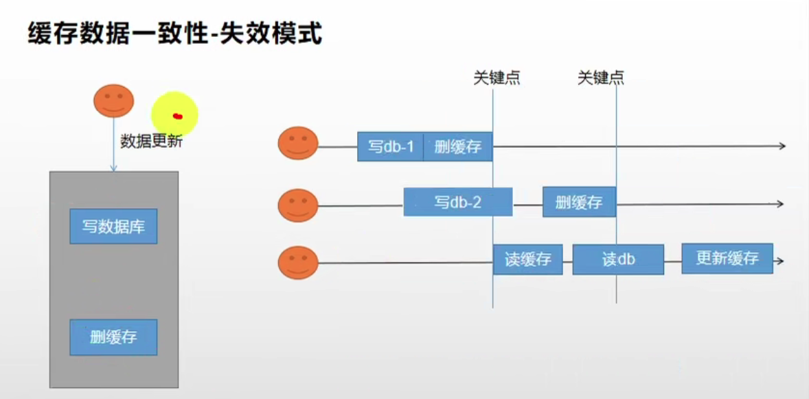

也会产生读脏数据的问题，并且如果数据经常修改的话，就不适合放入缓存；也就是经常修改的数据和实时性较高，就不要走缓存，直接查数据库

* 读写并发的问题：加读写锁

> 缓存一致性解决方案?

无论是双写模式还是失效模式，都会导致缓存的不一致问题，即多个实例同时更新会出事，怎么办？

* 如果是用户维度数据(订单数据、用户数据)，这种并发几率非常小，不用考虑这个问题，缓存加过期时间，每隔一段时间触发主动更新即可
* 如果是菜单、商品介绍等基础数据，也可以使用canal订阅binlog方式
* 缓存数据加过期时间可以解决大部分业务对缓存的要求
* 通过加读写锁保证并发读写

总结

* 能放入缓存的数据本身就不应该是实时性、一致性要求超高的，所以一般给缓存加上过期时间，保证每天拿到最新数据即可
* 我们不应该过度设计、增加系统的复杂性
* 遇到实时性、一致性较高的就应该查询数据库、即使慢一点

一般在大数据才使用


了解：

红锁(RedLock)：多个服务间保证同一时刻同一时间段内同一用户只能有一个请求（防止关键业务出现并发攻击）

#### SpringCache

从spring3.1开始定义Cache和CacheManager来统一不同的缓存技术，并使用JCache注解简化开发

依赖

```xml
<dependency>
    <groupId>org.springframework.boot</groupId>
    <artifactId>spring-boot-starter-data-redis</artifactId>
</dependency>
<dependency>
    <groupId>org.springframework.boot</groupId>
    <artifactId>spring-boot-starter-cache</artifactId>
</dependency>
```

配置

```xml
spring.cache.type=redis
```

使用

```java
@Cacheable:触发将数据保存到缓存的操作
@CacheEvict:触发将数据从缓存删除的操作    可实现缓存的失效模式
@CachePut:不影响方法执行下更新缓存   可实现缓存的双写模式 需要有返回值
@Caching:组合以上多个操作
@CacheConfig:在类级别共享缓存的相同配置
```

需要在启动类加`@EnableCaching`注解

每一个需要缓存的数据都需要放到那个名字下(主要是缓存的分区(按照业务类型分))
在方法前加`@Cacheable("listTree")` 代表当前方法的结果需要缓存，如果缓存中有，方法不调用，缓存中没有，会调用方法查询数据库，并将查询结果放入缓存；

默认：如果缓存名中，方法不调用；key默认自动生成：默认 缓存名字::SimpleKey []，value值默认使用jdk序列化机制，将数据序列化后放入redis；默认不过期

自定义：

* 指定生成的key值：直接设置key值，接受SpEL表达式：`@Cacheable(value = "listTree", key = "'listTree'")   /  key = "#root.method.name"`，如果是固定值就加单引号，不然会当初表达式动态取值
* 指定数据的过期时间：`spring.cache.redis.time-to-live=60000` 60秒
* 将数据保存为json格式：重写一个redisCacheConfiguration的Bean

```java
@EnableConfigurationProperties(CacheProperties.class)
@Configuration
@EnableCaching
public class CacheConfig {

    @Bean
    public RedisCacheConfiguration redisCacheConfiguration(CacheProperties cacheProperties){
        RedisCacheConfiguration config = RedisCacheConfiguration.defaultCacheConfig();

        config = config.serializeKeysWith(RedisSerializationContext.SerializationPair.fromSerializer(new StringRedisSerializer()));
        config = config.serializeValuesWith(RedisSerializationContext.SerializationPair.fromSerializer(new GenericFastJsonRedisSerializer()));

        // 绑定配置文件中的参数 以spring.cache 开头的
        CacheProperties.Redis redisProperties = cacheProperties.getRedis();
        if (redisProperties.getTimeToLive() != null) {
            config = config.entryTtl(redisProperties.getTimeToLive());
        }
        if (redisProperties.getKeyPrefix() != null) {
            config = config.prefixKeysWith(redisProperties.getKeyPrefix());
        }
        if (!redisProperties.isCacheNullValues()) {
            config = config.disableCachingNullValues();
        }
        if (!redisProperties.isUseKeyPrefix()) {
            config = config.disableKeyPrefix();
        }

        return config;
    }
}
```

```yml
spring:
  cache:
    type: redis
    redis:
      time-to-live: 60000
    # key-prefix: CACHE_	# 指定前缀的话就用这个，不会使用缓存名字 一般不使用
      use-key-prefix: true	# 是否使用前缀 一般开启
      cache-null-values: true # 是否缓存空值，防止缓存穿透	空值就不会转成json对象了
```

> SpringCache的不足

读模式

* 缓存穿透：查询null数据，解决：缓存空数据	cache-null-values: true
* 缓存击穿：大量并发查询过期的数据，解决：加锁 ？springcache默认是不加锁的；`@Cacheable`注解有sync参数，设置为true会加本地锁（不是分布式锁），只有查询缓存的get才加锁，就不会有这么大的并发过来，可以解决缓存击穿
* 缓存雪崩：大量的key同时过期，解决：加随机时间过期(可能会弄巧成拙，自己的时间加随机时间可能会相等)：time-to-live: 60000

写模式：缓存与数据库一致，SpringCache没有考虑

* 读写加锁，使用与读多写少
* 引入canal，感知mysql的更新去更新数据库
* 读多写多，直接查询数据库

总结：

* 常规数据(读多写少，即时性、一致性要求不高的数据)，完全可以使用SpringCache，在写模式下有个缓存过期时间就完全够了
* 特殊数据，特殊设计

### 分布式锁

#### 原理

只要是同一把锁，就能锁住需要这个锁的所有线程
   1. synchronized (this)：本地锁

      springboot所有组件在容器中都是单例的，可以实现，也可以在这个方法上加关键字

      得到锁以后需要再去缓存中确定一次，如果没有才继续查询，存入缓存也需要加锁同步，本地单容器测试只访问一次数据库
       (单例应用可以这样，但是分布式就不行了，所以我们需要分布式锁)
       本地锁:synchronized或者JUC的lock只能锁定本地线程的叫本地锁
       本地多容器测试发现每个容器都会访问一次数据库，这里需要加上分布式锁(所有容器只访问一次数据库)

```java
public List<CategoryEntity> getListWithTreeWithLocalLock() {
    synchronized (this) {
        return getDataFromDB();
    }
}

public List<CategoryEntity> getDataFromDB(){
    String list = redisTemplate.opsForValue().get("listWithTree");
    if (!StringUtils.isEmpty(list)) {
        List<CategoryEntity> entities = JSON.parseObject(list, new TypeReference<List<CategoryEntity>>() {
        });
        return JSON.parseObject(list, new TypeReference<List<CategoryEntity>>() {
        });
    }

    System.out.println("查询了数据库.......");
    List<CategoryEntity> entities = queryDB();
   
    // 放入返回也要进行加锁同步，不然会多次访问数据库
    // 缓存中没有需要把从数据库读出来的数据存入缓存，需要将对象转为json格式  可以跨平台兼容
    redisTemplate.opsForValue().set("listWithTree", JSON.toJSONString(entities), 5, TimeUnit.MINUTES);
    return entities;
}
```


   2. 分布式锁
      所有的容器都去同一个地方占坑，redis或数据库，任何所有容器都能访问的地方
      比如说redis的set有一个nx(不存在才插入)的参数；因为redis是单线程的，可以使用这个作为分布式锁

> 阶段一


> 阶段二


设置过期时间和设置占位锁必须是原子操作，不然在执行这两条语句之间的时候发生了断电、宕机等，就会造成死锁

> 阶段三


```java
public List<CategoryEntity> getListWithTreeWithRedisLock() {

    // 1、占分布式锁
    Boolean local = redisTemplate.opsForValue().setIfAbsent("lock", "111", 30, TimeUnit.SECONDS);

    if (local){
        // 加锁成功... 执行业务 访问数据库  但是如果程序报异常，没有执行删除操作，导致分布式死锁问题 finally处理的话程序可能执行到这服务器宕机 一样的
        // 解决办法：设置过期时间，设置过期时间和设置锁必须是原子性的，不然断电等也会产生异常
        List<CategoryEntity> data = getDataFromDB();
        redisTemplate.delete("lock");
        return data;
    }else {
        // 加锁失败... 休眠一段时间重试获取锁   自旋锁
        try {
            Thread.sleep(100);
        } catch (InterruptedException e) {
            e.printStackTrace();
        }
        return getListWithTreeWithRedisLock();
    }
}
```


> 阶段四


```java
public List<CategoryEntity> getListWithTreeWithRedisLock() {
    String uuid = UUID.randomUUID().toString();
    Boolean local = redisTemplate.opsForValue().setIfAbsent("lock", uuid, 30, TimeUnit.SECONDS);

    if (local){
        List<CategoryEntity> data = getDataFromDB();
        String lockValue = redisTemplate.opsForValue().get("lock"); //网络传输，如果很费事的时候
        if (uuid.equals(lockValue)){
            // 删除我自己的锁
            redisTemplate.delete("lock");  // 在删除的时候，自己的锁已经过期了，别人的锁刚设置成功 就被自己删了  导致其他线程进来 也就是没锁住
            // 原因就是对比和删除操作不是一个原子性操作
        }

        return data;
    }else {
        try {
            Thread.sleep(100);
        } catch (InterruptedException e) {
            e.printStackTrace();
        }
        return getListWithTreeWithRedisLock();
    }
}
```

> 阶段五(最终形态)

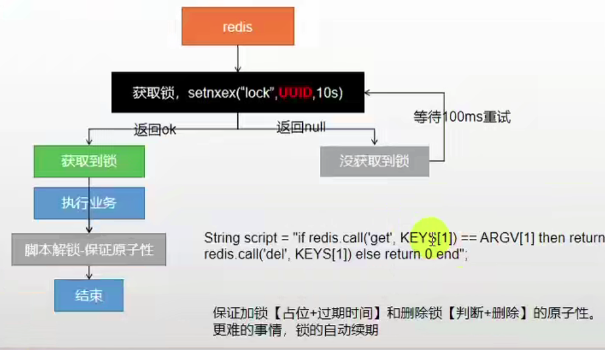

```sh
# Lua 脚本
if redis.call('get', KEYS[1]) == ARGV[1] 
    then 
	    return redis.call('del', KEYS[1]) 
	else 
	    return 0 
end
```

```java
// 需要执行上述脚本
public List<CategoryEntity> getListWithTreeWithRedisLock() {

    // 1、占分布式锁
    String uuid = UUID.randomUUID().toString();
    Boolean local = redisTemplate.opsForValue().setIfAbsent("lock", uuid, 30, TimeUnit.SECONDS);

    if (local){
        List<CategoryEntity> data;
        try{
            data = getDataFromDB();
        }finally {
            String script = "if redis.call('get', KEYS[1]) == ARGV[1] then return redis.call('del', KEYS[1]) else return 0 end";
            // 原子操作 对比之后删除锁，成功返回1l 失败返回0l
            Long lock = redisTemplate.execute(new DefaultRedisScript<>(script, Long.class),
                                              Arrays.asList("lock"), uuid);// lock 匹配 KEYS[1] uuid 匹配ARGV[1]
        }
        return data;
    }else {
        // 加锁失败... 重试  休眠一段时间 自旋锁
        System.out.println("获取分布式锁失败，等待重试");
        try {
            Thread.sleep(100);
        } catch (InterruptedException e) {
            e.printStackTrace();
        }
        return getListWithTreeWithRedisLock();
    }
}
// 本地多容器压测成功(只访问了一次数据库)
```

分布式锁主要是需要进行原子加锁(set的 nx 命令和过期时间)和原子删锁(redis+Lua脚本)

自动续签可以设置锁的过期时间稍微长一点


#### Redisson

redisson的所有锁基本上都是调用lua脚本，保证了原子性；基于看门狗机制，解决了死锁问题

锁的名字就相当于一把锁，锁的粒度越小，越细就越快，越大就越慢

> 简介

```xml
<!-- redisson:实现分布式锁、分布式对象等的框架 -->
<dependency>
    <groupId>org.redisson</groupId>
    <artifactId>redisson</artifactId>
    <version>3.16.2</version>
</dependency>
```

可重入锁(ReentrantLock)：一个方法获取了这个锁之后，调用另一个方法，这个一个方法也可以获取这个锁，只是释放锁的顺序也应该一致

配置

```java
@Configuration
public class RedissonConfig {

    /**
     * 所有对Redisson的使用都是通过这个对象
     *
     */
    @Bean(destroyMethod="shutdown")
    RedissonClient redisson() throws IOException {
        Config config = new Config();
        config.useSingleServer().setAddress("redis://47.98.137.243:6379");
        return Redisson.create(config);
    }

}
```

测试

```java
@RequestMapping("/test")
public String testRedisson(){
    RLock lock = redisson.getLock("myLock");
    lock.lock(); // 阻塞式等待  默认过期时间30s
    // 解决了两个问题： 锁的自动续期，如果业务超长，运行期间会自动给锁续上30s，不用担心业务过长，锁被删除
    //                加锁的业务一旦完成，就不会给当前锁续期，即使不手动解锁，锁也会在30s之后自动删除

    // 设置过期时间和不设置走的不同的方法(源码)
    // 如果设置了过期时间，就给redis执行脚本，进行占锁，默认时间就是我们指定的时间
    // 看门狗机制：如果没有设置，就是用30*1000 [lockWatchdogTimeout,看门狗默认时间]
    // 只要占锁成功，就会启动一个定时任务(重新设置过期时间，也是看门狗时间，在经过看门狗时间/ 3 的时候续期，也就是每隔10秒续期到30s)
    try{
        System.out.println("加锁成功，执行业务"+Thread.currentThread().getId());
        Thread.sleep(30000);
    }catch (Exception e){

    }finally {
        System.out.println("释放锁"+Thread.currentThread().getId());
        lock.unlock();
    }
    return "hello";
}
```

最佳实战

```java
lock.lock(30,TimeUnit.SECONDS); // 因为如果业务时间超过30秒，基本上是不可能的，所以一般使用这个，还去除了续期过程
```

> 读写锁

读的并发：加不加锁没区别，相当于没有加锁，会同时加锁成功

读+写的并发：需要先写再读

读+写：写锁需要等它之前的读锁释放

写的并发：需要排队，阻塞等待

```java
@RequestMapping("/write")
public String write(){

    RReadWriteLock readWriteLock = redisson.getReadWriteLock("rw-lock");
    RLock rLock = readWriteLock.writeLock();
    String s = "";
    try {
        // 该数据加写锁，读数据加读锁：保证一定能读到最新数据
        // 写锁是一个排他锁(互斥锁)。读锁是一个共享锁，写锁没释放，读必须等待
        rLock.lock();
        s= UUID.randomUUID().toString();
        Thread.sleep(10000);
        redisTemplate.opsForValue().set("write",s);
    } catch (InterruptedException e) {
        e.printStackTrace();
    } finally {
        rLock.unlock();
    }
    return s;
}

@RequestMapping("/read")
public String read(){
    RReadWriteLock readWriteLock = redisson.getReadWriteLock("rw-lock");
    // 读锁
    RLock rLock = readWriteLock.readLock();
    String s = "";
    rLock.lock();
    try {
        s= redisTemplate.opsForValue().get("write");
    } catch (Exception e) {
        e.printStackTrace();
    }finally {
        rLock.unlock();
    }
    return s;
}

```

> 信号量Semaphore

可以作为分布式限流

```java
/**
     * 车库停车
     *
     */
@GetMapping("/park")
public String park() throws InterruptedException {
    RSemaphore park = redisson.getSemaphore("park");
    boolean acquire = park.tryAcquire();// 获取信号，获取值，占一个车位  阻塞方法
    if (acquire){
        // 业务方法
    } else {
        return "error";
    }

    return "ok";
}

@GetMapping("/go")
public String go() throws InterruptedException {
    RSemaphore park = redisson.getSemaphore("park");
    park.release();// 释放一个车位
    return "ok";
}
```


> 闭锁CountDownLauch

```java
/**
     * 放假，锁门，需要所有同学走完
     * 闭锁
     *
     */
@GetMapping("/lockDoor")
public String lockDoor() throws InterruptedException {
    RCountDownLatch door = redisson.getCountDownLatch("door");
    door.trySetCount(5);
    door.await(); // 等待闭锁完成，计数为0
    return "放假了。。";
}

@GetMapping("/gogogo/{id}")
public String gogogo(@PathVariable("id") Long id){
    RCountDownLatch door = redisson.getCountDownLatch("door");
    door.countDown(); // 计数减一
    return id+"班人走了";
}
```

## 异步和线程池

### 线程池

> 线程

初始化线程的4种方式

* 继承Thread
* 实现Runnable接口
* 实现Callable接口+FutureTask（可以拿到返回结果，可以处理异常）  前三种一般都不使用   将所有的多线程异步任务都交给线程池
* 线程池

```java
// FutureTask也可以传入Runnable及一个对象，可以通过对象获得返回值 
FutureTask<Integer> futureTask = new FutureTask<>(() -> {
    int i = 10 / 2;
    return i;
});
new Thread(futureTask).start();
// 会等待整个线程执行完，返回执行结果 阻塞等待
futureTask.get();
System.out.println(futureTask.get());
```

> 线程池 (ExecutorService)

降低资源的消耗、提高响应速度、提高线程的可管理性，可以控制资源，性能稳定，不会产生资源耗尽的情况

四大方法

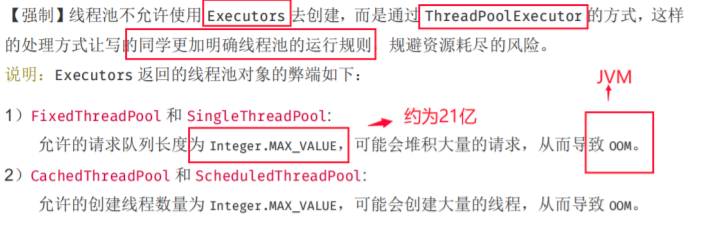

```java
// 核心线程数量和最大线程数量一样，不会被回收
public static ExecutorService newFixedThreadPool(int nThreads) {
    return new ThreadPoolExecutor(nThreads, nThreads,
                                  0L, TimeUnit.MILLISECONDS,
                                  new LinkedBlockingQueue<Runnable>());
}
// 核心线程为0，会回收完
public static ExecutorService newCachedThreadPool() {
    return new ThreadPoolExecutor(0, Integer.MAX_VALUE,
                                  60L, TimeUnit.SECONDS,
                                  new SynchronousQueue<Runnable>());
}
// 核心和最大都为1
public static ExecutorService newSingleThreadExecutor() {
    return new FinalizableDelegatedExecutorService
        (new ThreadPoolExecutor(1, 1,
                                0L, TimeUnit.MILLISECONDS,
                                new LinkedBlockingQueue<Runnable>()));
}
// 执行定时任务的线程池
public static ScheduledExecutorService newScheduledThreadPool(int corePoolSize) {
    return new ScheduledThreadPoolExecutor(corePoolSize);
}
```


七大参数

```java
int corePoolSize, //核心线程数(一直存在，除非设置allowCoreThreadTimeOut)，线程池创建好就会创建这么多线程
int maximumPoolSize, //最大线程数  控制资源
long keepAliveTime, //当当前线程数大于核心线程数时，只要线程空闲时间大于这个时间就释放这个线程(只要超过核心线程数的线程)
TimeUnit unit, // 时间单位
BlockingQueue<Runnable> workQueue, // 任务队列(阻塞队列)，存多的任务  LinkedBlockingQueue:默认是Integer.MAX_VALUE，构造方法可指定数量
ThreadFactory threadFactory, // 创建线程的工厂
RejectedExecutionHandler handler // 拒绝策略：如果队列满了怎么办
```

四种拒绝策略

```java
// 当核心线程和任务队列都满了，还有任务进来
new ThreadPoolExecutor.AbortPolicy() // 不处理，直接抛出异常
new ThreadPoolExecutor.CallerRunsPolicy() // 直接返回任务，哪来的哪去
new ThreadPoolExecutor.DiscardPolicy() //丢掉任务，不会抛出异常！
new ThreadPoolExecutor.DiscardOldestPolicy() //队列满了，尝试去和最早运行的线程的竞争，不会抛出异常！
```


工作流程

1. 线程池创建，准备好core数量的核心线程，准备接受任务
2. core满了，将再进来的任务放入阻塞队列中，空闲的core自己去阻塞队列获取任务执行
3. 阻塞队列满了，就直接开新线程执行，最大开到max指定的数量
4. max满了就用拒绝策略拒绝任务
5. max执行完之后，空闲的线程在指定的时间keepAliveTime后，释放max-core的线程数

线程池管理线程性能稳定，也可以获取执行结果，并捕获异常。但是在业务复杂的情况下，一个异步调用可能会依赖于另一个异步调用的执行结果

### CompletableFuture异步编排

一个异步调用依赖于另一个异步调用的执行结果，JDK1.8的

> 测试API

```java
private static ExecutorService service = Executors.newFixedThreadPool(10);
public static void main(String[] args) throws ExecutionException, InterruptedException {
    System.out.println("main start");
    //        CompletableFuture.runAsync(()->{ // 没有返回结果
    //            int i = 10/2;
    //            System.out.println("当前结果："+i);
    //        },service);
    CompletableFuture<Integer> future = CompletableFuture.supplyAsync(() -> {  // 有返回值
        System.out.println("sada");
        return 10 / 2;
    }, service).whenComplete((res,exception)->{ // 能得到异常信息，但是不能修改返回值  方法完成后的感知
        System.out.println("异步任务执行成功，结果是"+res+"，异常是"+exception);
    }).exceptionally(throwable -> {  // 可以感知异常，同时返回默认值
        return 10;
    });
    // 会等待线程执行完成 阻塞
    System.out.println(future.get());
    System.out.println("main end");
}

public static void test() throws ExecutionException, InterruptedException {
    CompletableFuture<Integer> future = CompletableFuture.supplyAsync(() -> {
        System.out.println("sada");
        return 10 / 2;
    }, service).handle((res,thr)->{ // supplyAsync方法执行完成后的处理
        if (res != null){
            return res*2;
        }
        if (thr != null){
            return 0;
        }
        return 0;
    });
    // 会等待线程执行完成 阻塞
    System.out.println(future.get());
}
```

> 线程串行化方法

thenApply：当一个线程依赖另一个线程时，能获取A任务返回的结果，并返回当前任务的返回值

thenAccept：消费处理结果，接受A任务的处理结果，并消费，无返回结果

thenRun：只要A执行完成，就开始执行B，A和B无关联

带有Async默认是异步执行的，就是A和B是否使用同一线程执行(带Async会再开一个线程执行)

```java
public static void main(String[] args) {
    System.out.println("main start");
    CompletableFuture<Integer> future = CompletableFuture.supplyAsync(() -> {
        System.out.println("sada");
        return 10 / 2; 
    }, service).thenApplyAsync(res->{
        System.out.println("任务2启动了"+res);
        return 10; 
    },service);
    System.out.println("main end");
}
```

> 两任务组合----都要完成

两个任务必须都完成，才能触发该任务

thenCombine：组合两个future，获取两个future的返回结果，并返回当前任务的返回值

thenAcceptBoth：组合两个future，获取两个future的返回结果，然后处理当前任务，没有返回值

runAfterBoth：组合两个future，不需要获取future的结果，只需要两个future处理完任务后，处理该任务

```java
public static void main(String[] args) throws ExecutionException, InterruptedException {
    System.out.println("main start");
    CompletableFuture<Integer> future01 = CompletableFuture.supplyAsync(() -> {
        System.out.println("任务1线程：" + Thread.currentThread().getId());
        int i = 10 / 2;
        System.out.println("任务1结束：" + i);
        return i;
    }, service);
    CompletableFuture<String> future02 = CompletableFuture.supplyAsync(() -> {
        System.out.println("任务2线程：" + Thread.currentThread().getId());
        System.out.println("任务2结束");
        return "hello";
    },service);

    //        future01.runAfterBothAsync(future02,()->{
    //            System.out.println("任务3开始");
    //        },service);

    //        future01.thenAcceptBothAsync(future02,(res1,res2)->{
    //            System.out.println("任务3开始，之前的结果"+res1+" "+res2);
    //        },service);

    CompletableFuture<String> future = future01.thenCombineAsync(future02, (res1, res2) -> {
        return res1 + res2;
    }, service);

    System.out.println("main end " + future.get());
}
```

> 两任务组合----一个完成

两个任务中，任何一个future任务完成的时候，执行任务

applyToEither：两个任务中有一个执行完成，获取它的返回值，处理当前任务并有新的返回值

acceptEither：两个任务中有一个执行完成，获取它的返回值，处理当前任务，没有返回值

runAfterEither：两个任务中有一个执行完成，不需要获取future的结果，处理当前任务，没有返回值

```java
public static void main(String[] args) throws ExecutionException, InterruptedException {
    System.out.println("main start");
    CompletableFuture<String> future01 = CompletableFuture.supplyAsync(() -> {
        System.out.println("任务1线程：" + Thread.currentThread().getId());
        int i = 10 / 4;
        System.out.println("任务1结束：" + i);
        return i+"";
    }, service);
    CompletableFuture<String> future02 = CompletableFuture.supplyAsync(() -> {
        System.out.println("任务2线程：" + Thread.currentThread().getId());
        try {
            Thread.sleep(3000);
        } catch (Exception e) {
            e.printStackTrace();
        }
        System.out.println("任务2结束");
        return "hello";
    },service);

    //        future01.runAfterEitherAsync(future02, () -> {
    //            System.out.println("任务3开始");
    //        }, service);

    //        future01.acceptEitherAsync(future02,(res)->{
    //            System.out.println("任务3："+res);
    //        },service);

    CompletableFuture<String> future = future01.applyToEitherAsync(future02, (res) -> {
        System.out.println("任务3：" + res);
        return "da" + res;
    }, service);

    System.out.println("main end " +future.get());
}
```

> 多任务组合

allOf：等待所有任务执行完

anyOf：只要有一个任务执行完

```java
public static void main(String[] args) throws ExecutionException, InterruptedException {
    System.out.println("main start");
    CompletableFuture<Object> future01 = CompletableFuture.supplyAsync(() -> {
        System.out.println("查询商品图片信息");
        return "hello.jpg";
    }, service);
    CompletableFuture<Object> future02 = CompletableFuture.supplyAsync(() -> {
        try {
            Thread.sleep(3000);
        } catch (InterruptedException e) {
            e.printStackTrace();
        }
        System.out.println("查询商品属性");
        return "黑色+256G";
    },service);

    //        CompletableFuture<Void> future = CompletableFuture.allOf(future01, future02);
    //        future.get(); //阻塞等待，等待所有任务都执行完
    //        System.out.println("main end ："+future01.get()+future02.get());

    CompletableFuture<Object> anyOf = CompletableFuture.anyOf(future01, future02);
    System.out.println("main end ："+anyOf.get()); // 只要有一个任务完成就行
}
```


## 登录

### 社交登录

QQ、微博、github等网站的用户量非常大，网站为了简化自我网站的登录与注册逻辑，引入社交登录功能

* 用户点击QQ按钮
* 引导跳转到QQ授权页

权限认证 

> OAuth2.0

是一个开放标准，允许用户授权第三方网站并访问他们为服务器提供的信息，而不需要提供账号和密码

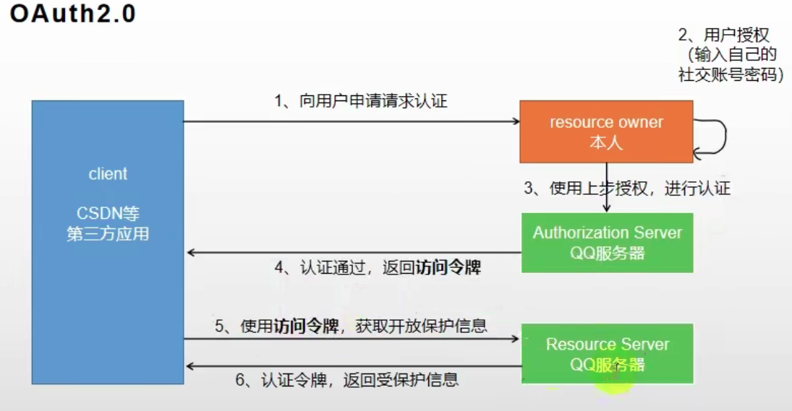

授权返回的code只能使用一次，换取回来的token可以使用到过期时间(在一段时间内使用不同的code获取到也是相同的token)

微博：


```java
@GetMapping("/weibo/success")
public String weibo(@RequestParam("code") String code) throws Exception {
    HashMap<String, String > map = new HashMap<>();
    map.put("client_id","");
    map.put("client_secret","");
    map.put("grant_type","authorization_code");
    map.put("redirect_uri","http://127.0.0.1:20000/oauth2.0/weibo/success");
    map.put("code",code);
    //根据code换取accessToken
    HttpResponse response = HttpUtils.doPost("https://api.weibo.com", "/oauth2/access_token", "post", null, null, map);
    if (response.getStatusLine().getStatusCode() == 200){
        //获取到accessToken
        SocialUser socialUser = JSON.parseObject(EntityUtils.toString(response.getEntity()), SocialUser.class);

        // 知道是哪个社交用户
        // 如果用户是第一次进入网站，自动注册用户，这个社交账号需要对应一个用户，下次进入网站就不用注册了
        // 登录或注册这个用户
        R r = memberFeginService.oauthLogin(socialUser);
        if (r.getCode() == 0){
            // 登录成功跳回首页
            MemberResponseVo responseVo = r.getData(new TypeReference<MemberResponseVo>() {});
            log.info("登录成功，用户信息：\n"+responseVo.toString());
            return "redirect:http://127.0.0.1:10001";
        }
    }
    //登录失败
    return "redirect:http://127.0.0.1:20000/login.html";
}

// memberFeginService.oauthLogin() 调用的下面这个
@Override
public MemberEntity login(SocialUser socialUser){
    // 登录注册合并逻辑
    String uid = socialUser.getUid();
    MemberEntity entity = this.baseMapper.selectOne(new QueryWrapper<MemberEntity>().eq("social_uid", uid));
    if (entity != null){
        // 这个用户已经注册
        entity.setAccessToken(socialUser.getAccess_token());
        entity.setExpiresIn(socialUser.getExpires_in());
        this.baseMapper.updateById(entity);

        return entity;
    }
    // 没有注册
    // 查询当前社交用户的社交账号信息（昵称、性别等）
    MemberEntity memberEntity = new MemberEntity();
    HashMap<String , String > map = new HashMap<>();
    map.put("access_token",socialUser.getAccess_token());
    map.put("uid",socialUser.getUid());
    try{
        HttpResponse response = HttpUtils.doGet("https://api.weibo.com", "/2/users/show.json", "get", null, map);
        if (response.getStatusLine().getStatusCode() == 200){
            // 查询成功
            JSONObject jsonObject = JSONObject.parseObject(EntityUtils.toString(response.getEntity()));
            memberEntity.setNickname(jsonObject.getString("name"));
            memberEntity.setGender("m".equals(jsonObject.getString("gender")) ? 1:0);
        }
    }catch (Exception e){
        // 即使网络出错也可以登录成功
        log.error("网络出错："+e.getMessage());
    }
    memberEntity.setSocialUid(socialUser.getUid());
    memberEntity.setAccessToken(socialUser.getAccess_token());
    memberEntity.setExpiresIn(socialUser.getExpires_in());
    this.baseMapper.insert(memberEntity);
    return memberEntity;
}
```

### 分布式Session共享

session

* 不能跨域名共享
* 分布式服务(集群状态)复制多份，session不同步问题

> SpringSession

session不同步问题：将session存入redis中，使用SpringSession配置即可

```xml
<dependency>
    <groupId>org.springframework.session</groupId>
    <artifactId>spring-session-data-redis</artifactId>
</dependency>

spring:
  session:
    store-type: redis
server:
  servlet:
    session:
      timeout: 30m

@EnableRedisHttpSession // 整合redis作为session存储
```

```java
session.setAttribute("loginUser",responseVo); // 使用这个 spring会自动将session存入redis中

@Configuration
public class GulimallSessionConfig {
    @Bean // 配置session作用域问题  子域(auth.gulimall.com)返回的session在主域也(gulimall.com)可以使用
    public CookieSerializer cookieSerializer() {

        DefaultCookieSerializer cookieSerializer = new DefaultCookieSerializer();

        //放大作用域，使cookie在主域上也能生效
        // cookieSerializer.setDomainName("gulimall.com");
        cookieSerializer.setCookieName("GULISESSION");

        return cookieSerializer;
    }

    @Bean // 设置session序列化，使用JSON序列化存入redis数据库
    public RedisSerializer<Object> springSessionDefaultRedisSerializer() {
        return new GenericJackson2JsonRedisSerializer();
    }
}
```

原理：装饰者模式

SessionRepositoryFilter.java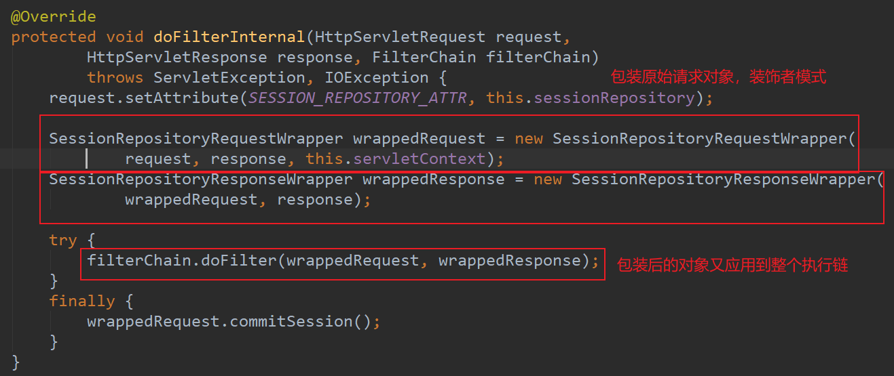

SpringSession核心原理
@EnableRedisHttpSession导入RedisHttpSessionConfiguration配置
      1、给容器中添加了一个组件
          SessionRepository->RedisOperationsSessionRepository：Redis操作session，session的增删改查封装类
      2、SpringHttpSessionConfiguration->SessionRepositoryFilter->就是一个Filter：每个请求都会经过这个过滤器
          doFilterInternal方法->使用装饰者模式包装原始的request和response：SessionRepositoryRequestWrapper，SessionRepositoryResponseWrapper
          然后执行doFilter->通过该链
          以后获取session，request.getSession(),就是SessionRepositoryRequestWrapper的getSession方法->使用SessionRepository执行对应的增删改查
          也就是使用Redisson执行
自动续签延期，也有过期时间

### 单点登录

一处登录，处处可用

> 有状态登录

为了保证客户端cookie的安全性，服务端需要记录每次会话的客户端信息，从而识别客户端身份，根据用户身份进行请求的处理，典型的设计如tomcat中的session。

例如登录：用户登录后，我们把登录者的信息保存在服务端session中，并且给用户一个cookie值，记录对应的session。然后下次请求，用户携带cookie值来，我们就能识别到对应session，从而找到用户的信息。

缺点是什么？

- 服务端保存大量数据，增加服务端压力
- 服务端保存用户状态，无法进行水平扩展
- 客户端请求依赖服务端，多次请求必须访问同一台服务器

即使使用redis保存用户的信息，也会损耗服务器资源。

> 无状态登录

微服务集群中的每个服务，对外提供的都是Rest风格的接口。而Rest风格的一个最重要的规范就是：服务的无状态性，即：

- 服务端不保存任何客户端请求者信息
- 客户端的每次请求必须具备自描述信息，通过这些信息识别客户端身份

带来的好处是什么呢？

- 客户端请求不依赖服务端的信息，任何多次请求不需要必须访问到同一台服务
- 服务端的集群和状态对客户端透明
- 服务端可以任意的迁移和伸缩
- 减小服务端存储压力

> 无状态登录流程

无状态登录的流程：

- 当客户端第一次请求服务时，服务端对用户进行信息认证（登录）
- 认证通过，将用户信息进行加密形成token，返回给客户端，作为登录凭证
- 以后每次请求，客户端都携带认证的token
- 服务的对token进行解密，判断是否有效。

整个登录过程中最关键的是：**token的安全性**

token是识别客户端身份的唯一标示，如果加密不够严密，被人伪造那就完蛋了。

采用何种方式加密才是安全可靠的呢？

我们将采用`JWT + RSA非对称加密`

> JWT实现无状态登录

Json Web Token

用于分布式系统的单点登录SSO场景，主要用于用户身份鉴别和接口安全性校验的一种机制

**组成**

JWT：头部(header)+载荷(payload)+签证(signature)

**header**

* 声明类型，这里是JWT
* 加密的算法，通常使用HMAC SHA256

```bash
{
	'typ':'JWT',
	'alg':'HS256'
}
```

将头部进行base64加密，构成了第一部分

**payload**

存放用户信息的地方

也是进行base64进行加密

**signature**

这部分需要base64加密后的header和payload使用`.`连接组成的字符串，然后通过header中声明的加密方式(有一个secret密匙)进行加盐加密，组成了jwt的第三部分

> JWT交互流程

- 1、用户登录
- 2、服务的认证，通过后根据secret生成token
- 3、将生成的token返回给浏览器
- 4、用户每次请求携带token
- 5、服务端利用公钥解读jwt签名，判断签名有效后，从Payload中获取用户信息
- 6、处理请求，返回响应结果

因为JWT签发的token中已经包含了用户的身份信息，并且每次请求都会携带，这样服务的就无需保存用户信息，甚至无需去数据库查询，完全符合了Rest的无状态规范。

> 加密技术

加密技术是对信息进行编码和解码的技术，编码是把原来可读信息（又称明文）译成代码形式（又称密文），其逆过程就是解码（解密），加密技术的要点是加密算法，加密算法可以分为三类：  

- 对称加密，如AES
  - 基本原理：将明文分成N个组，然后使用密钥对各个组进行加密，形成各自的密文，最后把所有的分组密文进行合并，形成最终的密文。
  - 优势：算法公开、计算量小、加密速度快、加密效率高
  - 缺陷：双方都使用同样密钥，安全性得不到保证 
- 非对称加密，如RSA
  - 基本原理：同时生成两把密钥：私钥和公钥，私钥隐秘保存，公钥可以下发给信任客户端
    - 私钥加密，持有公钥才可以解密
    - 公钥加密，持有私钥才可解密
  - 优点：安全，难以破解
  - 缺点：算法比较耗时
- 不可逆加密，如MD5，SHA 
  - 基本原理：加密过程中不需要使用[密钥](https://baike.baidu.com/item/%E5%AF%86%E9%92%A5)，输入明文后由系统直接经过加密算法处理成密文，这种加密后的数据是无法被解密的，无法根据密文推算出明文。


## 购物车

用户在**登录**状态下将商品添加到购物车【**用户购物车/在线购物车**】

* 放入数据库
* 放入redis，提高吞吐量(宕机数据丢失的风险，损失性能配置持久化)；在redis使用hash存储，取得时候类似于map
  * Map<String k1,Map<String k2,CartItemInfo>>：k1标识每个人的购物车，k2是购物项的商品id
* 登录以后，会将**临时购物车**的数据全部合并过来，并清空**临时购物车**

用户在**未登录**下将商品添加到购物车【**游客购物车/离线购物车/临时购物车**】

* 放入localstorage或cookie
* 放入redis
* 浏览器即使关闭，下次进入，**临时购物车**数据还在

```java
@Component
@Slf4j
public class CartInterceptor implements HandlerInterceptor {

    public static ThreadLocal<UserInfoTo> threadLocal = new ThreadLocal<>();

    // 目标方法执行之前
    @Override
    public boolean preHandle(HttpServletRequest request, HttpServletResponse response, Object handler) throws Exception {
        log.info(request.getRequestURL().toString());
        UserInfoTo userInfoTo = new UserInfoTo();
        HttpSession session = request.getSession();
        MemberResponseVo responseVo = (MemberResponseVo) session.getAttribute(AuthServerConstant.LOGIN_USER);
        if (responseVo != null){
            // 用户登录
            userInfoTo.setUserId(responseVo.getId());
        }
        Cookie[] cookies = request.getCookies();
        for (Cookie cookie:cookies){
            if (CartConstant.TEMP_USER_COOKIE_NAME.equals(cookie.getName())){
                userInfoTo.setUserKey(cookie.getValue());
                userInfoTo.setIsLogin(true);
                break;
            }
        }

        // 如果没有临时用户一定分配一个临时用户
        if (StringUtils.isEmpty(userInfoTo.getUserKey())){
            String uuid = UUID.randomUUID().toString();
            userInfoTo.setUserKey(uuid);
        }

        // 目标方法执行之前
        threadLocal.set(userInfoTo);
        return true;
    }

    // 目标方法执行之后，分配临时用户让浏览器保存
    @Override
    public void postHandle(HttpServletRequest request, HttpServletResponse response, Object handler, ModelAndView modelAndView) throws Exception {
        // 让浏览器保存一个cookie 一个月后过期，京东没有延长cookie过期时间
        UserInfoTo userInfoTo = threadLocal.get();
        // 没有创建user-key的用户才设置cookie
        if (userInfoTo.getUserId() == null){
            Cookie cookie = new Cookie(CartConstant.TEMP_USER_COOKIE_NAME, userInfoTo.getUserKey());
            cookie.setDomain("gulimall.com");
            cookie.setMaxAge(CartConstant.TEMP_USER_COOKIE_TIMEOUT);
            response.addCookie(cookie);
        }
    }
}
```


> 拦截器和ThreadLocal

拦截器可以在进入请求之前判断用户是否登录，ThreadLocal可以快速获得当前登录（线程）的用户

[过滤器和拦截器的区别](https://www.cnblogs.com/panxuejun/p/7715917.html)

执行顺序：过滤器-->拦截器-->请求：业务方法-->拦截器-->过滤器

## RabbitMQ

消息队列

### 应用场景

**异步处理**

> 串行

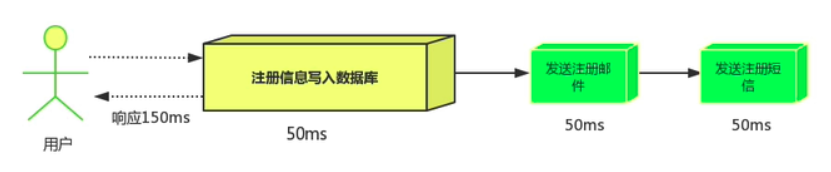

> 并行(线程池)


> 消息队列


写入数据库就返回注册成功，并不关心邮件和短信是否发送成功

**应用解耦**

> 传统场景


当库存系统出现故障后，下订单就会失败

> 消息队列

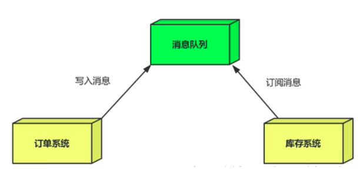

将下单信息写入消息队列，就算库存系统出现故障，消息队列也能保证消息的可靠投递，不会导致消息丢失

**流量控制(削峰)**


比如说秒杀活动，就算请求很多，系统也可以全部接受，放入消息队列，应用程序只需要按自己最大的处理能力获取订单，达到削峰的作用

也可以控制阀值，超过阀值的直接丢掉

可以缓解短时间内的高流量压垮应用

### 概述

> **重要概念**

* **消息代理**(message broker)：就是安装了消息中间件的服务器，发消息和接收消息都要连接这个服务器
* **目的地**(destination)：就是消息将要发给哪 

当消息发送者发送消息后，将由消息代理接管，消息代理保证消息传递到指定目的地

> 目的地

* 队列(queue)：点对点消息通信(point to point)
* 主题(topic)：发布(publish)/订阅(subscribe)消息通信

> 点对点模式

消息发送者发送消息，消息代理将其放入一个队列中，消息接受者从中获取内容，消息读取后被移出队列

消息只有唯一的发送者和接受者，但是接收者可以有多个 (就是可以有很多个应用订阅这个队列，但是最后只有一个会抢到)

> 发布订阅式

在消息被放入topic时，多个接收者(订阅了这个topic的)会同时收到这个消息；类似于b站关注up主，然后up主发视频后，粉丝同时收到消息

> JMS(Java Message Service)

基于jvm消息代理的规范(ActiveMQ和HornetMQ是JMS实现)

> AMQP(Advanced Message Queuing Protocol)

高级消息队列协议，消息代理的规范，兼容JMS

RabbitMQ是AMQP的实现


**RabbitMQ概念**

* Message：消息，没有名字，由消息头和消息体组成，消息体不透明，消息头：routing-key(路由键)、priority(相对于其他消息的优先权)、delivery-mode(指出该消息是否永久存储)等
* Publisher：消息生产者，也是向交换器发布消息的客户端应用程序(发消息是发给交换机)
* Exchange：交换器，接受生产者发送的消息并将消息路由给服务器的队列；exchange四种类型：direct(默认)、fanout、topic、headers，不同类型的消息转发策略不同
* Queue：消息队列，用来保存消息知道发送给消费者，它是消息的容器。一个消息可以投入一个或多个队列，消息一致在队列里，等待消费者取走消息
* Binging：绑定，一个绑定就是基于路由键将交换器和消息队列连起来的路由规则，可以把交换器理解为一个由绑定构成的路由表
* Connection：网络连接，TCP等；(一个客户端建立一个Connection，有多个Channel进行操作)
* Channel：信道，多路复用中一条独立的双向数据流通道。信道是建立在真实的TCP连接内的虚拟连接，AMQP命令都是由信道发出去的(发布或接受消息、订阅队列)。主要是对于操作系统来说建立和销毁TCP都是非常昂贵的开销，所以引入信道复用TCP连接

* Consumer：消费者，从消息队列获取消息的客户端程序(接受消息是监听队列)
* Virtual Host：虚拟主机，表示一批交换器、消息队列和相关对象；虚拟主机共享相同的身份认证和加密环境的独立服务器域；每个vhost本质是一个mini版的RabbitMQ服务器，拥有自己的队列、交换器、绑定和权限机制，RabbitMQ默认的vhost是/
* Broker：表示消息队列服务器实体


一个Connection多个Channel，相当于高速公路上多条道，

vhost可以用于不同环境(java和php)的隔离、也可以用于生产环境和开发环境的隔离

> 测试

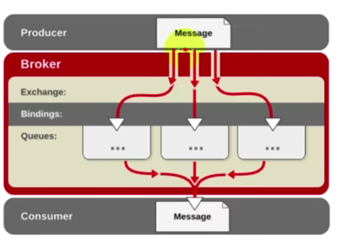

> Exchange交换器类型

direct、fanout、topic、headers(匹配消息的header，而不是路由，并且与direct完全一致，但性能差很多，基本用不到)

**direct**：点对点

将消息直接交给一个指定的队列，路由键按照绑定关系精确匹配

**fanout**：广播(发布订阅)

广播类型，不处理或匹配路由键，只要队列绑定到该交换器，消息就会传到该交换器的所有队列

**topic**：发布订阅

部分广播模式，在广播模式的基础上可以挑给谁发消息

路由键需要和某个模式匹配，队列需要绑定一个模式，比如说：usa.*  可以匹配  usa.test 和 usa.dadad

单词之间用`.`隔开，`#` 匹配0个或多个单词，`*`匹配一个单词

### 延时队列

发到这个队列的消息需要30分钟以后才能被人收到

实现定时任务的效果，比如订单30分钟后(扫描数据库)未支付，关闭订单；库存 40分钟后订单不存在或取消，解锁库存

如果使用定时任务，会消耗系统内存，增加数据库压力，存在较大的时间误差(失效问题，比如刚扫描完后1分钟的时候下单，下次扫描订单生成29分钟，要再下一次扫描才会扫到)

解决：使用rabbitmq的消息TTL和死信Exchange

Rabbitmq可以对队列和消息都指定TTL

TTL：消息存活时间

死信：消息在一定时间里没有被人消费

* 一个消息被consumer拒收了，并且reject方法里面的参数requeue为false，就是不会再次放入队列里
* 消息的TTL到了，消息过期
* 队列的长度限制满了，排在最前面的消息会被丢弃或扔到死信路由上

我们可以控制消息在一段时间后变成死信，可以控制变成死信的消息路由到指定的交换机，结合两者，就实现了延时队列

> 实现

可以设置消息的过期时间、也可以设置队列的过期时间(队列里面消息的过期时间)

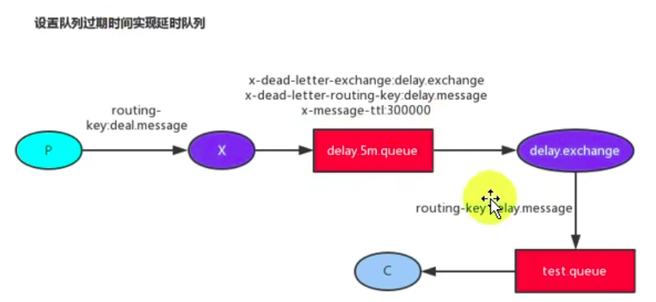


**建议设置队列过期**，因为rabbitmq使用惰性检查的，比如说发了两个消息进队列，第一个过期时间是5分钟，第二个是1分钟，当服务器进行检查的时候发现第一个是5分钟，就放进队列了，等五分钟后再来检查，把第一个丢掉，再看第二个

订单实现见 **分布式事务.RabbitMQ延时队列**

### 安装

> docker安装

```bash
docker run -d -e RABBITMQ_DEFAULT_USER=admin -e RABBITMQ_DEFAULT_PASS=admin -p 5671:5671 -p 5672:5672 -p 4369:4369 -p 25672:25672 -p 15671:15671 -p 15672:15672  -v /home/rabbitmq/data:/var/lib/rabbitmq --restart=always --name rabbitmq rabbitmq:management
```

4369,25672：erlang发现&集群端口

5672,5671：AMQP端口

15672：web管理后台端口

61613,61614：STOMP端口

1883,8883：MQTT端口

### SpringBoot整合RabbitMQ

```xml
<dependency>
    <groupId>org.springframework.boot</groupId>
    <artifactId>spring-boot-starter-amqp</artifactId>
</dependency>
```

```yml
@EnableRabbit

spring:
  rabbitmq:
 	host: @spring.rabbit.host@
    port: 5672
    username: admin
    password: admin
    virtual-host: /
```

```java
 * 使用RabbitMQ
 * 1.引入amqp场景，RabbitAutoConfiguration自动生效
 * 2.给容器中自动配置了
 *      RabbitTemplate、AmqpAdmin、CachingConnectionFactory、RabbitMessagingTemplate
 * 3.@EnableRabbit 开启RabbitMQ的功能
 * 4.@RabbitListener  监听队列消息，得到消息(队列必须存在)；必须开启@EnableRabbit
     
     * 参数可以写的参数
     * 1.Message:原生消息详细信息，头+体
     *  T : 直接是发送消息的实体内容
     *  Channel channel: 当前传输数据的通道
     *
     * 2.可以有很多人来监听这个队列；只要收到消息，队列就会删除这个消息，而且只能有一个能收到消息
     *  1)订单服务启动多个，同一个消息，只能有一个客户端收到
     *  2)只有一个消息完全处理完，方法运行结束，才会接收到下一个消息
     * 3.@RabbitListener(queues = {"hello-java-queue"})：可以放在类、方法上  @RabbitHandler放在方法上
     *  当@RabbitListener放在类上，使用@RabbitHandler 该方法就监听队列，多个方法加这个注解 类似重载，处理不同的实体，区分不同的场景
 
         
// test
public class GulimallOrderApplicationTests {

    @Autowired
    AmqpAdmin amqpAdmin;

    @Autowired
    RabbitTemplate rabbitTemplate;

    @Test
    public void testSendMessage(){
        // 如果发送的消息是一个对象，实体需要实现Serializable接口
        // 默认使用自己的编码，在RabbitConfig中配置了 转成json的编码器
        for (int i=0;i<10;i++){
            OrderReturnReasonEntity orderReturnReasonEntity = new OrderReturnReasonEntity();
            orderReturnReasonEntity.setName("name："+i);
            rabbitTemplate.convertAndSend("hello-java-exchange","hello.java",orderReturnReasonEntity, new CorrelationData(UUID.randomUUID().toString()));  // new CorrelationData() 是消息的唯一id

        }
    }

    /**
     * 创建Exchange、Queue、Binding
     *
     * 收发消息
     */
    @Test
    public void createExchange(){
        //  public DirectExchange(String name, boolean durable, boolean autoDelete)
        //  durable:是否持久化   autoDelete:是否自动删除
        DirectExchange directExchange = new DirectExchange("hello-java-exchange", true, false);
        amqpAdmin.declareExchange(directExchange);
        log.info("Exchange[{}]创建成功","hello-java-exchange");
    }

    @Test
    public void createQueue(){
        // public Queue(String name, boolean durable, boolean exclusive, boolean autoDelete, Map<String, Object> arguments)
        //  durable:是否持久化 exclusive:是否排它(只要有一条连接连上了这个队列，其他连接都连不上这个队列，一般false) autoDelete:是否自动删除
        Queue queue = new Queue("hello-java-queue", true,false,false);
        amqpAdmin.declareQueue(queue);
        log.info("Queue[{}]创建成功","hello-java-queue");
    }

    @Test
    public void createBinding(){
        // public Binding(String destination, Binding.DestinationType destinationType, String exchange, String routingKey, Map<String, Object> arguments) {
        // destination:目的地 destinationType:目的地类型 exchange:交换机 routingKey:路由Key
        Binding binding = new Binding("hello-java-queue",Binding.DestinationType.QUEUE,
                "hello-java-exchange","hello.java",null);
        amqpAdmin.declareBinding(binding);
        log.info("Binding[{}]创建成功","hello-java-binding");
    }
}
         

@Service("orderItemService")
@RabbitListener(queues = {"hello-java-queue"})
public class OrderItemServiceImpl{

    @RabbitHandler
    public void recieveMessage(Message message, OrderReturnReasonEntity orderReturnReasonEntity){
        System.out.println("接收到消息："+orderReturnReasonEntity);
    }
}
```

#### Rabbit消息确认机制---可靠抵达

* **保证消息**不丢失，可靠抵达，可以使用事务消息，性能下降250倍 ；为此引入确认机制

* publisher  confirmCallback   确认模式
* publisher  returnCallback    未投递到queue 退回模式
* consumer   ack机制

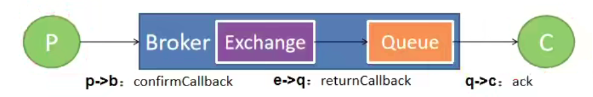

> 确认回调--ConfirmCallback   

spring.rabbitmq.publisher-confirms=true


> 错误回调--returnCallback

触发时机--消息投递失败(未投递到队列里面的消息就会触发这个)

spring.rabbitmq.publisher-returns=true

spring.rabbitmq.template.mandatory=true

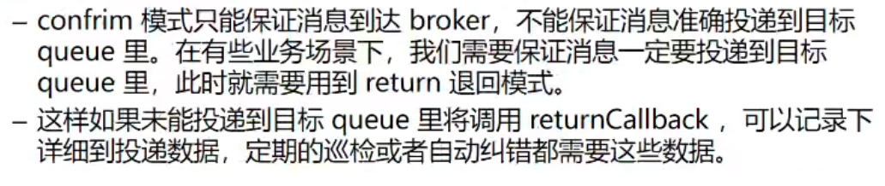

> 可靠抵达--ack(手动确认)

消费者获取消息，成功处理，可以回复ack给broker；开启手动确认ack

spring.rabbitmq.listener.simple.acknowledge-mode=manual    

* basic.ack：用于肯定确认，broker将移除此消息
* basic.nack：用于否定确认，可以指定broker是否丢弃此消息，可以批量
* basic.reject：用于否定确认，同上，但不能批量

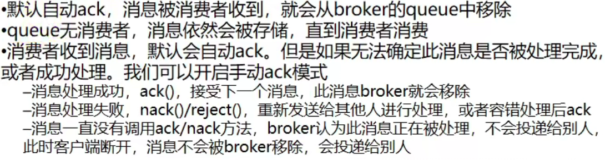

消息可靠抵达配置

```java
package com.lvboaa.gulimall.order.config;

import org.springframework.amqp.core.Message;
import org.springframework.amqp.rabbit.connection.CorrelationData;
import org.springframework.amqp.rabbit.core.RabbitTemplate;
import org.springframework.amqp.support.converter.Jackson2JsonMessageConverter;
import org.springframework.amqp.support.converter.MessageConverter;
import org.springframework.beans.factory.annotation.Autowired;
import org.springframework.context.annotation.Bean;
import org.springframework.context.annotation.Configuration;

import javax.annotation.PostConstruct;
@Configuration
public class RabbitConfig {

    @Autowired
    RabbitTemplate rabbitTemplate;

    @Bean
    public MessageConverter messageConverter(){
        return new Jackson2JsonMessageConverter();
    }

    /**
     * 定制RabbitTemplate
     * 1.服务器收到消息就回调
     *      1.spring.rabbitmq.publisher-confirms=true
     *      2.设置消息回调ConfirmCallback
     * 2.消息正确抵达队列进行回调
     *      1.spring.rabbitmq.publisher-returns=true
     *        spring.rabbitmq.template.mandatory=true
     *      2.设置投递失败异步回调ReturnCallback
     * 3.消费端确认(保证每个消息正确被消费，此时消息才可以被broker删除)
     *      1.默认是自动确认的，只要消息接收到，客户端自动确认，服务端就会移除这个消息
     *      问题：我们收到很多消息，自动回复给服务器ack,只有一个消息处理成功，然后宕机，就会发生消息丢失
     *      解决：手动确认，设置spring.rabbitmq.listener.direct.acknowledge-mode=manual
     *          (不进行手动确认(消息状态一直为unacked)，队列就不会移除这个消息，宕机消息也不会丢失，状态变为ready)
     *      2.如何签收
     *         签收：channel.basicAck(deliveryTag,false);  业务成功完成
     *         退回(拒签)：channel.basicNack(deliveryTag,false,true); channel.basicReject();  业务处理失败
     */
    @PostConstruct  // RabbitConfig对象创建完成以后，执行构造方法以后就执行这个方法
    public void initRabbitTemplate(){

        //设置确认回调
        rabbitTemplate.setConfirmCallback(new RabbitTemplate.ConfirmCallback() {
            /**
             *
             * @param correlationData  当前消息的唯一关联数据(这个是消息的唯一id)
             * @param b     (消息是否成功)   只要消息抵达Broker(服务代理)，这个就为true
             * @param s     (失败的原因)
             */
            @Override
            public void confirm(CorrelationData correlationData, boolean b, String s) {
//                System.out.println("confirmcallback:"+correlationData+" "+b+" "+s);
            }
        });

        //设置消息抵达队列的确认回调
        rabbitTemplate.setReturnCallback(new RabbitTemplate.ReturnCallback() {
            /**
             *  只有消息没有投递给指定的队列才会触发这个失败回调
             * @param message   投递失败的消息的详细信息
             * @param i         回复的状态码
             * @param s         回复的文本内容
             * @param s1        当时消息发给哪个交换机
             * @param s2        当时消息使用哪个路由键
             */
            @Override
            public void returnedMessage(Message message, int i, String s, String s1, String s2) {
//                System.out.println("Fail Message:"+message+" "+i+" "+s+" "+s1+" "+s2);
            }
        });
    }
}

// 消费者手动ack，确认接受或退回
@RabbitHandler
public void recieveMessage(Message message, OrderReturnReasonEntity orderReturnReasonEntity, Channel channel){
    System.out.println("接收到消息："+orderReturnReasonEntity);

    // channel内按顺序自增的
    long deliveryTag = message.getMessageProperties().getDeliveryTag();

    // 签收货物 multiple代表是否批量签收
    try {
        if (deliveryTag % 2 == 0){
            channel.basicAck(deliveryTag,false);
            System.out.println("签收了货物..."+deliveryTag);
        }else {
            // 退货  channel.basicReject();
            // requeue 拒收了消息是否重新入队  true:入队 false:丢弃
            channel.basicNack(deliveryTag,false,true);

            System.out.println("退回了货物..."+deliveryTag);
        }

    } catch (IOException e) {
        // 网络中断异常信息
        e.printStackTrace();
    }
}
```

#### 保证消息可靠性--消息丢失、重复、积压等

> 消息丢失

消息发送出去，由于网络问题没有抵达服务器

* 做好容错方法(try-catch)，发送消息时可能有网络问题，失败后要有重试机制，可记录到数据库，采用定期扫描重发的方式
* 做好日志记录，每个消息状态是否被服务器收到都应该做记录
* 做好定期重发、如果消息没有发送成功，定期扫描数据库对未成功发送的消息重发

消息抵达broker，broker要将消息写入磁盘(持久化)才算成功，此时broker尚未完成持久化，宕机

* publisher也需要加入确认回调机制，确认成功的消息，再修改数据库消息状态

自动ack状态下，消费者收到消息，但没来得及消费然后宕机

* 一定要开启手动ACK，消费成功才移除，失败或没来得及处理就noack并重新入队

**总结**：

1. 做好消息确认机制(publisher的ConfirmCallback，consumer的手动ack)
2. 每一个发送的消息都保存在数据库；定期将失败的消息再发一遍

> 消息重复

消息消费成功，由于重试机制，自动将消息发送出去(允许)

消息消费成功，事务已经提交，ack时，机器宕机，导致没有ack成功，Broker的消息重新由unack变为ready，并发送给其他消费者

* 消费者的业务消费接口应设计为**幂等性**的，比如扣库存有工作单的状态标签
* 使用**防重表**(redis/mysql)，发送消息每一个都要业务的唯一标识，处理过就不处理
* rabbitmq每一个消息都有redelivered字段，可以获取**是否是被重新投递过来的**

> 消息积压

消费者宕机积压

消费者消费能力不足积压

发送者发送流量太大

* 上线更多的消费者，进行正常消费
* 上线专门的队列消费服务，将消息先批量取出来，记录数据库，离线慢慢处理

## 订单服务

### 订单中心

电商系统涉及3流，信息流、资金流、物流

> 订单状态

待付款、已付款/待发货、待收货/已发货、已完成、已取消、售后中

核心流程


订单确认流程

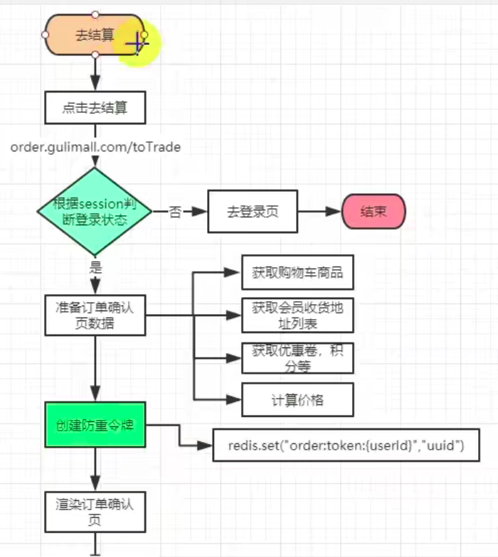	

### 接口幂等性处理

提交一次跟提交100次结果都是一样的(用户对同一操作发起的一次请求和多次请求的结果是一致的)

防重复提交，所有微服务都应该有

> 哪些情况需要幂等

* 用户多次点击按钮
* 用户页面回退再次提交
* 微服务互相调用，由于网络问题，导致请求失败。feign触发重试机制
* 其他业务情况

> 什么情况下需要幂等

以SQL为例

查找select 是幂等的

update table set col1=1 where col2=2、delete from table where col1=1都是幂等的

update table set col1=col1+1 where col2=2不是幂等的

> 幂等性解决方案

1、token机制

在执行业务前先获取token，服务器把token存在redis中

然后调用业务接口的时候，把token放在请求头携带过去

服务器判断token是否存在redis中，存在则表示第一次请求，然后删除token，继续执行业务

如果token不在redis中，就表示是重复操作，直接返回重复标记给用户，就保证了幂等性

危险性：

​	先删除token可能导致业务没有执行，重试之后还带上之前的token，由于已经删除，请求还是不能删除

​	后删除可能导致业务处理成功，但是服务闪断，出现超时，没有删除token，导致业务继续执行

​	最好设置为先删除，如果业务调用失败，就重新获取token再次请求

​	token的获取、比较和删除必须是原子性操作，不然在分布式系统下的高并发可能并发执行，使用redis的lua脚本

2、各种锁机制

数据库悲观锁：悲观锁一般伴随事务使用，数据锁定时间可能会很长，另外id字段一定是主键或者唯一索引，不然可能会造成锁表，`select * from table for update`

数据库乐观锁：适用于更新表的场景，给数据库的表添加一个version字段，`update table set count=count-1,version=version+1 where id=1 and version=1 `；主要用于读多写少

业务层分布式锁：

多个机器可能在同一时间同时出出力相同的数据，比如多台机器定时任务都拿到了相同的数据进行处理，就可以加上分布式锁，处理完成释放锁。获取锁时先判断这个数据是否被处理过。

3、各种唯一性约束

数据库唯一约束：多次插入会插入失败(在数据库层面防重)

redis set防重机制：可以计算数据的MD5将其放入redis的set中，处理数据前先看这个md5是否存在，存在就不处理(百度网盘的秒传功能就是这个原理实现的)

4、在数据库中建立防重表

5、全局请求唯一id
调用接口时，生成一个唯一id，redis将数据保存在集合中(去重)，存在即处理

可以使用nginx设置每个请求的唯一id:`proxy_set_header X-Request-Id $request_id;`

### 收单

1. 订单在支付页的时候，不进行支付，等待订单过期，解锁库存；然后支付，最后订单状态改为已支付，但是库存解锁了
   * 使用支付宝自动收单功能(订单超时)解决，只要一段时间不支付，就不能支付了
2. 由于时延等问题。订单解锁完成，正在解锁库存的时候，异步通知才到
   * 订单解锁，手动调用收单
3. 网络阻塞问题，订单支付成功的异步通知一直
   * 查定订单列表时，ajax获取当前未支付的订单状态；查询订单状态时，再获取一下支付宝该订单的状态
4. 其他各种问题
   * 每天晚上闲时下载支付宝对账单，进行对账(定时任务)

## 分布式事务

生成订单业务流程：生成订单---->锁定库存----->扣减积分


3、4会导致数据不一致

远程服务假失败：远程服务其实成功了，由于网络故障等没有返回；导致订单回滚，库存却扣减；

远程服务执行成功，下面的其他业务出错，导致当前事务回滚，但是已执行的远程服务不能回滚

事务传播行为：

* REQUIRED                   支持当前事务，如果不存在，就新建一个；就是和调用它的方法共用一个事务
* REQUIRES_NEW          如果有事务存在，挂起当前事务，创建一个新的事务；不和调用它的方法共用一个事务 

### 概述

> CAP

**C**onsistency（一致性）：在分布式系统中的所有数据备份，在**同一时刻是否同样的值**。

对于数据分布在不同节点上的数据来说，如果在某个节点更新了数据，那么在其他节点如果都能读取到这个最新的数据，那么就称为强一致，如果有某个节点没有读取到，那就是分布式不一致。

**A**vailability（可用性）：在集群中一部分节点故障后，集群整体(包括故障的节点)是否还能响应客户端的读写请求。（要求数据需要备份）

**P**artition tolerance（分区容忍性）：大多数分布式系统都分布在多个子网络。每个子网络就叫做一个区（partition）。分区容错的意思是，区间通信可能失败。(就是分区出错了要想办法解决)

CAP 原则指的是，中三个要素最多只能同时实现两个，**不可能三者兼顾**；分布式系统必须要满足P，也就是一致性和可用性二选一(如果是CA就只有本地服务才能实现，就不是分布式了)


分布式系统实现一致性的算法：raft、paxos

[raft动画演示](http://thesecretlivesofdata.com/raft/)

对于大型互联网公司来说，集群规模越来越大，所以节点故障、网络故障是常态，并且要保证服务可用性达到99.9999%(N个9)，即保证P和A，舍弃C

> BASE理论

是对CAP的延伸，思想是即使无法做到强一致性，但可以采取适当办法采用弱一致性，即**最终一致性**

1. Basically Available（**基本可用**）

   基本可用是指分布式系统在出现故障的时候，允许损失部分可用性，即保证核心可用。 不等价于系统不可用
   电商大促时，为了应对访问量激增，部分用户可能会被引导到降级页面(错误页面)，服务层也可能只提供降级服务。这就是损失部分可用性的体现。或者响应时间增加

2. Soft state（软状态）

   软状态是指允许系统存在中间状态，而该中间状态不会影响系统整体可用性。分布式存储中一般一份数据至少会有三个副本，**允许不同节点间副本同步的延时**就是软状态的体现。mysql replication的异步复制也是一种体现。(比如说存数据除了成功和失败，还有正在同步中)

3. Eventually consistent（最终一致性）

   最终一致性是指系统中的所有数据副本经过一定时间后，最终能够达到一致的状态。弱一致性和强一致性相反，最终一致性是弱一致性的一种特殊情况。

强一致：更新的数据能被后续的访问看到

弱一致：允许更新的数据部分或全部访问不到

最终一致性：经过一段时间后要求能访问到更新的数据

分布式事务就是围绕我们要保证什么一致性来做的

### 常见解决方案

> 2PC模式

2PC(2 phase commit 二阶提交)：刚性事务(遵循ACID原则，强一致性)

也是XA事务模式

还有3PC：2PC相当于手动操作，3PC自动操作

了解

> TCC事务补偿方案

柔性事务(遵循BASE理论，最终一致性)

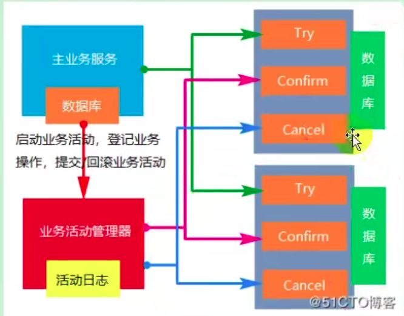

就是把业务分成三部分；把自定义的分支事务纳入全局事务的管理中

> 最大努力通知方案

柔性事务

隔一段时间进行通知，不保证数据一定能通知成功，但会提供可查询操作接口进行核对；主要场景就是调用支付宝支付或微信支付的异步结果通知

> **可靠消息+最终一致性方案**

柔性事务

基于消息中间件的两阶段提交往往用在高并发场景下，将一个分布式事务拆成一个消息事务（A系统的本地操作+发消息）+B系统的本地操作，其中B系统的操作由消息驱动，只要消息事务成功，那么A操作一定成功，消息也一定发出来了，这时候B会收到消息去执行本地操作，如果本地操作失败，消息会重投，直到B操作成功，这样就变相地实现了A与B的分布式事务。

虽然上面的方案能够完成A和B的操作，但是A和B并不是严格一致的，而是最终一致的，我们在这里牺牲了一致性，换来了性能的大幅度提升。当然，这种玩法也是有风险的，如果B一直执行不成功，那么一致性会被破坏，具体要不要玩，还是得看业务能够承担多少风险。


适用于高并发最终一致：mq

低并发基本一致：二阶段提交

高并发强一致：没有解决方案

### SpringCloudAlibaba Seata

在这个系统实现2PC模式 也就是AT模式；但是Seata不适用于高并发场景、效率不行(一般基于消息服务)，只适用于一般的分布式场景，比如说后台系统自己保存一些商品信息；

#### 术语

**TC (Transaction Coordinator) - 事务协调者**

维护全局和分支事务的状态，驱动全局事务提交或回滚。  协调全局

**TM (Transaction Manager) - 事务管理器**

定义全局事务的范围：开始全局事务、提交或回滚全局事务。	控制大事务

**RM (Resource Manager) - 资源管理器**

管理分支事务处理的资源，与TC交谈以注册分支事务和报告分支事务的状态，并驱动分支事务提交或回滚。		每个微服务自己的事务

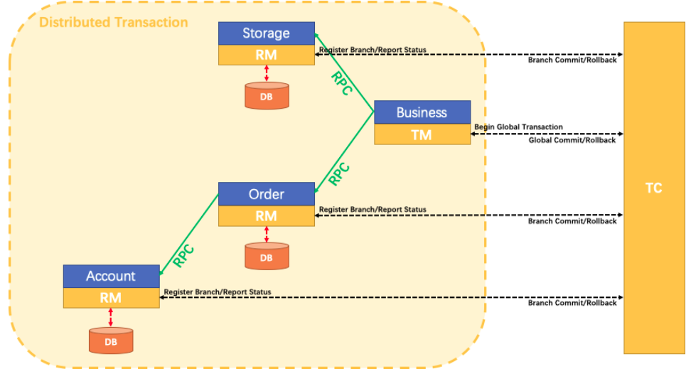

#### 使用

[SpringCloudAlibaba Seata](http://seata.io/zh-cn/docs/user/quickstart.html)

在业务方法加上`@GlobalTransactional`就行了

SEATA AT 模式需要 `UNDO_LOG` 表：这个表是用来反向补偿的，也就是回滚日志

```bash
CREATE TABLE `undo_log` (
  `id` bigint(20) NOT NULL AUTO_INCREMENT,
  `branch_id` bigint(20) NOT NULL,
  `xid` varchar(100) NOT NULL,
  `context` varchar(128) NOT NULL,
  `rollback_info` longblob NOT NULL,
  `log_status` int(11) NOT NULL,
  `log_created` datetime NOT NULL,
  `log_modified` datetime NOT NULL,
  `ext` varchar(100) DEFAULT NULL,
  PRIMARY KEY (`id`),
  UNIQUE KEY `ux_undo_log` (`xid`,`branch_id`)
) ENGINE=InnoDB AUTO_INCREMENT=1 DEFAULT CHARSET=utf8;
```

```xml
// 导入spring-cloud-alibaba-seata seata-all 0.7.1(这个版本需要和seata server 一致)
<dependency>
    <groupId>com.alibaba.cloud</groupId>
    <artifactId>spring-cloud-alibaba-seata</artifactId>
</dependency>
```

```
Seata控制分布式事务
*  1）、每一个微服务必须创建undo_Log
*  2）、安装事务协调器：seate-server
*  3）、整合
*      1、导入依赖  spring-cloud-alibaba-seata seata-all 0.7.1
*      2、解压并启动seata-server：
*          registry.conf:注册中心配置    修改 registry  type=nacos
*      3、所有想要用到分布式事务的微服务使用seata DataSourceProxy 代理自己的数据源
*      4、每个微服务，都必须导入   registry.conf   file.conf
*          vgroup_mapping.{application.name}-fescar-server-group = "default"
	 	   还需要在properties中配置：spring.cloud.alibaba.seata.tx-service-group: {application.name}-fescar-server-group
*      5、启动测试分布式事务
*      6、给分布式大事务的入口标注@GlobalTransactional
*      7、每一个远程的小事务用@Trabsactional
```

```java
// seata DataSourceProxy 代理自己的数据源
@Configuration
public class SeataConfig {

    @Autowired
    DataSourceProperties dataSourceProperties;


    @Bean
    public DataSource dataSource(){
        HikariDataSource dataSource = dataSourceProperties.initializeDataSourceBuilder().type(HikariDataSource.class).build();
        if (StringUtils.hasText(dataSourceProperties.getName())) {
            dataSource.setPoolName(dataSourceProperties.getName());
        }

        return new DataSourceProxy(dataSource);
    }

}
```

### RabbitMQ延时队列

五分钟后关闭订单


升级

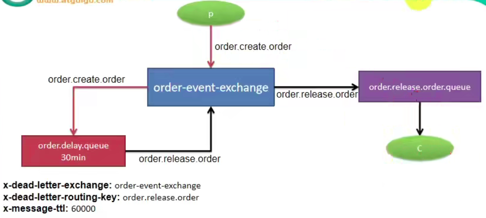

队列和交换机可以在spring容器中创建，服务一启动就会在rabbitmq中创建队列和交换机(是当连接上rabbitmq上，发现没有这些队列，才会创建队列)

```java
@Configuration
public class MQConfig {
    
    @Autowired
    AmqpAdmin amqpAdmin;

    // @Bean Binding、Queue、Exchange 会自动创建（在RabbitMQ）不存在的情况下
    /**
     * 死信队列
     *
     * @return
     */@Bean
    public Queue orderDelayQueue() {
        /*
            Queue(String name,  队列名字
            boolean durable,  是否持久化
            boolean exclusive,  是否排他
            boolean autoDelete, 是否自动删除
            Map<String, Object> arguments) 属性
         */
        HashMap<String, Object> arguments = new HashMap<>();
        arguments.put("x-dead-letter-exchange", "order-event-exchange");
        arguments.put("x-dead-letter-routing-key", "order.release.order");
        arguments.put("x-message-ttl", 60000); // 消息过期时间 1分钟
        Queue queue = new Queue("order.delay.queue", true, false, false, arguments);

        return queue;
    }

    /**
     * 普通队列
     *
     * @return
     */
    @Bean
    public Queue orderReleaseQueue() {

        Queue queue = new Queue("order.release.order.queue", true, false, false);

        return queue;
    }

    /**
     * TopicExchange
     *
     * @return
     */
    @Bean
        public Exchange orderEventExchange() {
        /*
         *   String name,
         *   boolean durable,
         *   boolean autoDelete,
         *   Map<String, Object> arguments
         * */
        return new TopicExchange("order-event-exchange", true, false);

    }


    @Bean
    public Binding orderCreateBinding() {
        /*
         * String destination, 目的地（队列名或者交换机名字）
         * DestinationType destinationType, 目的地类型（Queue、Exhcange）
         * String exchange,
         * String routingKey,
         * Map<String, Object> arguments
         * */
        return new Binding("order.delay.queue",
                Binding.DestinationType.QUEUE,
                "order-event-exchange",
                "order.create.order",
                null);
    }

    @Bean
    public Binding orderReleaseBinding() {

        return new Binding("order.release.order.queue",
                Binding.DestinationType.QUEUE,
                "order-event-exchange",
                "order.release.order",
                null);
    }
}
```

库存服务的延时队列和订单类似


```java
@RabbitListener(queues = "order.release.order.queue")
@Service
@Slf4j
public class OrderCloseListener {

    @Autowired
    OrderService orderService;

    @RabbitHandler
    public void releaseOrder(OrderEntity orderEntity, Message message, Channel channel) throws IOException {
        log.info("收到过期的订单，关闭订单："+orderEntity.getId());
        try {
            orderService.closeOrder(orderEntity);
            channel.basicAck(message.getMessageProperties().getDeliveryTag(),false);
        }catch (Exception e){
            channel.basicReject(message.getMessageProperties().getDeliveryTag(),true);
        }
    }
}


public void closeOrder(OrderEntity orderEntity) {
    //关闭订单之前先查询一下数据库，判断此订单状态是否已支付
    OrderEntity orderInfo = this.baseMapper.selectOne(new QueryWrapper<OrderEntity>().
                                                      eq("order_sn",orderEntity.getOrderSn()));

    if (orderInfo.getStatus().equals(OrderStatusEnum.CREATE_NEW.getCode())) {
        log.info("关闭订单："+orderEntity.getId());
        //代付款状态进行关单
        OrderEntity orderUpdate = new OrderEntity();
        orderUpdate.setId(orderInfo.getId());
        orderUpdate.setStatus(OrderStatusEnum.CANCLED.getCode());
        this.baseMapper.updateById(orderUpdate);

        // 发送消息给MQ
        OrderTo orderTo = new OrderTo();
        BeanUtils.copyProperties(orderInfo, orderTo);

        try {
            //TODO 确保每个消息发送成功，给每个消息做好日志记录，(给数据库保存每一个详细信息)保存每个消息的详细信息
            // 防止订单创建成功发给mq消息的时候卡顿，造成先解锁库存再解锁订单，在解锁库存的时候发现订单是新建状态，
            // 不处理，所以在订单处理完之后发一条消息，让库存重新处理
            rabbitTemplate.convertAndSend("order-event-exchange", "order.release.other", orderTo);
        } catch (Exception e) {
            //TODO 定期扫描数据库，重新发送失败的消息
        }
    }
}
```


## 秒杀服务

秒杀具有瞬间高并发的特点，即必须做限流+异步+缓存(页面静态化)+独立部署(独立的微服务)


限流方式：

* 前端限流：在前端页面限流，例如小米的验证码设计
* nginx限流，直接负载部分请求到错误的静态页面：令牌算法，漏斗算法
* 网关限流，限流的过滤器
* 代码中使用分布式信号量
* rabbitmq限流（能者多劳：chanel.basicQos(1)）,保证发挥所有服务器的性能

> 流程


### 定时任务

> cron表达式

quartz

秒	分	时	日	月	周	年(Spring不支持)

特殊字符：

​	,  : 枚举

​		（cron="7,9,23 * * * * ?")：任意时刻的7,9,23秒启动这个任务

​	-:范围

​		 （cron="7-20 * * * * ?")：任意时刻的7-20秒之间，每秒启动一次

​	*:任意

​		 指定的任意时刻都可以

​	/:步长

​		（cron="7/5 * * * * ?")：第7秒启动，每5秒一次

​		（cron="*/5 * * * * ?")：任意秒启动，每5秒一次

​	?:(出现在日和周几的位置)：为了防止日和周冲突，在周和日上如果要写通配符使用?

​			(cron="* * * 1 * 3")：每月的1号，而且必须是周二才执行(从1开始，周日，7是周六，MON-SUN也可以)

​	L:出现在日和周的位置，表最后一个

​			(cron="* * * ? * 3L")：每个月的最后一个星期2

​	W:工作日，在日上使用

​			(cron="* * * W * ?")：每个月的工作日

​	#:第几个

​			(cron="* * * ? * 5#2")：每个月的第二个周4

> Springboot整合

springboot是自己的定时任务，不能写年，需要写年 需整合quartz

```java
@Slf4j
@Component
public class HelloSchedule {

    /**
     *  开启一个定时任务
     *  1、Spring中由6位组成，不允许第7位的年
     *  2、在周几的位置，1-7代表周日到周六，MON-SUN也可以
     *  3、定时任务不应该阻塞(当前任务执行很长，也应该自己执行自己的，下一个定时任务自动启动)
     *      1).把业务的调用用异步调用，放入线程池 CompletableFuture.runAsync()
     *      2).Spring支持定时任务线程池:spring.task.scheduling；不是很好使 TaskSchedulingAutoConfiguration
     *      3).直接开启异步任务:@EnableAsync (开启)，@Async 标注在方法上 TaskExecutionAutoConfiguration
     *      解决：使用异步+定时任务来完成定时任务不阻塞的问题
     */
    @Async
    @Scheduled(cron = "* * * * * ?")
    public void hello() throws InterruptedException {
        log.info("hello");
        Thread.sleep(3000);
    }
}
```

```java
public String startTime(){
    LocalDate now = LocalDate.now();	// 当前日期 2021-11-05
    LocalTime localTime =LocalTime.MIN; // 00:00:00
    LocalTime localTime1 =LocalTime.MAX;	// 23:59:59
    LocalDateTime localDateTime = LocalDateTime.of(now,localTime); // 2021-11-05 00:00:00
    String format = localDateTime.format(DateTimeFormatter.ofPattern("yyyy-MM-dd HH:mm:ss")); // 格式化
    return format;
}
```

### 秒杀(高并发)系统关注的问题

1. 服务单一职责+独立部署：秒杀服务即使自己扛不住压力，挂掉也不要影响别人(形成一个微服务)
2. 秒杀链接加密：防止恶意攻击，模拟秒杀请求；防止链接暴露，自己的工作人员提前秒杀商品(在秒杀的时候才暴露randomCode)
3. 库存预热+快速扣减：秒杀读多写少，无需实时校验库存。库存预热，放入redis中。**信号量控制秒杀请求**(redis也可以做成集群，分片高可用)  ；扣库存的时候可以在redis中扣减，不用去操作数据库
4. 动静分离：nginx做好动静分离，保证秒杀和商品详情页的动态请求打到后端的服务集群，使用CDN网络(静态资源)，分担本集群压力
5. 恶意请求拦截：识别非法攻击请求进行拦截(每秒访问1000次的，或者不带令牌的)，网关层解决
6. 流量错峰：使用各种手段，将流量分担到更大宽度的时间点，如验证码(识别机器，输入快慢可以流量错峰，不会集中)，加入购物车
7. 限流&熔断&降级：前端限流(1秒只能点一次等)+后端限流；限制次数、总量，快速失败降级运行；熔断隔离防止雪崩；引导到降级页面
8. 队列削峰：1万个商品，每个1000件秒杀，双11所有秒杀成功的请求，进入队列，慢慢创建订单，扣减库存即可

### 秒杀流程

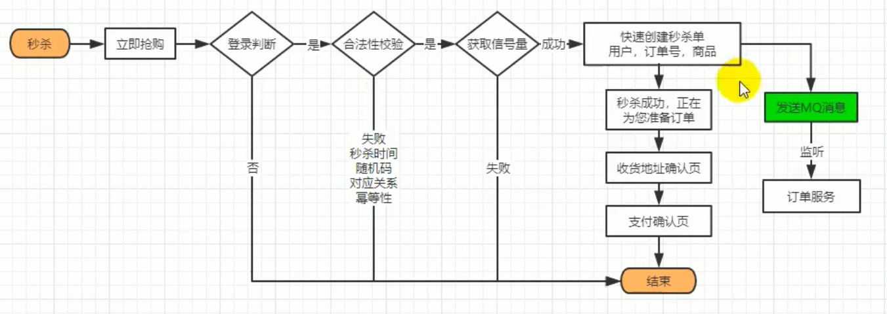

应对超高并发，请求发给秒杀系统，做一系列的判断，获取信号量成功后直接创建订单号，然后只会发一个消息，并不会动任何数据库，速度很快；缺点就是如果订单服务炸了，就不会把订单准备成功，就一直卡到秒杀成功这


## SpringCloud Alibaba-Sentinel

### 简介

限流、熔断、降级

* 熔断：A服务调用B服务的某个功能，由于网络不稳定、数据库卡满、B服务宕机等原因，导致调用B功能时间长，如果这样次数太多，我们就可以直接将B断路，凡是调用这个功能的直接返回降级数据，不必等待。这样B的故障问题，就不会影响其他模块
* 降级：加如网站出入高峰期间，手动的将一些非核心业务(如注册)停掉，所有的调用直接返回降级数据，保证核心业务的正常运行
* 对打入服务的请求流量进行控制，是服务承担不超过自己能力的流量压力

相同：

* 都是保证大部分服务的可用性和可靠性，防止崩溃，牺牲小我
* 用户最终都是体验某个功能不可以

不同：

* 熔断是被调用放故障，触发系统的主动规则
* 降级是基于全局考虑，保证核心业务运行，是手动关闭服务

### Sentinel

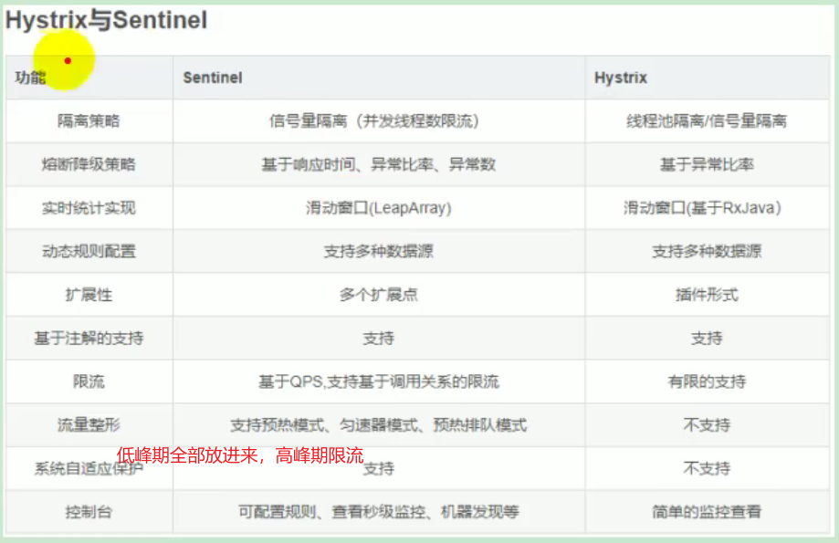

[SpringCloud Alibaba-Sentinel文档](https://github.com/alibaba/Sentinel/wiki/%E4%BB%8B%E7%BB%8D)

主要是在可视化界面进行操作

[dashboard](https://github.com/alibaba/Sentinel/wiki/%E6%8E%A7%E5%88%B6%E5%8F%B0):`java -Dserver.port=8080 -Dcsp.sentinel.dashboard.server=localhost:8080 -Dproject.name=sentinel-dashboard -jar sentinel-dashboard.jar`

默认用户：sentinel/sentinel

主要是先定义资源，再对资源定义控制规则，再检查效果

由于sentinel对很多都进行了适配，所以所有请求都作为了资源；其他的资源也可以自己定义或用注解标记


```
/**
 * 1、整合Sentinel
 *  1）、导入依赖 spring-cloud-starter-alibaba-sentinel
 *  2）、下载sentinel控制台
 *  3）、配置 sentinel 控制台地址信息
 *  4）、在控制台调整参数、【默认所有的流控规则保存在内存中，重启失效】
 *
 * 2、每一个微服务都导入 actuator ：并配合 management.endpoints.web.exposure.include=* 增强统计信息
 * 3、自定义 sentinel 流控返回的数据
 *
 * 4、使用Sentinel来保护feign远程调用，熔断；
 *  1）、调用方的熔断保护：feign.sentinel.enable=true
 *  2）、调用方手动指定远程服务的降级策略。远程服务被降级处理。触发我们的熔断回调方法
 *  3）、超大浏览的时候，必须牺牲一些远程服务。在服务的提供方（远程服务）指定降级策略；
 *      提供方是在运行，但是不运行自己的业务逻辑，返回的是默认的降级数据（限流的数据）；
 *      主要是考虑全局，不运行真正的业务方法，不会占用服务器资源
 *
 * 5、自定义受保护的资源
 *  1）、代码
 *          try (Entry entry = SphU.entry("seckillSkus")) {
 *              //业务逻辑
 *          } catch(Exception e) {}
 *
 *  2）、基于注解
 *
 */
```

#### 限流

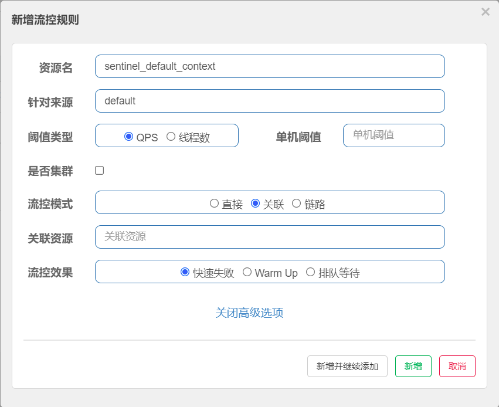

集群模式下：单机均摊指每台机器都是这样的阈值；总体阈值指整个集群一共的阈值，通过负载均衡进行分配

流控模式：

* 直接：直接在当前服务的请求进行流控限制，所有访问这个请求都要被限流；
* 关联：两个资源有资源争抢或依赖关系的时候，就有了关联。比如说数据库的读和写；读过高会影响写的速度，反之一样；我们可以给读进行限流(读操作过于频繁)，来达到写优先的目的
* 链路：只有从某一个入口进来的请求才会被限流。

流控效果：

* 快速失败：超过限流了，直接拒接，返回错误信息
* Warm up：冷启动，预热；假设阈值为480，来了500个请求，在一段时间内一点一点地放请求，慢慢放，不一次性放完；可以设置预热时间
* 排队等待：超过限流的排队等待，可以设置超时时间

#### 熔断

远程调用错误的时候，调用设置的回调方法，也是熔断方法

#### 降级

设置在一定规则，请求没达到这个要求就去调用熔断回调(降级处理)，而不调用自己的方法(在请求方法超时获取报错时都会使用)


慢调用比例(RT)：请求的响应时间大于RT时间就为慢调用，以慢调用比例为阀值，大于这个阀值在熔断时长内(时间窗口)就会被熔断；之后会进入探测恢复状态，重新判断比例和阀值

异常比例：异常比例大于阀值就熔断

##### 网关流控

在网关限制了流量， 请求就不会进入请他微服务


## Sleuth+ZipKin 服务链路追踪

### 简介

可以通过链路追踪做好熔断降级，预防雪崩；主要是达到每个请求的步骤清晰可见，出了问题，能很快定位

> 基本术语

* Span(跨度)：基本工作单元，一个远程调用就会产生一个span，span是一个64位id唯一标识的，Trace是另一个64位id唯一标识的
* Trace(跟踪)：一系列span组成的树状结构。请求一个api接口，这个接口需要调用多个微服务，调用每个微服务都会产生一个新的span，由这个请求产生的span组成一个trace
* Annotation(标注)：及时记录一个事件，一些核心注解定义一个请求的开始和结束
  * cs：Client Start  客户端发送一个请求，这个注解描述span的开始
  * ss：Server Start  服务器获取请求并处理它，ss减去cs的时间戳就是网络传输的时间
  * sf：Server Finish  (服务器发送响应)，请求处理的完成(请求返回客户端时)，sf减去ss的时间是服务器请求的时间
  * cf：Client Finish  (客户端接受响应)span的结束，cf减去cs的时间就是整个请求消耗的时间

### 整合

```xml
# 导入依赖 sleuth
<dependency>
    <groupId>org.springframework.cloud</groupId>
    <artifactId>spring-cloud-starter-sleuth</artifactId>
</dependency>

# 开启日志
logging:
  level:
    com.lvboaa.gulimall: debug
    org.springframework.cloud.openfeign: debug	# 加这个是在控制台可以看到span和trace的id，与zipkin整合无关
    org.springframework.cloud.sleuth: debug
```


```xml
# docker安装服务器
docker run -d -p 9411:9411 openzipkin/zipkin

# 导入依赖
<!--    zipkin:图形展示链路追踪，包含了sleuth，可以去掉，也可以直接把上面sleuth的依赖去掉    -->
<dependency>
    <groupId>org.springframework.cloud</groupId>
    <artifactId>spring-cloud-starter-zipkin</artifactId>
    <exclusions>
        <exclusion>
            <groupId>org.springframework.cloud</groupId>
            <artifactId>spring-cloud-starter-sleuth</artifactId>
        </exclusion>
    </exclusions>
</dependency>


spring:
  zipkin:
    base-url: http://192.168.131.131:9411/  # zipkin服务器地址
    discovery-client-enabled: false # 关闭服务发现，否则springcloud会把zipkin的url当成服务器名
    sender:
      type: web # 设置使用http的方式传输数据
  sleuth:
    sampler:
      probability: 1  # 设置抽样采集率为100%，默认是0.1，也就是10%的采样请求数据
```

zipkin默认数据是保存在内存中的，可以整合保存到mysql(不可能)、es中

```bash
docker run --env STORAGE_TYPE=elasticsearch --env ES_HOSTS=192.168.131.131:9200 openzipkin/zipkin-dependencies
```

只要有这个就代表整合zipkin成功


**高并发总结--->三宝**

缓存、异步、队排好


## 集群搭建

### 概述

集群主要是保证单点出现故障的时候服务是可用的

> 目标

* 高可用：保证单点出现故障的时候服务是可用的
* 突破数据量限制：一台服务器不能存储大量数据，需多台分担，最好能做到互相备份，即使单点故障，其他节点也能找到数据
* 数据备份容灾：单点故障后，存储的数据仍然可以在别的地方拉起
* 压力分担：比如说读写分离，尽量避免单点压力的存在

> 集群基础形式


主从复制：mysql的读写分离(主节点和从节点数据一致，主节点存不下了从节点也存不下)

主从调度：kubernetes主节点调用从节点进行work

分片式：主要是数据分片(1-1万在第一台服务器，一万到两万在第二台服务器)，可以突破数据限制；也可以在片区之间备份

### MySQL集群

#### 集群搭建

mysql-mmm：双主集群，原理是会将真实数据库节点的ip映射为虚拟ip(vip)，包括一个读ip和多个写ip；当一个节点宕机之后，会发送ip漂移，就是把这个虚拟ip映射到可用的节点上；实现了高可用，但是数据的一致性可能有问题(宕机时可能有一部分数据未同步)

···

[尚硅谷mysql集群](https://www.bilibili.com/video/BV1np4y1C7Yf?p=362)


> 搭建mysql集群(主从同步)

```bash
# master
docker run -p 3307:3306 --name mysql-master --restart=always -v /home/mysql/master/log:/var/log/mysql -v /home/mysql/master/data:/var/lib/mysql -v /home/mysql/master/conf:/etc/mysql -e MYSQL_ROOT_PASSWORD=123456 -d mysql:5.7

vi /home/mysql/master/conf/vi.cnf
# 添加配置(基础配置)：
[client]
default-character-set=utf8

[mysql]
default-character-set=utf8

[mysqld]
init_connect='SET collation_connection = utf8_unicode_ci'
init_connect='SET NAMES utf8'
character-set-server=utf8
collation-server=utf8_unicode_ci
skip-character-set-client-handshake
skip-name-resolve

# 添加配置(主从配置) binlog-do-db 是需要主从同步的数据库 replicate-ignore-db 是不同步的表(主要是系统表)
server_id=1
log-bin=mysql-bin
read-only=0
binlog-do-db=test

replicate-ignore-db=mysql
replicate-ignore-db=sys
replicate-ignore-db=information_schema
replicate-ignore-db=performance_schema

# 连接mysql新建用户，用于从机连接主机复制进行日志复制
GRANT REPLICATION SLAVE ON *.* to 'backup'@'%' identified by '123456';
show master status;	# 查看master状态(同步状态，同步文件等信息)
```

```bash
# slaver
docker run -p 3317:3306 --name mysql-slaver01 --restart=always -v /home/mysql/slaver01/log:/var/log/mysql -v /home/mysql/slaver01/data:/var/lib/mysql -v /home/mysql/slaver01/conf:/etc/mysql -e MYSQL_ROOT_PASSWORD=123456 -d mysql:5.7

vi /home/mysql/slaver01/conf/my.cnf
# 添加配置(基础配置)：
[client]
default-character-set=utf8

[mysql]
default-character-set=utf8

[mysqld]
init_connect='SET collation_connection = utf8_unicode_ci'
init_connect='SET NAMES utf8'
character-set-server=utf8
collation-server=utf8_unicode_ci
skip-character-set-client-handshake
skip-name-resolve

# 主从配置	read-only=0表示 可读写  等于1 表示只读(root账号是有所有权限的，只读只针对授权是没有super权限的用户)
server_id=2
log-bin=mysql-bin
read-only=1
binlog-do-db=test

replicate-ignore-db=mysql
replicate-ignore-db=sys
replicate-ignore-db=information_schema
replicate-ignore-db=performance_schema

# 连接mysql，配置
change master to master_host='192.168.131.131',master_user='backup',master_password='123456',master_log_file='mysql-bin.000001',master_log_pos=0,master_port=3307;

start slave;	# 启动从库同步	stop slave; 关闭主从同步
show slave status; # 查看从库状态(Slave_IO_Running和Slave_SQL_Running都为yes表示成功)
```

但是在这种情况下不能解决单表的性能问题

#### 分库分表、读写分离

设置第一个服务器 `auto_increment_offset=1;auto_increment_increment=2;`设置主键从1开始自增，步长为2

第二个服务器设置主键从2开始自增，步长为2(但是不会这么做的，不好维护)

mycat

> ShardingSphere

Sharding-JDBC：类似于C3P0、Druid等连接池；需要引入依赖，在代码中配置好分库分表的策略

Sharding-Proxy：中间件，所有应用连接到proxy，然后proxy分配策略，再操作数据库(代理所有的数据库)

配置Sharding-Proxy

```bash
# docker 安装 没配置好
docker run -d --restart=always --name sharding-proxy -v /home/mysql/sharding-proxy/conf:/opt/sharding-proxy/conf  -v /home/mysql/sharding-proxy/ext-lib:/opt/sharding-proxy/ext-lib -e PORT=3308 -p 3344:3308 apache/sharding-proxy:latest
# 下载
https://shardingsphere.apache.org/document/legacy/4.x/document/cn/downloads/

# 将mysql-connector-java-5.1.18.jar放在lib目录

# 可查看快速入门进行配置；也可按以下配置
 
# server.yaml proxy服务器配置
authentication:
  users:
    root:
      password: root
    sharding:
      password: sharding 
      authorizedSchemas: sharding_db	# 配置proxy代理的数据库信息
props:
  executor.size: 16  # 线程数
  sql.show: false
  
# config-sharding.yaml	分库分表配置
schemaName: sharding_db

dataSources:
  ds_0:
    url: jdbc:mysql://192.168.131.131:3307/demo_ds_0?serverTimezone=UTC&useSSL=false
    username: root
    password: 123456
    connectionTimeoutMilliseconds: 30000
    idleTimeoutMilliseconds: 60000
    maxLifetimeMilliseconds: 1800000
    maxPoolSize: 50
  ds_1:
    url: jdbc:mysql://192.168.131.131:3307/demo_ds_1?serverTimezone=UTC&useSSL=false
    username: root
    password: 123456
    connectionTimeoutMilliseconds: 30000
    idleTimeoutMilliseconds: 60000
    maxLifetimeMilliseconds: 1800000
    maxPoolSize: 50				# 定义两个数据库(可以不同服务器)
shardingRule:
  tables:
    t_order:
      actualDataNodes: ds_${0..1}.t_order_${0..1}
      tableStrategy:
        inline:
          shardingColumn: order_id
          algorithmExpression: t_order_${order_id % 2}	# 分表策略
      keyGenerator:
        type: SNOWFLAKE
        column: order_id
    t_order_item:
      actualDataNodes: ds_${0..1}.t_order_item_${0..1}
      tableStrategy:
        inline:
          shardingColumn: order_id
          algorithmExpression: t_order_item_${order_id % 2}     # 这样可以确保订单在0表里面，订单的订单项在item_0表里，就不用进行多表联查了
      keyGenerator:
        type: SNOWFLAKE
        column: order_item_id
  bindingTables:
    - t_order,t_order_item      # 绑定关系，表示order和order_item有关系，sharding查询的时候就在同一个库中查询，就不会跨库join了
  defaultDatabaseStrategy:      
    inline:
      shardingColumn: user_id
      algorithmExpression: ds_${user_id % 2}       # 分库策略(例如不同地区的存在不同服务器的数据库中)
  defaultTableStrategy: 		# 如果相同就可以配置全局的策略，也可以在每张表里面自己配置
    none:
    
# config-master_slave.yaml	主从配置
# 配置好之后，写全交给master节点，读全给slave节点(还有负载均衡策略)
schemaName: sharding_db
dataSources:
  master_ds_0:
    url: jdbc:mysql://192.168.131.131:3307/demo_ds_0?serverTimezone=UTC&useSSL=false
    username: root
    password: 123456
    connectionTimeoutMilliseconds: 30000
    idleTimeoutMilliseconds: 60000
    maxLifetimeMilliseconds: 1800000
    maxPoolSize: 50
  slave_ds_0:
    url: jdbc:mysql://192.168.131.131:3317/demo_ds_0?serverTimezone=UTC&useSSL=false
    username: root
    password: 123456
    connectionTimeoutMilliseconds: 30000
    idleTimeoutMilliseconds: 60000
    maxLifetimeMilliseconds: 1800000
    maxPoolSize: 50
  master_ds_1:
    url: jdbc:mysql://192.168.131.131:3307/demo_ds_1?serverTimezone=UTC&useSSL=false
    username: root
    password: 123456
    connectionTimeoutMilliseconds: 30000
    idleTimeoutMilliseconds: 60000
    maxLifetimeMilliseconds: 1800000
    maxPoolSize: 50
  slave_ds_1:
    url: jdbc:mysql://192.168.131.131:3317/demo_ds_1?serverTimezone=UTC&useSSL=false
    username: root
    password: 123456
    connectionTimeoutMilliseconds: 30000
    idleTimeoutMilliseconds: 60000
    maxLifetimeMilliseconds: 1800000
    maxPoolSize: 50
masterSlaveRule:        # 主从规则
  ms_ds_0:
    masterDataSourceName: master_ds_0
    slaveDataSourceNames:
      - slave_ds_0
    loadBalanceAlgorithmType: ROUND_ROBIN
  ms_ds_1:
    masterDataSourceName: master_ds_1
    slaveDataSourceNames:
      - slave_ds_1
    loadBalanceAlgorithmType: ROUND_ROBIN
```

然后点击start.bat(windows下)启动，可以在命令行窗口设置端口启动：`start.bat 3344`

使用navicat连接(mysql，只能用navicat11连)：localhost:3344  root/root

```bash
# 测试  在sharding_db中新建数据库
CREATE table `t_order`(
	`order_id` BIGINT(20) NOT NULL auto_increment,
	`user_id` int(11) NOT NULL,
	`status` varchar(50)	collate utf8_bin default null,
	PRIMARY KEY (`order_id`)
) ENGINE=INNODB DEFAULT CHARSET=utf8 collate=utf8_bin;

# 插入三条记录 发现 user_id为偶数分到ds_0库，奇数分到ds_1库；然后order_id为偶数分到order_0表，奇数分到order_1表
insert into t_order (user_id,status) VALUES (1,'true');
insert into t_order (user_id,status) VALUES (2,'true');
insert into t_order (user_id,status) VALUES (3,'true');
```


### Redis集群

> 客户端分区

Jedis中可以配置算法进行分区，将数据存储到不同的redis服务器中，但是容错方面处理有问题

> 代理分区

不直接给redis保存数据，而是连接代理，代理服务器帮我们进行存储

常用方案Twemproxy和Codis

> redis-cluster

官方的，既有高可用，也可以分片存储

一组RedisCluster由多个Redis实例组成。官方推荐6个实例，3个主节点、3个从节点。一旦主节点发生故障，cluster可以选举从节点成为新的主节点，保证高可用性。

对于客户端来说，怎么知道对应的key要路由到哪一节点呢？cluster将所有数据划分成16384个不同的槽位，可以根据机器的性能分配给不同的redis实例，槽位的数据是可以迁移的。

每次储存一个key，cluster就会使用CRC16算法：CRC16(key)&16383；保证槽位不大于16384

> 缺点

* 批量操作有限，只支持具有相同slot值得key批量操作；

* 事务操作有限，**但是一般都使用lua脚本**，比事务好用
* 集群不支持多数据库，集群模式下只能使用db0
* 命令大多会重定向，耗时多(如果请求发给这个服务器但槽位在另一个机器上，就会返回给发送端重新发送)

#### 部署cluster

3主3从，从为了同步备份，主进行slot数据分片；虽然数据是分片存储的，但外部只要连接一个master节点，就可以获取到集群的所有数据

```bash
# 创建6个容器
for port in $(seq 7001 7006);  \
do \
mkdir -p /home/redis/node-${port}/conf
touch /home/redis/node-${port}/conf/redis.conf
cat << EOF > /home/redis/node-${port}/conf/redis.conf
port ${port}
cluster-enabled yes
cluster-config-file nodes.conf
cluster-node-timeout 5000
cluster-announce-ip 192.168.131.131
cluster-announce-port ${port}
cluster-announce-bus-port 1${port}
appendonly yes
EOF
docker run -p ${port}:${port} -p 1${port}:1${port} --name redis-${port}  \
-v /home/redis/node-${port}/data:/data \
-v /home/redis/node-${port}/conf/redis.conf:/etc/redis/redis.conf \
-d redis:5.0.7 redis-server /etc/redis/redis.conf; \
done

# 将几个容器配置成集群
docker exec -it redis-7001 /bin/bash # 进入容器
redis-cli  --cluster create 192.168.131.131:7001 192.168.131.131:7002 192.168.131.131:7003 192.168.131.131:7004 192.168.131.131:7005 192.168.131.131:7006 --cluster-replicas 1

redis-cli -c -h 192.168.131.131 -p 7001 # 连接客户端，-c指集群方式 进行测试可以发现会根据key的槽值进行分片存储
cluster info  # 查看集群信息
cluster nodes # 节点信息
```

模拟宕机

当主节点宕机后，从节点自动替换成主节点；当主节点再次启动时，就会变成当前主节点的从节点

### ElasticSearch集群

主节点(控制节点)：数据的变更命令、增删改查，不会真正的操作数据，只负责命令；当集群只有一个主节点时，流量的增加也不会成为瓶颈；任何节点都可以成为主节点；

作为用户，可以把命令发送到任何节点，包括主节点，无论发送到哪个节点，它都能负责把所需文档的节点收集回数据，并将最终结果返回给客户端。ES对一切的管理都是透明的

集群健康状态

`GET  /_cluster/health`：status: green(所有主分片和副分片都正常运行)，yellow(主分片正常，不是所有的副分片正常)，red：有主分片没正常运行

#### 新增节点

当单机节点时：配置集群模式，集群健康状态就是黄色，因为没有副本节点，单机就算配置还是有单机故障问题，所以就没有；

然后在同一台机器启动第二个节点时，只要cluster.name相同，就会自动加入集群；

在不同机器上启动节点时，需要加入统一集群，就需要配置可连接的单播主机列表。水平扩容：直接启动第三个节点，主分片和副本分片都会重新分配，每个节点两个分片，可以提升节点的负载能力(**副本分片永远不会和主分片放在一个节点**，因为一个节点宕机数据就丢失了)

```bash
PUT /blogs/_settings
{
	"number_of_shards": 3,		# 主节点有几个
	"number_of_replicas":2		# 一个主节点有几个副本分片
}
```


#### 应对故障

当主节点宕机后，集群会马上选举一个主机点并重新分片，提升主节点这个过程是瞬时发生的，如同打开一个开关

> 脑裂现象

主节点：数据的增删改查命令管理

候选主节点：当设置`node.master:true`就表示这个节点为候选主节点

数据节点：设置`node.data:true`，复制数据的存储和操作，一个节点可以为主及数据节点

客户端节点：既不做主节点也不做数据节点，用于负载均衡，因为请求这个节点也可以获取到数据;设置`node.master:false;node.data:false`

当一个集群有10个节点时，由于网络问题，导致7个节点和3个节点分开了，每个网络分区都会选举一个主节点，当网络恢复时，就有两个主节点，就是**脑裂现象**

集群中不同的节点对于master的选择出现了分歧，多个master竞争，导致主分片和副本分片也发生了分歧，就会标识分歧的分片为坏片

老版本脑裂问题解决，新版本不用

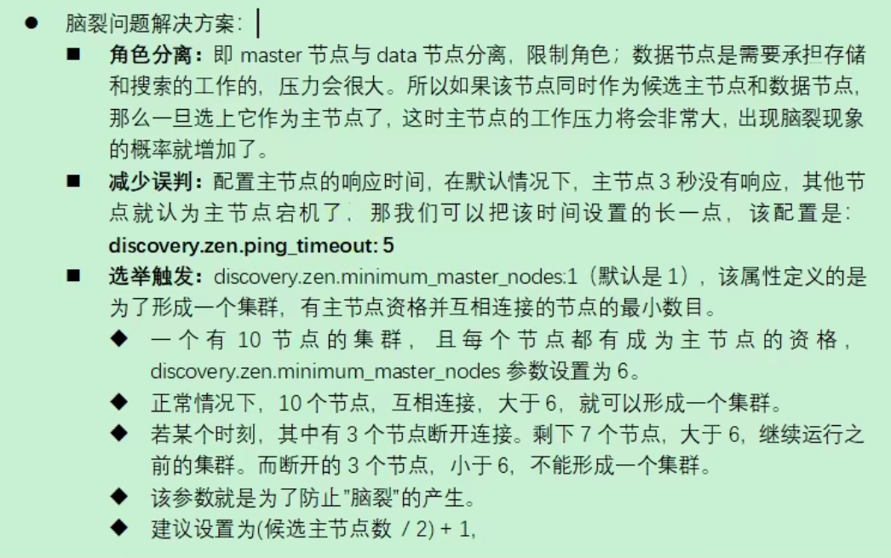

#### 搭建集群

```bash
sysctl -w vm.max_map_count=262144	# 防止JVM报错，临时
echo vm.max_map_count=262144 >> /etc/sysctl.conf 
sysctl -p	# 永久

# 准备docker 网络
docker network ls
docker network create --driver bridge --subnet=172.18.12.0/16 --gateway=172.18.1.1 mynet
docker network inspect mynet	# 查看网络信息
以后使用 --network=mynet --ip 172.18.12.x 指定ip

# 搭建3个master主节点
for port in $(seq 1 3); \
do \
mkdir -p /mydata/elasticsearch/master-${port}/config
mkdir -p /mydata/elasticsearch/master-${port}/data
chmod -R 777 /mydata/elasticsearch/master-${port}
cat << EOF > /mydata/elasticsearch/master-${port}/config/elasticsearch.yml
cluster.name: my-es  #集群的名称，同一个集群该值必须设置成相同的
node.name: es-master-${port}  #该节点的名字
node.master: true  #该节点有机会成为master节点
node.data: false #该节点可以存储数据
network.host: 0.0.0.0
http.host: 0.0.0.0   #所有http均可访问
http.port: 920${port}
transport.tcp.port: 930${port}
discovery.zen.ping_timeout: 10s #设置集群中自动发现其他节点时ping连接的超时时间
discovery.seed_hosts: ["172.19.1.21:9301","172.19.1.22:9302","172.19.1.23:9303"]
cluster.initial_master_nodes: ["172.19.1.21"] #新集群初始时的候选主节点，es7的新增配置
EOF
docker run --name elasticsearch-node-${port} \
-p 920${port}:920${port} -p 930${port}:930${port} \
--network=mynet --ip 172.19.1.2${port} \
-e ES_JAVA_OPTS="-Xms300m -Xmx300m"  \
-v /mydata/elasticsearch/master-${port}/config/elasticsearch.yml:/usr/share/elasticsearch/config/elasticsearch.yml  \
-v /mydata/elasticsearch/master-${port}/data:/usr/share/elasticsearch/data  \
-v /mydata/elasticsearch/master-${port}/plugins:/usr/share/elasticsearch/plugins  \
-d elasticsearch:7.4.2
done

# 搭建三个数据节点
for port in $(seq 4 6); \
do \
mkdir -p /mydata/elasticsearch/master-${port}/config
mkdir -p /mydata/elasticsearch/master-${port}/data
chmod -R 777 /mydata/elasticsearch/master-${port}
cat << EOF > /mydata/elasticsearch/master-${port}/config/elasticsearch.yml
cluster.name: my-es  #集群的名称，同一个集群该值必须设置成相同的
node.name: es-node-${port}  #该节点的名字
node.master: false  #该节点有机会成为master节点
node.data: true #该节点可以存储数据
network.host: 0.0.0.0
http.host: 0.0.0.0   #所有http均可访问
http.port: 920${port}
transport.tcp.port: 930${port}
discovery.zen.ping_timeout: 10s #设置集群中自动发现其他节点时ping连接的超时时间
discovery.seed_hosts: ["172.19.1.21:9301","172.19.1.22:9302","172.19.1.23:9303"]
cluster.initial_master_nodes: ["172.19.1.21"] #新集群初始时的候选主节点，es7的新增配置
EOF
docker run --name elasticsearch-node-${port} \
-p 920${port}:920${port} -p 930${port}:930${port} \
--network=mynet --ip 172.19.1.2${port} \
-e ES_JAVA_OPTS="-Xms300m -Xmx300m"  \
-v /mydata/elasticsearch/master-${port}/config/elasticsearch.yml:/usr/share/elasticsearch/config/elasticsearch.yml  \
-v /mydata/elasticsearch/master-${port}/data:/usr/share/elasticsearch/data  \
-v /mydata/elasticsearch/master-${port}/plugins:/usr/share/elasticsearch/plugins  \
-d elasticsearch:7.4.2
done
```

### RabbitMQ镜像集群

使用Erlang开发，集群非常方便，因为Erlang天生就是分布式语言，但不支持负载均衡，需要自己结合nginx等方式进行lb

RabbitMQ中包括：内存节点(RAM)，磁盘节点(Disk,消息持久化)，集群中至少有一个磁盘节点

#### 普通模式(默认)

生产环境不用

消息只会存在一个节点，只会同步源数据，如队列、交换机；不会同步队列里面的消息。

比如说消息在A的队列中，当lb到B节点时，就直接从A中取出经过B发送给消费者。但发生单点故障时，A故障时，消息就不在了

**应用场景**：适合消息无需持久化的场合，如日志队列。队列非持久化且创建该队列的节点宕机，客户端才可以重连其他节点，并重新创建队列。若为持久化，就只能等故障节点恢复。

> 部署

```bash
# 部署三个容器
docker run -d --hostname rabbitmq01  --name rabbitmq01 -v /home/rabbitmq/rabbitmq01:/var/lib/rabbitmq  -p 15673:15672 -p 5673:5672 -e --erlang-cookie='lvboaa' rabbitmq:management
docker run -d --hostname rabbitmq02  --name rabbitmq02 -v /home/rabbitmq/rabbitmq02:/var/lib/rabbitmq  -p 15674:15672 -p 5674:5672 -e --erlang-cookie='lvboaa' rabbitmq:management
docker run -d --hostname rabbitmq03  --name rabbitmq03 -v /home/rabbitmq/rabbitmq03:/var/lib/rabbitmq  -p 15675:15672 -p 5675:5672 -e --erlang-cookie='lvboaa' rabbitmq:management


# 进入容器修改配置加入集群
docker exec -it rabbitmq01 /bin/bash
# rabbitmq-server -detached # 好像都不需要这句，如果集群加入失败，每个容器先执行这一句	
rabbitmqctl stop_app
rabbitmqctl reset
rabbitmqctl start_app
ctrl p+q

docker exec -it rabbitmq02 /bin/bash
rabbitmqctl stop_app
rabbitmqctl reset
rabbitmqctl join_cluster --ram rabbit@rabbitmq01
rabbitmqctl start_app
ctrl p+q

docker exec -it rabbitmq03 /bin/bash
rabbitmqctl stop_app
rabbitmqctl reset
rabbitmqctl join_cluster --ram rabbit@rabbitmq01
rabbitmqctl start_app
ctrl p+q
```


#### 镜像模式(生产环境)

源数据和消息实体会主动在镜像节点之间同步，而不会在取数据时临时拉取；高可用。有选举算法，1个master，n个slaver，生产者、消费者的请求都转到master(相当于slaver是对master的备份)

**应用场景**：可靠性要求较高的场景，如下单、库存(死信)队列。

缺点：若镜像队列过多，且消息体量大，集群内部网络带宽会被同步消息消耗

* 首先需要搭建普通集群模式，然后才能设置镜像集群
* 若消费过程中，master先挂掉，则选举新的master，若未来得及确认，可能会重复消费

> 设置普通集群为镜像

```bash
# 随便进入一个容器
docker exec -it rabbitmq01 /bin/bash

# 查看当前策略
rabbitmqctl list_policies

# 添加策略 策略名字为myall,虚拟主机/ems,正则表达式为 “^” 表示所有匹配所有队列名称  ^所有队列
rabbitmqctl set_policy -p /ems myall '^' '{"ha-mode":"all","ha-sync-mode":"automatic"}' 

# 清除策略
rabbitmqctl clear_policy


# 参数
rabbitmqctl set_policy [-p <vhost>] [--priority <priority>] [--apply-to <apply-to>] <name> <pattern>  <definition>
-p Vhost： 可选参数，针对指定vhost下的queue进行设置
Name:     policy的名称
Pattern: queue的匹配模式(正则表达式)	
Definition：镜像定义，包括三个部分ha-mode, ha-params, ha-sync-mode
         	 ha-mode:指明镜像队列的模式，有效值为 all/exactly/nodes
                      all：表示在集群中所有的节点上进行镜像  # 一般使用这种
                      exactly：表示在指定个数的节点上进行镜像，节点的个数由ha-params指定
                      nodes：表示在指定的节点上进行镜像，节点名称通过ha-params指定
          	 ha-params：ha-mode模式需要用到的参数
             ha-sync-mode：进行队列中消息的同步方式，有效值为automatic和manual # 自动和手动，手动需要执行命令，一般使用手动
             priority：可选参数，policy的优先级  # 多个策略对应于一个队列，谁的优先级大谁生效
```

当主机宕机之后，镜像集群会推举出一个新的主节点；保证消息可以继续消费，保证高可用性

当之前的主机恢复之后，会自动成为当前主节点的从节点


## Kubernetes

### 概述

k8s就是一个管理和部署集群的东西，其他东西都不管(比如说日志等，如果想要日志，就部署elk组件就行了)

就是一个分布式的编排系统，能管理整个集群

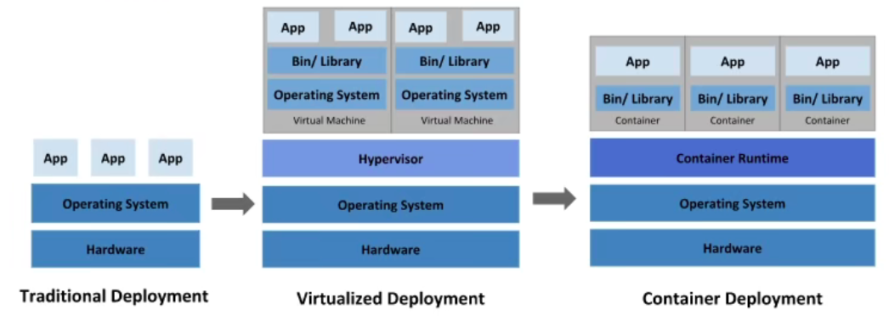


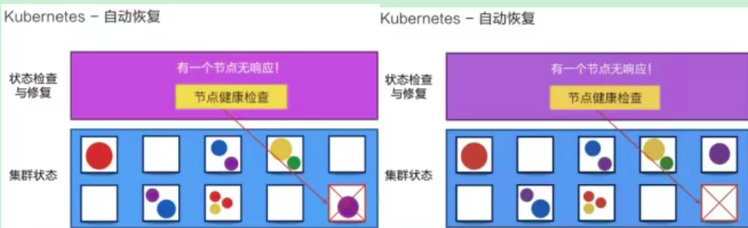


> 架构

整体主从方式

Master(管理Node)和Node(做真正事情的)

所有的操作都是操作主节点，然后主节点调配从节点进行工作

kubectl：是输入操作命令到master节点的命令行工具

**主节点**

kube-apiserver

* 对外暴露K8S的api接口，是外界进入资源操作的唯一入口（所有的请求都会先进入这里）
* 提供认证、授权、访问控制、API注册和发现等机制

etcd

* etcd是兼具一致性和高可用性的键值数据库，可以作为保存k8s所有集群数据的后台数据库
* k8s集群的etcd数据库通常需要有个备份计划

kube-scheduler

* 主节点上的组件，该主键监视那些新创建的未指定运行节点的pod，并选择节点让pod在上面运行(就是一个调度器)
* 所有对k8s的集群操作，都必须经过主节点进行调度

kube-controller-manager

* 主节点上运行控制器的组件，真正的创建pod
* 节点控制器(Node Controller)：复制在节点出现故障是进行通知和响应
* 副本控制器(Replication Controller)：负责为系统中的每个副本控制器对象维护正确数量的pod
* 端点控制器(Endpoints Controller)：填充端点(Endpoints)对象(即加入Service与pod)
* 服务账户和令牌控制器(Service Account & Token Controllers)：为新命名空间创建默认账户和API访问令牌

**从节点**

节点组件在每个节点上运行，维护运行的pod并提供k8s运行环境

kubelet

* 在集群中每个节点上运行的代理，保证容器都运行在pod中
* 负责维护容器的生命周期，同时也负责Volume(CSI)和网络(CNI)的管理

kube-proxy

* 负责为service提供cluster内部的服务发现和负载均衡

容器运行环境(Container Runtime)

* 容器运行环境是负责运行容器的软禁
* k8s支持多个容器运行环境:Docker、containerd、cri-o、rktlet以及任何实现k8s CRI(容器运行环境接口)的容器

fluentd

* 当前节点的日志收集，是一个守护进程，有助于提供集群层面日志


> Pod

一个pod有一个容器或者多个容器


Container：就是docker启动的容器

Pod

* k8s用pod组织一组容器
* 一个pod中所有容器共享网络
* pod是k8s的最小容器单元

### 部署服务

#### 部署有状态服务

会将数据持久化到磁盘，比如说mysql数据库；当改节点宕机后，直接拉取服务能读取到之前的数据

* 有状态服务抽取配置为ConfigMap(比如说mysql的my.cnf文件)
* 必须使用pvc持久化数据(比如说每个mysql节点的数据)
* 服务集群内访问使用DNS提供的稳定域名


### k8s部署应用

* 每一个微服务都打包成一个镜像并上传到仓库(可以上传到docker hub公共仓库或者k8s的私有仓库)
  * 但是这个不应该我们手动一个一个构建-->下面这一套流程都应该做成自动化部署(项目需要一个Jenkinsfile)
  * deploy配置pod及副本数量等，service统一暴露一个微服务(相当于nginx的负载均衡)


1、为每个项目准备一个Dockerfile，Docker会按照这个文件将项目制作成镜像

2、为每一个项目生成k8s的部署描述文件

3、编写好Jenkinsfile文件，就可以按照流水线自动构建了

```bash
# Dockerfile 对于每个微服务来说都可以用这个，只需要把所有程序的生产端口都改成8080，因为这个8080是容器暴露的，跟其他没有关系
FROM java:8
EXPOSE 8080

VOLUME /tmp
ADD target/*.jar  /app.jar
RUN bash -c 'touch /app.jar'
ENTRYPOINT ["java","-jar","/app.jar"]

# deploy.yaml
apiVersion: apps/v1
kind: Deployment
metadata:
  labels:
    app: gulimall-auth-server
  name: gulimall-auth-server
  namespace: gulimall
spec:
  replicas: 1
  selector:
    matchLabels:
      name: gulimall-auth-server
  template:
    metadata:
      labels:
        name: gulimall-auth-server
    spec:
      containers:
        - name: gulimall-auth-server
          image: $REGISTRY/$DOCKERHUB_NAMESPACE/$APP_NAME:$TAG_NAME
          ports:
            - containerPort: 8080
              protocol: TCP
          resources:
            limits:
              cpu: 300m
              memory: 600Mi
            requests:
              cpu: 100m
              memory: 100Mi
          terminationMessagePath: /dev/termination-log
          terminationMessagePolicy: File
          imagePullPolicy: IfNotPresent
      restartPolicy: Always
      terminationGracePeriodSeconds: 30
  strategy:
    type: RollingUpdate
    rollingUpdate:
      maxSurge: 25%
      maxUnavailable: 25%
  revisionHistoryLimit: 10
  progressDeadlineSeconds: 600

---
apiVersion: v1
kind: Service
metadata:
  labels:
    app: gulimall-auth-server
  name: gulimall-auth-server
  namespace: gulimall
spec:
  ports:
    - name: http
      protocol: TCP
      port: 8080          # pod端口
      targetPort: 8080    # 容器端口
      nodePort: 20001     # 对外访问的端口
  selector:
    name: gulimall-auth-server
  type: NodePort
  sessionAffinity: None
```


对于一个父模块下有很多的微服务来说，都依赖了common模块时，当common没在本地仓库时，打包微服务会报错，所以首先需要install父模块，把所有子模块的微服务安装到本地maven仓库：`maven clean install -Dmaven.test.skip=true`

对于k8s中使用内部域名访问组件，直接在父模块的pom.xml增加一个profile进行修改即可


> 注意

如果需要把自己的镜像提交到aliyun的镜像仓库中，不能用docker commit进行打包(因为不为打包外面自己配置的文件)，需使用Dockerfile(把自己的配置文件压缩add进去，add的时候会自动解压)进行打包(docker build -t ..... -f Dockerfile .)
