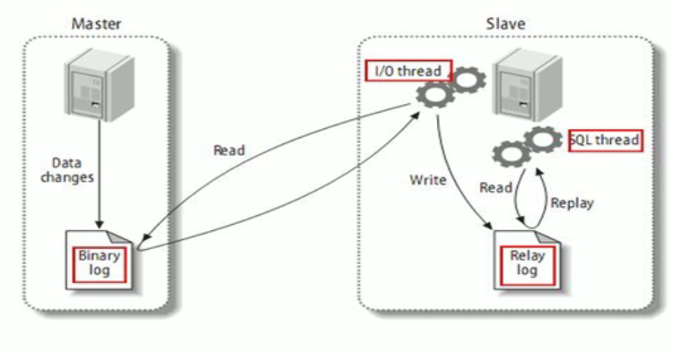

# MySQL高级

MySQL是一个关系型数据库管理系统

> 新学linux命令

```bash
top		# 查看虚拟机信息，如运行时间

# 在文件中修改 vi 1.txt 后
set nu	# 显示行数
o		# 在当前光标行的下一行输入
```


## 简介

> mysql安装目录的作用


`ps -ef|grep mysql`查看mysql相关路径的配置

### MySQL逻辑架构简介


mysql语句的执行是从`from`开始，分层的架构，**插件式的、可拔插的存储引擎架构将查询处理和其他的系统任务以及数据的存储提取相分离。**

1、连接层

最上层是客户端和连接服务，类似于tcp/ip连接，完成一些类似连接处理、授权认证、及相关的安全方案，并在该层引入了线程池的概念，也会为每一个客户端验证他所具有的操作权限。

2、服务层

主要完成大多数的核心功能，如SQL接口、缓存的查询、SQL分析、SQL优化和内置函数的执行，过程和函数、查询表的顺序、是否利用索引等都在这层确定。

3、引擎层

负责MYSQL中数据的存储和提取，服务器通过API和存储引擎通信，我们可以根据我们的应用场景选取不同的存储引擎。

4、存储层

主要将数据存储在裸设备的文件系统之上，完成与存储引擎的交互。


> 存储引擎介绍

查看引擎:`show engines;` ` show variables like '%storage_engine%';`

MyISAM和InnoDB


MyISAM更多的是偏向读，查的快，查的好

阿里巴巴用的sql数据库是使用的percona的XtraDB引擎，替代了InnoDB，优化了一部分性能。

### SQL优化分析

> 性能下降SQL慢

执行时间长

等待时间长

**单值索引**：只给某表的某一个字段建了一个索引`create index user_name on user(name);`

**复合索引**：给多个字段建立索引`create index user_name_email on user(name,email);`

关联查询join子句太多

服务器调优及各个参数的设置（缓冲，线程数）


> mysql读取顺序


### Join

> 七大连接方式


mysql不支持full outer join语法(只有oracle中有)，使用union代替full join ：`select * from a left join b on a.key=b.key  union select * from a right join b on a.key=b.key `;


最后一个：`select * from a left join b on a.key=b.key where b.key is null union select * from a right join b on a.key = b.key where a.key is null;`

## 索引优化分析

索引(index)是帮助MySQL高效获取数据的**数据结构**。主要用于**排序加查找**。

### 简介

可以理解为“排好序的快速查找数据结构”

索引的目的在于提高查询效率，可以类比字典（如果没有索引，每次查找就需要从头开始全表扫描）

索引会影响 `where`后面的查找和`order by`后面的排序（两大功能：查找和排序）

现在MySQL的索引用的数据结构是BTree

在数据之外，**数据库系统还维护着满足特定查找算法的数据结构，**这些数据结构以某种方式引用（指向）数据，这种数据结构就是索引

> Tips

一般来说索引本身也很大，不可能全部存储在内存中，因此索引往往以索引文件的形式存储的磁盘上。

逻辑删除(设置标志位删除，物理上存在)：除了为了大数据时代的数据分析外，还利于建索引

为什么加了索引，查找快，增删改慢？增删改需要修改索引

> 索引的优劣

优势

* 建立书目索引，提高了数据检索的效率，降低了数据库的IO成本
* 对索引列数据进行排序，降低数据排序的成本，降低了CPU的消耗

劣势

* 实际上索引也是一张表，该表保存了主键与索引字段，并指向实体表的记录，所以索引列也是要占用空间 的。

* 索引大大提高了检索速度，但降低了更新表的速度，因为在增删改数据的时候也会更新索引的信息

### 建立索引

 建复合索引优于单值索引

一张表最多建的索引不要超过5个（建议）

单值索引：一个索引只包含单个列，一个表可以有多个单列索引

唯一索引：索引列的值必须唯一，但允许为空值

复合索引：一个索引包含多个列

基本语法

```bash
# 新建
create [unique] index indexName on tabel(column(length));
alter table add [unique] index [indexName] on (column(length));
# 删除
drop index [indexName] on table;
# 查看索引
show index from table;
```

> BTree索引检索原理

非叶子节点不存储数据，只有叶子节点才存储数据。

> 哪些情况下需要创建索引

1. 主键自动创建唯一索引
2. 频繁查找的字段应该创建索引，频繁更新的字段不建立索引
3. 查询中与其他表关联的字段，外键关系建立索引
4. 单值/组合索引的选择问题（在高并发下倾向创建组合索引）
5. 排序字段使用索引会大大提高排序速度
6. 查询中统计或者分组的字段

> 哪些情况下不需要创建索引

1. 表记录太少的表（三百万以下）
2. where 条件里用不到的字段
3. 频繁更新的字段
4. 数据列包含许多重复的内容，就不需要建立索引（就算建了，性能也不会有太大的提高）

> Tips

* 当like子句  前缀没有 % 后缀有% 索引不会失效

### 性能分析

> MySQL常见瓶颈

CPU：CPU饱和一般发生在数据装入内存或从磁盘上读取数据的时候

IO：磁盘IO瓶颈发生在装入数据远大于内存容量的时候

服务器硬件性能瓶颈：top、free、iostat和vmstat查看系统的性能状态

> **Explain**

使用explain关键字可以模拟优化器执行SQL查询语句，从而知道MySQL是如何处理你的SQL语句的，分析你的查询语句或是表结构的性能瓶颈（explain + sql语句）

能干什么？

1. 表的读取顺序
2. 数据读取操作的操作类型
3. 哪些索引可以使用
4. 哪些索引被实际使用
5. 表之间的引用
6. 每张表有多少行被优化器查询


> Explain属性解释


id：select查询的序列号，表明查询中执行select子句或操作表的顺序；id越大越先执行，id相同从上往下顺序执行。

select_type：

* SIMPLE：简单的查询，不包含子查询或者UNION
* PRIMARY：查询中若包含任何复杂的子查询，最外层查询就被标记成这个，就是最后加载的那个
* SUBQUERY：在select或者where列表包含了子查询
* DERIVED：在from列表中包含的子查询会标记为DERIVER(衍生)，将结果存在临时表中
* UNION：第二个SELECT出现在UNION之后，则被标记为UNION，若UNION包含在FROM子句的子查询中国，外层SELECT将被标记为DERIVED

* UNION RESULT：从UNION表获取结果的SELECT，就是两个结果最后UNION的结果集，这个在最后

table：显示这一行的数据是关于哪张表的

partitions：使用的哪个分区，需要结合表分区才可以看到

type：访问类型顺序

* 最好到最差：system>const>eq_ref>ref>range>index>ALL；一般查询至少达到range，最好能达到ref
* system：表只有一行记录（等于系统表），这是const类型的特例，平时不会出现，可以忽略不计；表只有一行数据就是这个
* const：表示通过一次索引就找到了，const用于比较primary key或者unique索引，就是在where中比较主键 `select * from table where id=1`
* eq_ref：唯一性索引扫描，对于每个索引键，表中只有一条记录与之匹配。常见于主键或唯一索引扫描 ；比如查询部门的经理，只有一个
* ref：非唯一性索引扫描，返回匹配某个单独值的所有数据，可能会有多个符合条件的行（就是where查询的时候匹配多行数据）； 比如查询部门的程序员，有多个
* range：只检索给定范围的行，使用一个索引来选择行。一般就是在where子句中使用 between、<、>、in等的查询，不用扫描全表
* index：也是读全表，但是index与ALL的区别就是index类型只遍历索引树（全索引扫描），因为索引文件通常比数据文件小 `select id from table`
* ALL：遍历全表扫描行  `select * from table`

possible_keys：显示可能应用在这张表的所有，一个或多个，不一定会实际使用

key：实际用到的索引（为null，表示没有使用索引）  判断是否使用索引，判断索引是否失效，判断到底使用了哪个索引

​		若查询中使用了覆盖索引，则改索引只会出现在key中，而不会出现在possible_keys中

​		**覆盖索引**：查询的字段的个数和顺序与建的复合索引的个数和顺序一致，查询的数据列从索引中就能够得到，而不必根据索引再读取数据文件（不能使用select *）

key_len：表示索引中使用的字节数，可计算查询中使用索引的长度；也就是同样查询结果下（长度越短越好）

ref：显示索引的哪一列被使用了，如果可能的话，是一个常数，哪些列或常量被用于查找索引列上的值

rows：根据统计信息及索引选用情况，大致估算出找到所需记录要读取的行数，越小越好

filtered：通过过滤条件之后对比总数的百分比

extra：包含不适合在其他列中显示但十分重要的额外信息，部分值具有优化的参考意义

* **using filesort**：这是 order by 语句的结果。这可能是一个CPU密集型的过程。using filesort表示出现了文件内排序，加重系统负担，而无法利用索引完成排序操作，表示很不好的现象，必须要优化，特别是大表，可以通过选择合适的索引来改进性能，用索引来为查询结果排序。**九死一生**（解决方案，where + order by的字段和索引个数、顺序一致）
* **using temporary**：使用临时表来保存中间结果。 需要把数据存入临时表，再把数据从临时表读取出来，也是必须需要优化的地方，特别是数据量大的情况。常见的原因是在来不同表的列上使用了distinct，或者使用了order by 和 group by 。**十死无生**（解决方案：group by的字段个数、顺序和索引一致，类似覆盖索引）

* **using index**：表示使用了覆盖索引，这个值重点强调了只需要使用索引就可以满足查询表的要求，不需要直接访问表数据，如果同时出现了using where，表明索引被用来执行索引键值的查找，没有出现using where 表明索引用来读取数据而非执行查找动作。好事（select 的时候不是 * 而是跟索引个数和顺序一样的字段）
* using where：表示使用了where 过滤
* using join buffer：表示使用了连接缓存
* impossible where：where 子句的条件一直为 false，不能用来获取任何元组(select name from user where sex='男' and sex='女')
* distinct：优化distinct操作，在匹配第一个元组后停止查找同样值得动作


### 索引优化

> 单表优化

```bash
explain select id,author_id from article where category_id=1 and comments>1 order by views desc limit 1;

# 创建包含三个字段的索引，类似于覆盖索引（只优化了全表扫描的缺点），但是comments是一个范围，导致后面索引失效(extra 有个 Using filesort)  索引建立的索引应该是 category_id,views(extra的问题也解决了)
create index idx_article_ccv on article(category_id,comments,views);

# 失效的原因
# 是BTree的工作原理，因为BTree先排序category_id，如果遇到相同的category_id再排序comments，如果遇到相同的comments再排序views，当commnets字段在联合索引中处于中间位置时，comments>1是一个范围(即range)，mysql就无法对range后面的索引进行检索了，也就是range类型后面字段的索引无效
```

> 两表索引优化

```bash
# 左连接加右表的索引，右连接加左表的索引，可以优化  （就是某连接一定要在想反方向建立索引）
# 就算只建了一张表，也可以在sql语句中直接对调两张表的位置，脑子要放灵活
# 内连接的话是随便在哪张表上建索引都行
```

> 三表索引优化

```bash
# 可以给连接字段建立索引，后面两张表的字段建立索引比较快，给第一张表建立索引只会将type从All改成Index
```


>  结论

多表查询，**永远都是用小结果集驱动大的结果集**，也就是小结果集的表放在前面。

优先优化内层循环，也就是子查询

保证join的条件字段已被索引


#### 如何避免索引失效

> 索引失效原因

如果使用了复合索引，在查询的时候没有使用最前面的索引字段就会导致索引失效，或者新建了三个索引字段，没有使用中间的字段，如果使用了最后的字段，最后字段的索引也不会生效


全值匹配我最爱

**最佳左前缀法则**：如果索引了多列，要遵守最左前缀法则，指查询从索引的最左前列开始并且**不跳过索引中的列**。

不要再索引列上做任何操作（计算、函数、类型转换(自动或手动)），会导致索引失效而转向全表扫描

范围查询之后的列也不会用到索引，自己本身可以用到索引

尽量使用覆盖索引(只访问索引的查询(索引列和查询列一致))，减少使用select * 的使用

mysql使用不等于(!=或<>)或导致无法使用索引而使用全表扫描(但是必须使用的时候也必须使用)

is null或is not null也无法使用索引（所以一般给字段不要设置null值，一般需要设置一个默认值）

like语句的%写在最右边的索引有效（如果要在左边或两边加%，就可以在select中的字段使用覆盖索引，like子句的字段 当然也需要在索引里面，使用覆盖索引可以解决索引失效的问题）（%没在右边的like，之后的索引也会失效）(只要左边是定值，不管右边有多少个%，索引都不会失效)

字符串不加单引号导致索引失效(当字符串的值为整数时，mysql查询可以不加引号也能查出来，会产生隐式的类型转换)

少用or，用的话索引也会失效


**全值匹配我最爱，最左前缀要遵守；**
**带头大哥不能死，中间兄弟不能断；**
**索引列上少计算，范围之后全失效；**
**Like百分写最右，覆盖索引不写星；**
**不等空值还有or，索引失效要少用；**
**VAR引号不可丢，SQL高级也不难！**


group by虽然是分组，但是一般分组前必排序(会有临时表产生)，所以group by 和order by的排序法则和索引优化原则几乎一致，不一致的地方就算group by还有having


#### 一般性建议

对于单值索引，尽量选针对当前query过滤性更好的索引

对于组合索引，当前query中过滤性最好的字段在索引字段中越靠左越好

对于组合索引，尽量选择能够包含当前query中的where子句中更多字段的索引

尽可能通过分析统计信息和调整query的写法来达到选择合适索引的目的


## 查询截取分析

### 查询优化

```bash
1.慢查询的开启与捕获(开启MySQL慢查询日志，设置阙值，比如超过5秒的就是慢SQL)
2.explain+慢SQL分析
3.show profile查询SQL在MySQL数据库中的执行细节和生命周期情况
4.MySQL数据库服务器的参数调优(运维或者DBA)
```

#### 永远小表驱动大表

小的数据集驱动大的数据集  


```bash
# in	当B表的数据集小于A表时，in优于exists
select * from A where id in (select id from B)

# exists 当A表的数据集小于B表时， exists优于in
select * from A where exists (select 1 from B where B.id = A.id)
```

Exists：将主查询的数据，放到子查询中做条件验证，根据验证结果(true或false)来决定主查询的数据是否得以保留(一般可以用条件表达式、子查询或JOIN代替)


#### order by 优化

order by尽量使用index方式排序，避免使用 file sort排序

order by子句符合最左前缀匹配法则

如果有where子句，where子句和order by子句组合需要满足最左前缀匹配


尽可能在索引列上完成排序操作，遵照索引进行最佳左前缀排序

> order by的字段不在索引列上

如果不在索引列上，firesort有两种算法

双路排序：mysql4.1之前，两次读取数据

单路排序：4.1之后，一次IO，把随机IO变成了顺序IO，但会使用更多的空间，会吧每一行保存在内存中

* 但是单路排序有问题：在sort_buffer中，单路排序比双路排序多占用更多内存，因为单路是把所有字段都取出，所以总数据大小可能会超出sort_buffer的容量，导致每次只能取sort_buffer容量的数据，排序(创建tmp文件，多路合并)，然后再取sort_buffer大小的数据，导致大量的I/O操作

> 例子

```bash
# key a_b_c(a,b,c)
# order by使用最左前缀  下面的都能使用索引 (不会变成file sort)
order by a
order by a,b
order by a,b,c
order by a desc,b desc,c desc

# 如果where使用索引的最左前缀定义为常量，则order by能使用索引
where a= const order by b,c
where a= const and b= const order by c
where a= const and b > const order by b,c  # 这儿查询 b虽然断了  但是 a和 order by的b,c又勾搭上了

# 不能使用索引进行排序
order by a asc,b desc,c desc  		# 排序不一致，必须保持一致
where g= const order by b,c			# 丢失a索引，丢失带头大哥
where a= const order by c 			# 丢失b索引
where a= const order by a,d			# d不是索引的一部分
where a in (...) order by b,c		# 范围查询后面的索引失效
```


>优化策略

增大sort_buffer_size参数的设置

增大max_length_for_sort_data参数的设置

提高order by的速度

* 只要使用order by，最好不要使用select *。(当Query字段大小总和小于max_length_for_sort_data而且排序字段不是Text|Blob类型，使用单路排序算法，否则使用多路排序)
* 两种算法的数据都可能超出sort_buffer容量，可能会产生多次I/O，所以要增大sort_buffer_size(配置sort_buffer的容量)

#### group by 优化

groupby实质是先排序后进行分组，遵照索引建的最佳左前缀

当无法使用索引列时，增大max_length_for_sort_data参数的设置+增大sort_buffer_size参数的设置

where 高于having ，能写在where 限定的条件就不要去having限定了；其他的均和order by一致


### 慢查询日志

是Mysql提供的一种日志记录，用来记录MySQL中SQL执行时间超过阀值的语句，使用`long_query_time`配置阀值，默认是10秒

> 使用

MySQL默认没有开启慢查询日志，需要手动开启，如果不是调优的话，一般不建议启动，会带来性能上的影响(慢查询日志支持将日志记录写入文件)

查看：`show variables like '%slow_query_log%;'`

手动开启：`set global slow_query_log=1;`(只对当前数据库生效，mysql重启后失效)；永久生效需在my.cnf配置文件添加`slow_query_log=1`

查询阀值：`show variables like '%long_query_time%';`mysql源码中是判断大于long_query_time，而不是大于等于

设置：`set global long_query_time=3`

`select sleep(4)`：可以睡眠4秒

`show global status like '%Slow_queries%';`：查看有多少条慢sql


> 配置my.cnf   开启慢查询日志

```bash
# 在 [mysqld]下面配置
slow_query_log=1;
slow_query_log_file=/var/lib/mysql/lvboaa-slow.log   # 默认是 主机-slow.log
long_query_time=3;
log_output=FILE
```

> 慢查询日志分析工具 mysqldumpslow

```bash
# 命令
s: 按照何种方式排序
c: 访问次数
l: 锁定时间
r: 返回记录
t: 查询时间
al: 平均锁定时间
ar: 平均查询时间
t: 返回前面多少条数据
g: 搭配正则汽配模式，大小写不敏感

# 工作常用参考
mysqldumpslow -s r -t 10 /var/lib/mysql/lvboaa-slow.log		# 得到返回记录集最多的10个SQL
mysqldumpslow -s c t -t 10 /var/lib/mysql/lvboaa-slow.log	# 得到访问次数最多的10个SQL
mysqldumpslow -s t -t 10 -g "left join" /var/lib/mysql/lvboaa-slow.log 		# 得到按照时间排序的前10条中含有左连接的语句
mysqldumpslow -s r -t 10 /var/lib/mysql/lvboaa-slow.log | more 		# 建议在使用这些命令结合 | more 使用，否则容易爆屏
```


### 批量数据脚本

函数有返回值，存储过程没有返回值

批量插入数据，如果报错：This function has none of DETERMINISTIC (就是因为开启了慢查询日志，开启了bin-log，就必须为function指定一个参数)

```bash
show variables like 'log_bin_trust_function_creators'
set global log_bin_trust_function_creators=1			# 重启失效
```

批量插入数据

```bash
# 新建函数和存储过程
delimiter $$
create function rand_string(n INT) returns varchar(255)
begin
	declare chars_str varchar(100) default 'abcdefghijklmnopqrstuvwxyz';
	declare return_str varchar(255) default '';
	declare i int default 0;
	while i < n do
	set return_str = concat(return_str,substring(chars_str,floor(1+rand()*52),1));
	set i = i + 1;
	end while;
	return return_str;
end $$

delimiter $$
create function rand_num() returns int(5)
begin 
	declare i int default 0;
	set i = floor(100+rand()*10);
	return i;
end $$


delimiter $$
create procedure insert_emp(IN START INT(10),IN max_num INT(10))
begin 
declare i int default 0;
	set autocommit=0;
	repeat
	set i=i+1;
	insert into emp (empno,ename,job,mgr,hiredate,sal,comm,deptno)values ((start+i),rand_string(6),'SALESMAN',0001,CURDATE(),2000,400,rand_num());
	until i=max_num
	end repeat;
	commit;
	set autocommit=1;
end $$

delimiter $$ 
create procedure insert_dept(in start int(10),in max_num int(10))
begin
declare i int default 0;
	set autocommit = 0;
	repeat
	set i = i+1;
	insert into dept(deptno,dname,loc) values((start+i),ran_string(10),ran_string(8));
	until i=max_num
	end repeat;
	commit;
end $$


# 调用存储过程批量添加数据
delimiter ;

call insert_dept(100,10);
call insert_emp(100001,5000000);
```

### Show Profile

是mysql提供可以用来分析当前会话中语句执行的资源消耗情况，可用于SQL的调优的测量

默认关闭，并保存最近15次的运行结果

* 开启

```bash
show variables like 'profiling';
set profiling=on;
```

* 查看使用：

````bash
# 查询sql的profile    查看结果
show profiles
# 根据query_id 查询生命周期运行时间		诊断sql
show profile cpu,block io for query 211;
````


> 当show profile时的status出现以下四个就说明sql有问题，必须优化

converting HEAP to MyISAM：查询结果太大，内存不够用往磁盘上搬

Creating tmp table：创建临时表，拷贝数据到临时表再把临时表删除

Copying to tmp table on disk：把内存中临时表复制到磁盘，危险

locked

### 全局查询日志

全局查询日志**不能在生产环境**使用，只能在测试环境使用

> 配置开启

```bash
# 在my.cnf中配置   配置 开启
# 开启
general_log=1
# 记录日志文件的路径
general_log_file=/path/logfile
# 输出格式
log_output=FILE

# 编码开启
set global general_log=1;
# 设置日志存在表中，会将记录存在mysql库中的general_log表中
set global log_output='TABLE';
select * from mysql.general_log;
```


## MySQL锁机制

锁是计算机协调多个进程或线程并发访问某一资源的机制(主要是保证数据的一致性及有效性)

### 锁的分类

> 从数据操作类型

* 读锁(共享锁)：针对同一份数据，多个读操作可以同时进行
* 写锁(排它锁)：当前写操作没有完成前，会阻断其他的写锁和读锁

> 从对数据操作的粒度分

* 表锁
* 行锁


根据开销、加锁速度、死锁、粒度、并发性能判断什么锁更适合当前业务

#### 表锁

表锁(偏读)：偏向**MyISAM**引擎，开销小，加锁快，无死锁，锁粒度大，发生锁冲突的概率最高，并发度最低

```bash
# 新建一个使用myisam引擎的表
# 查看表上加过的锁
show open tables;
# 给mylock这张表加读锁，给book加写锁
lock table mylock read,book write;

# 释放所有表锁
unlock tables;

# 当给当前表加了读锁，当前会话可以读当前表，不能写(增删改)当前表；也不能读写其他表
# 不会阻塞其他会话的读请求，会阻塞写请求，等到获得锁就立即执行

# 给当前表加写锁，当前会话可以读写操作当前表，但不能读其他表
# 会阻塞其他会话的读写操作
```

结论(myisam 表锁)：

MyISAM在执行查询语句(select)前，会自动给锁设计的所有表加读锁，在执行增删改操作前，会自动给锁涉及的表加写锁。

* 对MyISAM表的读操作(加读锁)：不会阻塞其他进程对同一表的读请求，但会阻塞对同一表的写请求，只有当读锁释放后，才会执行其他进程的写操作
* 对MyISAM表的写操作(加写锁)：会阻塞其他进程对同一表的读写操作，当锁释放后，才会执行其他进程的读写操作

**简而言之，就是读锁会阻塞写，但不会阻塞读，而写锁会阻塞读写锁。**


表锁分析：

`show status like 'table%';`：查询mysql内部表级锁定的情况；`Table_locks_immediate`表示产生表级锁定的次数；`Table_locks_waited`表示出现表级锁定而发生等待的次数

此外，myisam的读写调度室写优先，也就是myisam不适合做写为主表的引擎，因为写锁后，其他线程不能做任何操作，大量更新可能会造成永久阻塞。


#### 行锁

行锁(偏写)：偏向**InnoDB**引擎，开销大，加锁慢；会出现死锁，锁粒度最小，发生锁冲突的概率最低，并发度也最高。

InnoDB与MyISAM最大的不同点：InnoDB支持事务、支持外键、支持行锁、表空间较大；myisam支持表锁、支持全文索引、表空间较小。

`show variables like 'tx_isolation;'`：查看当前数据库的事务隔离级别；

```bash
# 事务隔离级别
Read uncommitted(未提交读)		最低级别，只保证不读取物理上损坏的数据					可以脏读、不可重复读、幻读
Read committed(已提交读)		语句级											  防止脏读
Repeatable read(可重复读)		事务级											  防止脏读、不可重复读				mysql默认级别
Serializable(可序列化)			最高级别，事务级								   防止脏读、不可重复读、幻读
```

数据库的事务隔离越严格，并发副作用越小，但付出的代价就越大，事务隔离本质是使事务在一定程度上串行化进行

```bash
# innodb默认行锁
# 关闭自动提交之后，在一个事务之内，更新一行数据的同时，另一个会话更新这行数据会阻塞，等待锁的获取  (但两个会话都可以进行读操作，要注意事务隔离级别)
```


> **使用索引不当会导致行锁升级为表锁**

```bash
# a为整数，b为varchar类型  这样可以成功，但是mysql会自动类型转换 放弃使用索引  会造成行锁升级为表锁，也就是其他会话对其他行的更新操作也会阻塞
update test_innodb_lock set a=41 where b=4000
```

> 间隙锁的危害

间隙锁：使用范围条件而不是相等条件检索数据并请求共享或排他锁时，InnoDB会给符合条件的已有数据记录的索引项加锁，对于键值在条件范围内但并不存在的记录叫做“间隙(GAP)”；InnoDB也会对间隙加锁，就是间隙锁(Next-key锁)

间隙锁的致命弱点：当锁定一个范围键值后，即使某些不存在的键值也会被锁定，造成锁定的时候无法插入指定键值范围内的任何数据，某些场景下可能会对性能造成很大的危害


> 如何锁定一行

```bash
begin;
select * from test_innodb_lock where a=8 for update;

commit; 		# 锁定某一行后，其他会话对改行的写操作会阻塞，知道当前会话commit，就解锁了
```

> 总结

Innodb存储引擎实现了行锁，虽然锁定机制方面带来的损耗可能会比表锁更高一些，但是整体的并发处理能力要远优于Myisam。当系统并发较高时，innodb会有较明显的优势。但是使用不当可能会导致innodb的整体性能低于myisam。


```bash
# 行锁分析
show status like 'innodb_row_lock%';		
# Innodb_row_lock_current_waits：当前正在等待行锁的数量  
# Innodb_row_lock_time：等待总时长
# Innodb_row_lock_time_avg：等待平均时长
# Innodb_row_lock_time_max：等待最大时长
# Innodb_row_lock_waits：系统启动后到现在总等待的次数
```

优化建议

* 尽可能让索引数据检索都通过索引来完成，避免无索引行锁升级为表锁
* 合理设计索引，尽量缩小锁的范围
* 尽可能较少检索条件，避免间隙锁
* 尽量控制事务大小，减少锁定资源量和时间长度
* 尽可能低级别事务隔离

页锁(了解)：开销和加锁时间介于表锁和行锁之间，会出现死锁，锁定粒度介于表锁和行锁之间，并发度一般

## 主从复制

slave会从master读取binlog来进行数据同步



MySQL复制过程分为三步：

1. master将改变记录到二进制日子(binary log)，这些记录过程叫二进制日志事件，binary log events
2. slave将master的binary log events拷贝到它的中继日志(relay log)
3. slave重做中继日志中的时间，将改变应用到自己的数据库中。**mysql复制是异步且串行化的**

复制的基本原则：

1. 每个slave只有一个master
2. 每个slave只能有唯一的服务器ID
3. 每个master可以有多个slave

复制的最大问题是：延时

使用docker配置一主一从

```bash
# 配置主机
docker run --name master --privileged=true -v /home/replication/master/data:/var/lib/mysql -v /home/replication/master/conf:/etc/mysql -v /home/replication/master/log:/var/log/mysql -p 3306:3306 -e MYSQL_ROOT_PASSWORD=root -d mysql:5.7		# --privileged=true 指定当前容器具有宿主机的root权限
# 需要在容器master /etc/mysql下的my.cnf文件下添加 也就是主机/home/replication/master/conf下
[client]
default-character-set=utf8

[mysql]
default-character-set=utf8

[mysqld]
character-set-server=utf8
lower_case_table_names=1
default-time-zone='+08:00'
server-id=1				# 代表主机
log-bin=mysql-bin		# 打开二进制存储
read-only=0				# 设置主机可读写

docker exec -it master /bin/bash
mysql -uroot -proot
grant replication slave on *.* to 'test'@'%' identified by '123456';	# 创建一个专门用来复制binlog的账号，并赋予复制权限
flush privileges;

show master status;		# 记住 File(mysql-bin.000001)和Position(154) 信息，配置从机需要  

# 配置从机
docker run --name slave --privileged=true -v /home/replication/slave/data:/var/lib/mysql -v /home/replication/slave/conf:/etc/mysql -v /home/replication/slave/log:/var/log/mysql -p 3307:3306 --link master:master -e MYSQL_ROOT_PASSWORD=root -d mysql:5.7		# --link master:master   前面的master表示要连接的容器，后面的master表示取得别名
# 需要在容器slave /etc/mysql下的my.cnf文件下添加  也就是主机/home/replication/slave/conf下
[client]
default-character-set=utf8

[mysql]
default-character-set=utf8

[mysqld]
character-set-server=utf8
lower_case_table_names=1
default-time-zone='+08:00'
server-id=2
log-bin=mysql-bin
read-only=1		# 只读，对于除了root用户的其他用户来说

docker exec -it slave /bin/bash
mysql -uroot -proot
change master to master_host='master', master_user='test', master_password='123456', master_port=3306, master_log_file='mysql-bin.000001', master_log_pos=154, master_connect_retry=30;   # 这个命令就是指定master的域名(link时取得别名)、用户名。密码、端口和master节点的log和position
start slave;	# 开启主从复制

# 查看服务器状态：只要Slave_IO_Running和Slave_SQL_Running都为true  表示主从复制搭建成功
show slave status\G;		# \G：表示使用 k:v 展示 而不是表
```

> 测试主从服务

在master上新建数据库、表和插入数据，成功之后在slave查询看是否有数据
