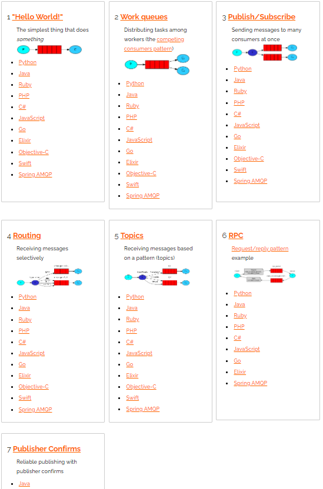
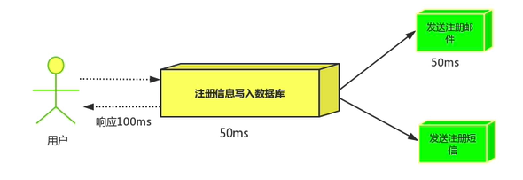
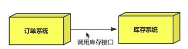
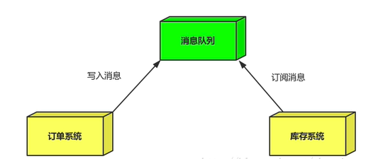
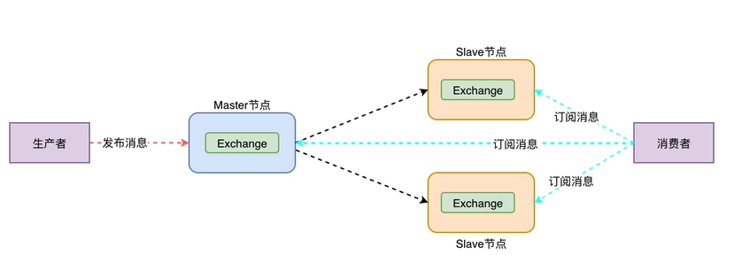
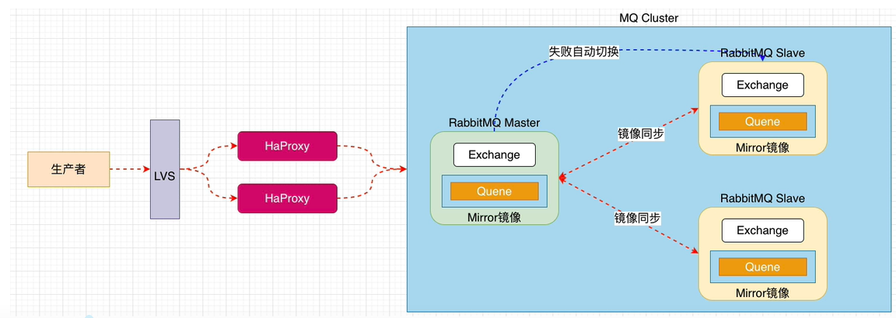
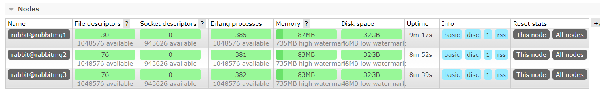

# RabbitMQ

## 入门

> docker 安装

```bash
docker run -d --name rabbitmq01 -p 5672:5672 -p 15672:15672 -v /home/rabbitmq/data:/var/lib/rabbitmq -e RABBITMQ_DEFAULT_USER=admin -e RABBITMQ_DEFAULT_PASS=admin rabbitmq:3.7.7-management
```

> rabbitmq工作模式


> 连接方式



## mq应用场景

### 异步处理

> 串行


> 并行



> 消息队列

将用户注册信息写入数据库之后就可以返回注册成功消息了，不需要等待系统发送邮件和短信


引入消息队列后，用户的响应时间就是串行的三倍，是并行的两倍

### 应用解耦

> 传统场景



当库存系统出现故障后，下订单就会失败

> 消息队列



将下单信息写入消息队列，就算库存系统出现故障，消息队列也能保证消息的可靠投递，不会导致消息丢失

### 流量削峰

比如说秒杀活动，有时候会因为流量过大，导致应用挂掉，也可以引入消息队列


好处：

* 可以控制活动人数，超过一定阀值的订单直接丢掉
* 可以缓解短时间内的高流量压垮应用（应用程序只需要按自己最大的处理能力获取订单）

## RabbitMQ集群

### 普通集群（副本集群）

master节点除了消息队列之外所有的数据和状态（消息队列中的信息也行）都可以复制给slave结点

只有主节点才存储`消息队列`，从结点只起到备份的作用



### 镜像集群

镜像集群的消息会在主从结点中自动同步，主节点宕机了也不会影响服务的使用，提示MQ集群的高可用性。（基于普通集群实现，也能同步队列）



##  Docker搭建集群

### 普通集群

> docker创建三个容器

```bash
# rabbitmq1
docker run -d -e RABBITMQ_DEFAULT_USER=admin -e RABBITMQ_DEFAULT_PASS=admin --hostname rabbitmq1 -p 5672:5672 -p 15672:15672 --name rabbitmq1 rabbitmq:3.7.7-management

# rabbitmq2
docker run -d -e RABBITMQ_DEFAULT_USER=admin -e RABBITMQ_DEFAULT_PASS=admin --hostname rabbitmq2 -p 5673:5672 -p 15673:15672 --name rabbitmq2 --link rabbitmq1:rabbitmq1 rabbitmq:3.7.7-management

# rabbitmq3
docker run -d -e RABBITMQ_DEFAULT_USER=admin -e RABBITMQ_DEFAULT_PASS=admin --hostname rabbitmq3 -p 5674:5672 -p 15674:15672 --name rabbitmq3 --link rabbitmq1:rabbitmq1 --link rabbitmq2:rabbitmq2 rabbitmq:3.7.7-management
```

> 将 **.erlang.cookie** 文件设置一样

```bash
# 复制一个容器内的 .erlang.cookie 文件复制到主机
docker cp rabbitmq1:/var/lib/rabbitmq/.erlang.cookie /home/rabbitmq/.erlang.cookie

# 更新另外两个的 .erlang.cookie文件
docker cp /home/rabbitmq/.erlang.cookie rabbitmq2:/var/lib/rabbitmq/.erlang.cookie
docker cp /home/rabbitmq/.erlang.cookie rabbitmq3:/var/lib/rabbitmq/.erlang.cookie

```

> 重启容器

```bash
docker restart rabbitmq1
docker restart rabbitmq2
docker restart rabbitmq3
```

> 将容器加入集群

```bash
# rabbitmq1
docker exec -it rabbitmq1 /bin/bash
# rabbitmq-server -detached # 好像都不需要这句，如果集群加入失败，每个容器先执行这一句
ctrl +P+Q

# rabbitmq2
docker exec -it rabbitmq2 /bin/bash
# rabbitmq-server -detached 
rabbitmqctl stop_app
rabbitmqctl join_cluster rabbit@rabbitmq1
rabbitmqctl start_app
ctrl +P+Q

# rabbitmq3
docker exec -it rabbitmq3 /bin/bash
rabbitmq-server -detached 
rabbitmqctl stop_app
rabbitmqctl join_cluster rabbit@rabbitmq1
rabbitmqctl start_app
ctrl +P+Q
```

> 成功截图



master节点除了消息队列之外所有的数据和状态（消息队列中的信息也行）都可以复制给slave结点

只有主节点才存储`消息队列`，从结点只起到备份的作用

可以往从节点生产消息，会自动同步到主节点，然后同步到其他的从节点；也可以在从节点进行消费，也会进行同步

当主节点宕机之后，从节点虽然显示有消息，但是不能消费了（如果队列和消息都未进行持久化，队列和消息就直接无了）；如果队列和消息都进行了持久化操作，等主机重启之后又可以进行消费了

### 镜像集群

> 命令参数

镜像集群只需要配置

```bash
rabbitmqctl set_policy [-p <vhost>] [--priority <priority>] [--apply-to <apply-to>] <name> <pattern>  <definition>
-p Vhost： 可选参数，针对指定vhost下的queue进行设置
Name:     policy的名称
Pattern: queue的匹配模式(正则表达式)	
Definition：镜像定义，包括三个部分ha-mode, ha-params, ha-sync-mode
         	 ha-mode:指明镜像队列的模式，有效值为 all/exactly/nodes
                      all：表示在集群中所有的节点上进行镜像  # 一般使用这种
                      exactly：表示在指定个数的节点上进行镜像，节点的个数由ha-params指定
                      nodes：表示在指定的节点上进行镜像，节点名称通过ha-params指定
          	 ha-params：ha-mode模式需要用到的参数
             ha-sync-mode：进行队列中消息的同步方式，有效值为automatic和manual # 自动和手动，手动需要执行命令，一般使用手动
             priority：可选参数，policy的优先级  # 多个策略对应于一个队列，谁的优先级大谁生效
```

> 设置策略

```bash
# 进入当前普通集群主节点 容器  只需要在主结点添加策略就行了
docker exec -it rabbitmq2 /bin/bash

# 查看当前策略
rabbitmqctl list_policies

# 添加策略 策略名字为myall,虚拟主机/ems,正则表达式为 “^” 表示所有匹配所有队列名称  ^所有队列
rabbitmqctl set_policy -p /ems myall '^' '{"ha-mode":"all","ha-sync-mode":"automatic"}' 

# 清除策略
rabbitmqctl clear_policy
```

> 成功截图


镜像集群会使用镜像复制主节点，信息、数据和队列都会复制，生产消息时需要设置队列持久化，消息不用

当主机宕机之后，镜像集群会推举出一个新的主节点；保证消息可以继续消费，保证高可用性

当之前的主机恢复之后，会自动成为当前主节点的从节点

