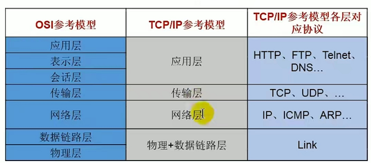
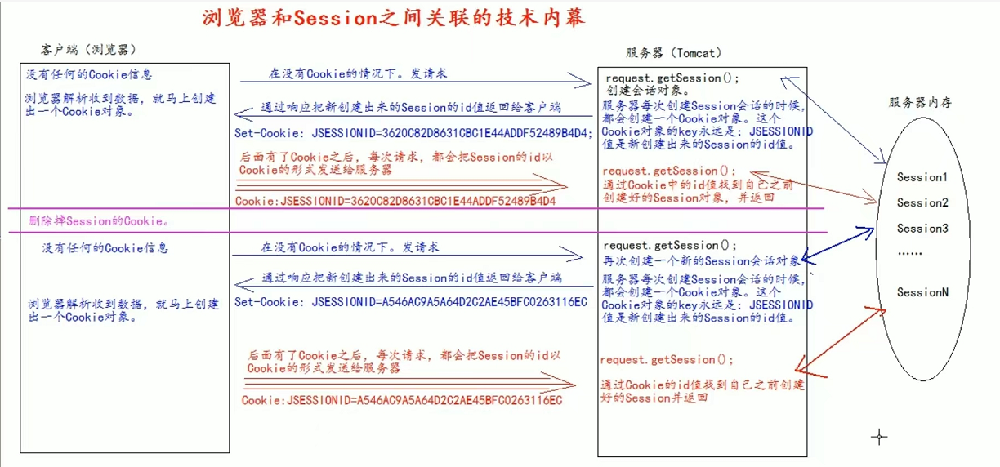

# RUNING 

## 浏览器

#### 网络通信协议



#### 浏览器和session的关联




## 语言和技术


### 设计模式

> 单例模式

程序运行时，在java虚拟机中只存在该类的一个实例对象。

饿汉式，项目启动的时候就创建对象，线程安全，但是可能会造成资源浪费，如果没有使用的话

懒汉式：需要用双重检测锁dcl和volatile保证线程安全和防止指令重排

```java
public class LazyMan {

    private static boolean flag = false;
    
    private volatile static LazyMan lazyMan;
    
    private LazyMan(){
        synchronized (LazyMan.class){
            if (flag == false){
                flag = true;
            }else {
                throw new RuntimeException("不要试图使用反射破坏异常");
            }
        }
    }

    // 双重检测锁模式的 懒汉式单例  DCL懒汉式
    public static LazyMan getInstance(){
        if (lazyMan==null){
            synchronized (LazyMan.class){
                if (lazyMan==null){
                    lazyMan = new LazyMan(); // 不是一个原子性操作，使用volatile防止指令重排
                    /**
                     * 三步操作
                     * 1. 分配内存空间
                     * 2、执行构造方法，初始化对象
                     * 3、把这个对象指向这个空间
                     *
                     * 指令重排可能导致
                     * 123
                     * 132 A
                     *     B //  第二步执行完的时候，b线程会判断lazyMan不为null，直接返回；但此时还没初始化，就会导致问题
                     *           此时lazyMan还没有完成构造
                     */
                }
            }
        }
        return lazyMan;
    }
}
```

查看反射的源码，发现

### Java基础

#### 集合

> HashMap

解决hash冲突使用链地址法，就是将hash冲突的k-v用链表存起来

* hash冲突解决办法
  * 链地址法，优点处理冲突简单，无堆积现象，缺点查询效率低
  * 再哈希法，使用多个hash函数进行hash，第一个hash函数冲突了就用第二个，优点不易聚集，但是增加了计算时间
  * 建立公共溢出区，将哈希表分为基本表和溢出表，产生hash冲突的就放入溢出表
  * 开放定址法，当出现哈希冲突时，以某个东西为基础产生另一个哈希地址，线性探测再散列：顺序查找下一个单元；二次(平方)探测再散列：在表的左右进行n的平方跳跃式探查；伪随机探测再散列：已某个随机数为起点探测，直到找出一个空单元或查遍全表

TreeSet和TreeMap中如果是引用对象，引用对象必须实现Comparable接口并重写compareTo方法、或者使用Comparator实现排序


#### 用三个线程循环打印ABC三个字母，如ABCABCABC

```java
public class ABC_Synch {
    public static class ThreadPrinter implements Runnable {
        private String name;
        private Object prev;
        private Object self;
        private ThreadPrinter(String name, Object prev, Object self) {
            this.name = name;
            this.prev = prev;
            this.self = self;
        }
        @Override
        public void run() {
            int count = 10;
            while (count > 0) {// 多线程并发，不能用if，必须使用whil循环
                synchronized (prev) { // 先获取 prev 锁
                    synchronized (self) {// 再获取 self 锁
                        System.out.print(name);//打印
                        count--;

                        self.notifyAll();// 唤醒其他线程竞争self锁，注意此时self锁并未立即释放。
                    }
                    //此时执行完self的同步块，这时self锁才释放。
                    try {
                        prev.wait(); // 立即释放 prev锁，当前线程休眠，等待唤醒
                        /**
                         * JVM会在wait()对象锁的线程中随机选取一线程，赋予其对象锁，唤醒线程，继续执行。
                         */
                    } catch (InterruptedException e) {
                        e.printStackTrace();
                    }
                }
            }
        }
    }
    public static void main(String[] args) throws Exception {
        Object a = new Object();
        Object b = new Object();
        Object c = new Object();
        ThreadPrinter pa = new ThreadPrinter("A", c, a);
        ThreadPrinter pb = new ThreadPrinter("B", a, b);
        ThreadPrinter pc = new ThreadPrinter("C", b, c);

        new Thread(pa).start();
        Thread.sleep(10);//保证初始ABC的启动顺序
        new Thread(pb).start();
        Thread.sleep(10);
        new Thread(pc).start();
        Thread.sleep(10);
    }
}
```


### JVM

#### JVM的主要组成部分

* 类加载器：将java代码加载成对应的字节码文件
* 运行时数据区：将字节码文件加载进内存中
* 执行引擎：命令解析器，将字节码翻译成底层的系统指令，再交由CPU去执行，在这个过程中可能会调用其他语言的本地库接口
* 本地库接口：其他语言对外暴露的接口，比如说线程Thread的native start0()方法

#### JVM运行时数据区包括什么

* 程序计数器：当前线程所执行的字节码的行号指示器
* Java虚拟机栈：存储局部变量、操作数、动态链接、方法出口等
* 本地方法栈：与虚拟机栈的功能差不多，只不过虚拟机站是服务Java的，本地方法则是第三方的native方法的
* 堆：存储new出来的对象和数据，java虚拟机中内存最大的一块，几乎所有的对象实例都在这分配内存
* 方法区：存储已被加载的类信息、常量、静态变量、即时编译后的代码等

方法区和堆所有线程共享，本地方法栈、虚拟机栈和程序计数器线程私有；JVM优化主要是在堆上的优化（调整0、1区的大小，gc多少次进入老年代等等），除了堆其他模块都不好进行优化

#### JVM加载类时的双亲委派机制

类加载器分类

* 启动类加载器（bootstrap classloader）:加载Java_HOME/lib/下的jar包
* 扩展类加载器（Extension ClassLoader）：负责加载ext目录或Java. ext. dirs系统变量指定的路径中的所有类库；
* 应用程序类加载器（Application ClassLoader）。负责加载用户类路径（classpath）上的指定类库，我们可以直接使用这个类加载器。一般情况，如果我们没有自定义类加载器默认就是用这个加载器。

双亲委派模型：如果一个类加载器收到了类加载的请求，它首先不会自己去加载这个类，而是把这个请求委派给父类加载器去完成，每一层的类加载器都是如此，这样所有的加载请求都会被传送到顶层的启动类加载器中，只有当父加载器无法完成加载请求（它的搜索范围中没找到所需的类）时，子加载器才会尝试去加载类。

所以就不能有同路径的String类，因为类加载器是通过全限定类名来确定类的唯一性的


#### 类装载的执行过程？

类装载分为以下 5 个步骤：

* 加载：根据查找路径找到相应的 class 文件然后导入内存；
* 验证：检查加载的 class 文件的正确性；
* 准备：给类中的静态变量分配内存空间；
* 解析：虚拟机将常量池中的符号引用替换成直接引用的过程。符号引用就理解为一个标示，而在直接引用直接指向内存中的地址；
* 初始化：对静态变量和静态代码块执行初始化工作。

#### 怎么判断对象是否可以被回收？

引用计数器：为每个对象创建一个引用计数，有对象引用时计数器 +1，引用被释放时计数 -1，当计数器为 0 时就可以被回收。它有一个缺点不能解决循环引用的问题；
可达性分析：首先定义一些GC Roots对象，然后以这些GC Roots对象作为起点向下搜索，如果在GC roots和一个对象之间没有可达路径，则称该对象是不可达的。不可达对象要经过至少两次标记才能判定其是否可以被回收，如果在两次标记后该对象仍然是不可达的，则将被垃圾收集器回收。

#### Java 中都有哪些引用类型？

强引用：发生 gc 的时候不会被回收。
软引用：有用但不是必须的对象，在发生内存溢出之前会被回收。
弱引用：有用但不是必须的对象，在下一次GC时会被回收。
虚引用（幽灵引用/幻影引用）：无法通过虚引用获得对象，用 PhantomReference 实现虚引用，虚引用的用途是在 gc 时返回一个通知。

#### 说一下 JVM 有哪些垃圾回收算法？

* 标记-清除算法：标记无用对象，然后进行清除回收。缺点：效率不高，会产生内存碎片。
* 标记-整理算法：标记无用对象，让所有存活的对象都向一端移动，然后直接清除掉边界以外的内存，消除内存碎片。
* 复制算法：按照容量划分二个大小相等的内存区域，当一块用完的时候将活着的对象复制到另一块上，然后再把已使用的内存空间一次清理掉。缺点：内存使用率不高，只有原来的一半。
* 分代算法：根据对象存活周期的不同将内存划分为几块，一般是新生代和老年代，新生代基本采用复制算法，老年代采用标记整理算法。（jvm现在使用的这个）

#### 简述分代垃圾回收器是怎么工作的？

分代回收器有两个分区：老生代和新生代，新生代默认的空间占比总空间的 1/3，老生代的默认占比是 2/3。

新生代使用的是复制算法，新生代里有 3 个分区：Eden、To Survivor、From Survivor，它们的默认占比是 8:1:1，它的执行流程如下：

把 Eden + From Survivor 存活的对象放入 To Survivor 区；
清空 Eden 和 From Survivor 分区；
From Survivor 和 To Survivor 分区交换，From Survivor 变 To Survivor，To Survivor 变 From Survivor。
每次在 From Survivor 到 To Survivor 移动时都存活的对象，年龄就 +1，当年龄到达 15（默认配置是 15）时，升级为老生代。大对象直接进入老生代。

老生代当空间占用到达某个值之后就会触发全局GC，一般使用标记整理的执行算法。以上这些循环往复就构成了整个分代垃圾回收的整体执行流程。

#### 说一下 JVM 调优的工具？

- jconsole：用于对 JVM 中的内存、线程和类等进行监控；
- jvisualvm：JDK 自带的全能分析工具，可以分析：内存快照、线程快照、程序死锁、监控内存的变化、gc 变化等。
- JProfiler

#### 常用的 JVM 调优的参数都有哪些？

-Xms2g：初始化推大小为 2g；
-Xmx2g：堆最大内存为 2g；
-XX:NewRatio=4：设置年轻的和老年代的内存比例为 1:4；
-XX:SurvivorRatio=8：设置新生代 Eden 和 Survivor 比例为 8:2；
–XX:+UseParNewGC：指定使用 ParNew + Serial Old 垃圾回收器组合；
-XX:+UseParallelOldGC：指定使用 ParNew + ParNew Old 垃圾回收器组合；
-XX:+UseConcMarkSweepGC：指定使用 CMS + Serial Old 垃圾回收器组合；
-XX:+PrintGC：开启打印 gc 信息；
-XX:+PrintGCDetails：打印 gc 详细信息。


### Linux

#### 查找bug的命令

```bash
# 这三个可以查看运行的jar的进程id(pid)
./jre/bin/jps
./jre/bin/jcmd
ps - ef|grep jar

# 然后使用jstack命令，就可以查看堆栈信息了
./jre/bin/jstack pid
# 也可以使用，把堆栈信息输入到dump.log文件中  下载到本地进行分析
./jre/bin/jstack pid >> /xxx/xx/x/dump.log

# 安装vim命令
apt-get install vim
```

### 算法

#### 遍历二叉树

```java
public class MyTree {

    private MyNode root;

    public MyNode getRoot() {
        return root;
    }

    public void setRoot(MyNode root) {
        this.root = root;
    }
}

@Data
public class MyNode {

    // 左子节点
    private MyNode lNode;
    // 数据域
    private String data;
    // 右子节点
    private MyNode rNode;
}

// 前序遍历
private static void frontSort(MyNode node) {
    if (node == null) {return;}
    System.out.println(node.getData());
    // 遍历左子树
    frontSort(node.getlNode());
    // 遍历右子树
    frontSort(node.getrNode());
}

// 中序遍历
private static void middleSort(MyNode node) {
    if (node == null) {return;}
    // 遍历左子树
    middleSort(node.getlNode());
    System.out.println(node.getData());
    // 遍历右子树
    middleSort(node.getrNode());
}

// 后序遍历
private static void postSort(MyNode node) {
    if (node == null) {return;}
    // 遍历左子树
    postSort(node.getlNode());
    // 遍历右子树
    postSort(node.getrNode());
    System.out.println(node.getData());
}
```


## 框架

### Spring

#### 为什么要使用spring框架

1.spring提供了ioc和aop技术，ioc是控制反转，使用ioc容器控制对象的创建而不用我们自己去创建，更好地实现了程序的解耦
2.aop就是面向切面，底层实现是使用的动态代理，能更好地处理某一类的问题
3.spring提供了事务支持，能更简单的实现事务
4.spring生态圈很广，能更好地和其他框架继承
5.最重要的就是使用的人多，是主流的框架

#### Spring创建Bean的过程

或者Bean的生命周期

1. 通过构造器创建bean实例（无参构造函数）
2. 为bean的属性设置值和对其他bean引用(调用set方法)
3. 把bean实例传递到bean的后置处理器的方法postProcessBeforeInitialzation
4. 调用bean的初始化的方法（需要配置初始化方法），给方法上加`@PostConstruct`注解、实现InitializingBean接口并重写AfterPropertiesSet方法、或者通过xml配置 init-method属性配置；执行顺序依次是1->2->3
5. 把bean实例传递到bean的后置处理器的方法postProcessAfterInitialzation
6. 现在bean就可以使用了，可以从spring容器中获取
7. 当容器关闭的时候，调用bean的销毁的方法(需要配置)，实现DisposableBean接口并配置destory方法，或者在xml中配置destory方法

#### Spring 中AOP原理


#### bean的作用域

1.默认，singlton，	spring的ioc容器只存在一个单例bean，bean以单例模式存在，是系统默认值
2.prototype：每次从容器调用bean都会创建一个新的bean，每次getBean相当于执行了new Bean()
web模式下
3.request，每次http请求都会创建一个新的bean
4.session，每次会话创建一个新的bean,同一个会话使用同一个bean
注意：prototype需要谨慎使用，因为频繁创建和销毁bean会带来很大的开销

#### spring的bean是线程安全的吗？		

前提：spring并没有对bean做线程安全处理
1.如果bean是无状态的，就是线程安全的
2.bean是有状态的，就是线程不安全的，比如说viewmodal
(无状态表示没有属性对象，不能保存数据，是不变的类，比如说controller和service)
(有状态表示有属性的对象，可以保存数据，比如说pojo实体类)
另外bean是不是线程安全的，跟bean是作用域没有关系，作用域只是bean的生命周期范围


#### spring是如何实现单例模式的

使用spring的三级缓存实现的，维护了一个单例单例注册表实现的，是用ConcurrentHashMap注册单例的，然后hashmap存的bean的名字的唯一的，就是单例的，也是通过三级缓存实现循环依赖的

### SpringMVC

#### SpringMVC执行流程

1. 用户向服务器发送请求，请求被SpringMVC的前端控制器DispatcherServlet捕获
2. DispatcherServlet对请求URL进行解析，得到请求资源标识符URI
3. 根据该URI调用HandlerMapping获得该Handler配置的所有相关信息(包括handler对象和对应的拦截器)
4. DispatcherServlet根据获取的handler，选择合适的HandlerAdapter
5. 成功获取到就开始执行拦截器的preHandler()方法（正向）
6. 然后提取request的参数，填充进handler，然后开始执行对应handler(Controller)的方法；在填充参数的时候spring会做一些额外的工作，如数据转化、数据格式化、数据验证等
7. handler执行完之后会返回一个ModalAndView对象
8. 此时开始执行拦截器的postHandler()方法（逆向）
9. 根据返回的ModalAndView选择合适的ViewResolver视图解析器进行解析，根据Modal和View渲染视图
10. 渲染完视图执行拦截器的afterCompletion()方法（逆向）
11. 将渲染结果返回给客户端

#### 拦截器过滤器的区别

* 拦截器基于java反射实现的（aop思想的体现），过滤器基于函数回调
* 拦截器不依赖于servlet容器，过滤器依赖
* 拦截器只对action请求起作用，过滤器对所有的请求都起作用（访问静态文件等）
* 拦截器可以访问action的上下文、值栈里面的对象，过滤器不行
* 拦截器会被调用多次（preHandle、postHandle、afterCompletion），而过滤器只会调用一次
* 拦截器可以获取ioc容器里面的各个bean（可以注入service调用业务方法），过滤器不行

过滤器和拦截器的调用顺序

```java
   @Override
    public void doFilter(ServletRequest request, ServletResponse response, FilterChain chain) throws IOException, ServletException {
        System.out.println("before...");
        chain.doFilter(request, response);
        System.out.println("after...");
    }

@Override
    public boolean preHandle(HttpServletRequest request, HttpServletResponse response, Object handler) throws Exception {
        System.out.println("preHandle");
        return true;
    }

    @Override
    public void postHandle(HttpServletRequest request, HttpServletResponse response, Object handler, ModelAndView modelAndView) throws Exception {
        System.out.println("postHandle");
    }

    @Override
    public void afterCompletion(HttpServletRequest request, HttpServletResponse response, Object handler, Exception ex) throws Exception {
        System.out.println("afterCompletion");
    }
```

System.out.println("before..."); --> servlet的service()方法 --> dispatcher  --> preHandle  --> controller --> postHandle --> afterCompletion -->  System.out.println("after...");


#### spring的controller是不是单例的，怎么保证线程安全

默认是单例的，所以controller里面有成员变量的时候是线程不安全的

```java
@Controller
@Scope("prototype")
public class ScopeTestController {
 
    private int num = 0;
 
    @RequestMapping("/testScope")
    public void testScope() {
        System.out.println(++num);
    }
 
    @RequestMapping("/testScope2")
    public void testScope2() {
        System.out.println(++num);
    }
 
}
```

保证线程安全

1. 不建议在controller里面使用非静态成员变量
2. 需要使用的时候设置controller为@Scope(“prototype”)设置为原型模式
3. 使用ThreadLocal替换非静态成员变量


### SpringBoot

#### Web原生组件注入（Servlet、Filter、Listener）

1. 使用ServletAPI

@ServletComponentScan(basePackages = **"com.atguigu.admin"**) :指定原生Servlet组件都放在那里

@WebServlet(urlPatterns = **"/my"**)：效果：直接响应，**没有经过Spring的拦截器？**

@WebFilter(urlPatterns={**"/css/\*"**,**"/images/\*"**})

@WebListener


推荐可以这种方式；


#### SpringBoot的默认数据库连接池HikariCP为什么怎么快

> 连接池

主要考虑是一下经常创建的对象 的创建和销毁会造成很多资源的浪费，比如像线程资源、数据库连接资源或者 TCP 连接等，这类对象的初始化通常要花费比较长的时间，如果频繁地申请和销毁，就会耗费大量的系统资源，造成不必要的性能损失。这个时候我们可以通过一个虚拟的池子来保存这些对象，来管理这些对象的创建和销毁

>HikariCP为什么这么快

* 优化并精简字节码

使用第三方的java字节码修改工具javassist来生成动态代理类，因为其速度更快，相比于jdk生成的动态代理字节码更少

* 使用更好的并发集合类ConcurrentBag实现

是一个专门为连接池设计的集合，有更好的并发性能，内部使用ThreadLocal和CopyOnWriteArrayList存储元素，先从当前线程的ThreadLocal中获取当前线程的数据避免锁竞争，没有再从共享的CopyOnWriteArrayList中获取数据

* 使用FastList代替ArrayList

ArrayList每次调用get()方法时都会进行rangeCheck检查索引是否越界，FastList的实现中去除了这一检查，只要保证索引合法那么rangeCheck就成为了不必要的计算开销(当然开销极小)。通常情况下，同一个Connection创建了多个Statement时，后打开的Statement会先关闭。ArrayList的remove(Object)方法是从头开始遍历数组，而FastList是从数组的尾部开始遍历，因此更为高效

#### 为什么要使用springboot

配置简单、自动装配、无代码生成和xml配置、提供应用监控、易上手、提高开发效率
用的人多

### Mybatis

#### 什么是ORM框架

是一种将程序中的对象和数据库中的关系数据映射起来的一种技术；就是能把数据库中的关系映射成程序中的对象，也能把程序中的对象持久化到对应的数据库关系表中，


## 中间件

### MySQL

#### mysql问题排查有哪些手段

* 使用show processlist查看当前数据库所有连接信息
* 使用explain命令查询sql语句执行计划，查看是否使用了某个索引等等
* 开启慢查询日志，查看慢查询的sql并优化
* 开启binlog日志，查询是否执行对应的sql

### Rabbitmq

#### Rabbitmq使用场景

* 削峰、异步、解耦
* 抢购活动（秒杀），削峰，可以把秒杀的订单放入消息队列，订单模块监听队列，慢慢创建订单，不用一下就创建完，减轻系统压力
* 延迟信息处理，如钉钉会议，在会议前十分钟提醒所有参会人员，或者说订单十分钟未支付成功发邮件或短信通知用户，十五分钟未支付取消订单
* 解耦系统，对于新增加的模块直接单独写模块，比如说给用户新增加积分系统，只需要用户确认评价之后发送一条消息到消息队列，然后新增的积分模块订阅这个队列即可处理；以后要再添加一些模块也可以直接订阅这个消息队列

#### Rabbitmq消息怎么进入死信队列

1. 消息存活时间过期（ttl超时）（可以设置消息的ttl或者队列的ttl，建议设置队列）
2. 消息队列达到最大长度时，当前消息会直接进入死信队列
3. 消费者拒绝消费并且requeue=false(basic.reject或basic.nack)
