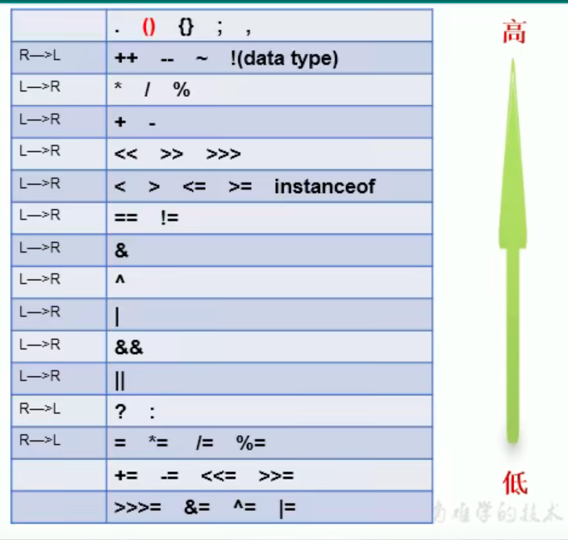
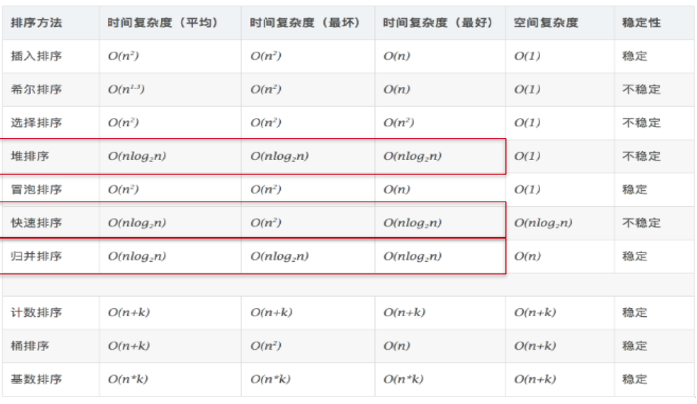

# Java基础

### 变量与运算符

#### 变量

float为啥4个字节，比long存的数还大：4个字节里面一部分表示数值，另一部分表示10 的阶码(10的多少次幂)；也因为要表示小数，导致精度不会这么高

> 运算时类型转换

容量小的数据类型和容量大的数据类型做运算时，自动转成容量大的(容量大小是表示的数值的大小，不是有几个字节)

byte、char、short -> int ->long -> float -> double

当byte、char、short两两运算(包括自己和自己)，结果都会变成int型

a++ 和 a += 1 不会转换类型，a原来是什么类型结果a还是这个类型(如 byte a=1; a+= 2.2; 结果a=3，还是byte类型)

> 进制转化

二进制：0,1，以0b或0B开头

八进制：0-7，以0开头

十进制：0-9

十六进制：0-9及A-F，以0x或0X开头，不区分大小写

十进制转成其他进制：十进制整数除以改进制数，知道取余为零，从最后一个余数读到第一个

其他进制转成十进制：按权展开、相加即得十进制数(十六进制96-->  9*16^1 + 6 * 16^0=150)

> 运算符优先级



### 排序和查找

通常来说，排序的目的是快速查找

稳定的排序算法：如A和B的值相等，排序后A和B的前后次序不变，这个排序方法就是稳定的

不稳定的：希尔排序、选择排序、堆排序、快速排序



> 二分法查找

排序的数组必须是有序的

```java
public void binarySearch(){
    //二分法查找：要求此数组必须是有序的。
    int[] arr3 = new int[]{-99,-54,-2,0,2,33,43,256,999};
    boolean isFlag = true;
    int number = 256;
    int head = 0;
    int end = arr3.length - 1;
    while(head <= end){
        int middle = (head + end) / 2;  // 这可以改成：(end - head)/2 + head; // 防止溢出
        if(arr3[middle] == number){
            System.out.println("找到指定的元素，索引为：" + middle);
            isFlag = false;
            break;
        }else if(arr3[middle] > number){
            end = middle - 1;
        }else{//arr3[middle] < number
            head = middle + 1;
        }
    }
    if(isFlag){
        System.out.println("未找打指定的元素");
    }
}
```

### 集合

> Iterator迭代器遍历

```java
Iterator iter = coll.iterator();//回到起点
while(iter.hasNext()){
    Object obj = iter.next();
    if(obj.equals("Tom")){
        iter.remove();
    }
}
```

在调用it.next()方法之前必须要调用it.hasNext()进行检测。若不调用，则下一条记录无效，直接调用it.next()会抛出NoSuchElementException异常

> ArrayList

ArrayList在1.7和1.8有什么区别？

JDK1.7：ArrayList像饿汉式，直接创建一个初始容量为10的数组

JDK1.8：ArrayList像懒汉式，一开始创建一个长度为0的数组，当添加第一个元 素时再创建一个始容量为10的数组


# 附录

> linux检索全局文件

`find / -name mysql-bin.000962`