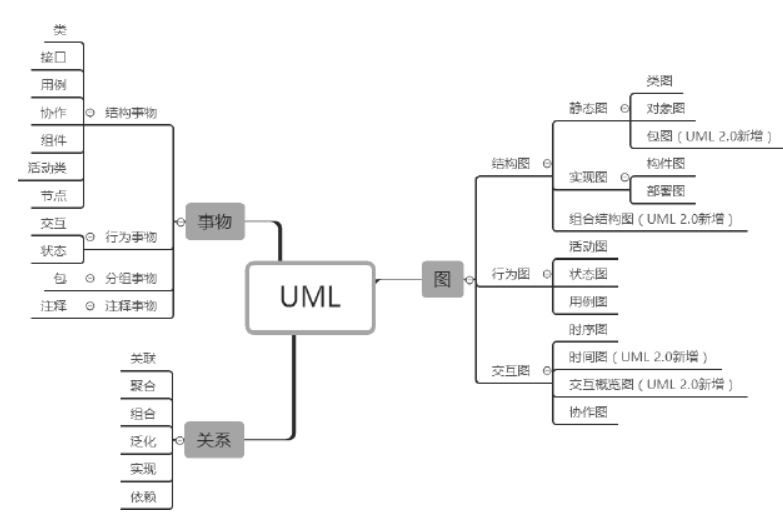
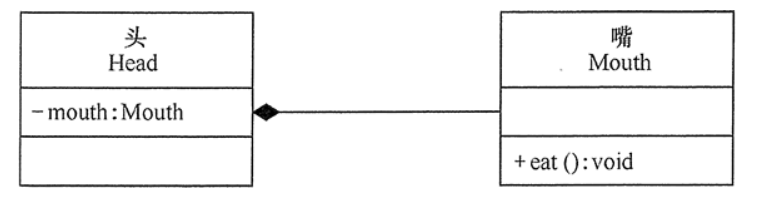
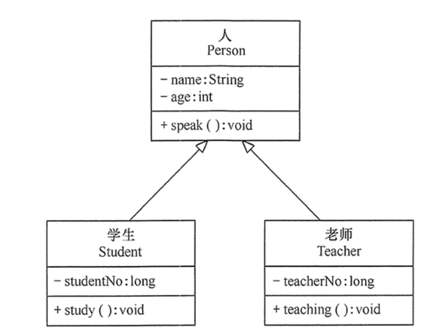
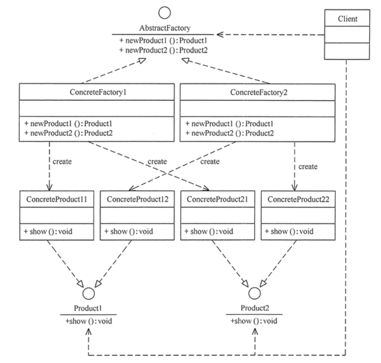

## Java设计模式：23种设计模式全面解析

设计模式（Design Pattern）是前辈们对代码开发经验的总结，是解决特定问题的一系列套路。它不是语法规定，而是一套用来提高代码可复用性、可维护性、可读性、稳健性以及安全性的解决方案。

这 23 种设计模式的本质是面向对象设计原则的实际运用，是对类的封装性、继承性和多态性，以及类的关联关系和组合关系的充分理解。

## 软件设计模式概述

### 概念

是一套被反复使用、多数人知晓的、经过分类编目的、代码设计经验的总结。

其目的是为了提高代码的可重用性、代码的可读性和代码的可靠性。

### 基本要素

软件设计模式使人们可以更加简单方便地复用成功的设计和体系结构。最关键的要素是：

1. 模式名称

可以根据模式的问题、特点、解决方案、功能和效果来命名。模式名称（PatternName）有助于我们理解和记忆该模式，也方便我们来讨论自己的设计。

2. 问题

描述了该模式的应用环境，解释了设计问题和问题存在的前因后果，以及必须满足的一系列先决条件。

3. 解决方案

包括设计的组成成分、它们之间的相互关系及各自的职责和协作方式，提供设计问题的抽象描述和怎样用一个具有一般意义的元素组合（类或对象的 组合）来解决这个问题。

4. 效果

描述了模式的应用效果以及使用该模式应该权衡的问题，即**模式的优缺点**。主要是对时间和空间的衡量，以及该模式对系统的灵活性、扩充性、可移植性的影响。

## GoF设计模式分类

### 根据目的来分

1. 创造性模式：用于描述“怎样创建对象”，它的主要特点是“将对象的创建与使用分离”。

单例、原型、工厂方法、抽象工厂、建造者等

2. 结构型模式：用于描述如何将类或对象按某种布局组成更大的结构

代理、适配器、桥接、装饰、外观、享元、组合

3. 行为型模式：用于描述类或对象之间怎样相互协作共同完成单个对象都无法单独完成的任务，以及怎样分配职责。

模板方法、策略、命令、职责链、状态、观察者、中介者、迭代器、访问者、备忘录、解释器

### 根据作用范围来分

1. 类模式：用于处理类与子类之间的关系，这些关系通过继承来建立，是静态的，在编译时刻便确定下来了。

工厂方法、适配器、模板方法、解释器

2. 对象模式：用于处理对象之间的关系，这些关系可以通过组合或聚合来实现，在运行时刻是可以变化的，更具动态性。

除了以上四种，全是


### 23种设计模式的功能

1. 单例（Singleton）模式：某个类只能生成一个实例，该类提供了一个全局访问点供外部获取该实例，其拓展是有限多例模式。
2. 原型（Prototype）模式：将一个对象作为原型，通过对其进行复制而克隆出多个和原型类似的新实例。
3. 工厂方法（Factory Method）模式：定义一个用于创建产品的接口，由子类决定生产什么产品。
4. 抽象工厂（AbstractFactory）模式：提供一个创建产品族的接口，其每个子类可以生产一系列相关的产品。
5. 建造者（Builder）模式：将一个复杂对象分解成多个相对简单的部分，然后根据不同需要分别创建它们，最后构建成该复杂对象。
6. 代理（Proxy）模式：为某对象提供一种代理以控制对该对象的访问。即客户端通过代理间接地访问该对象，从而限制、增强或修改该对象的一些特性。
7. 适配器（Adapter）模式：将一个类的接口转换成客户希望的另外一个接口，使得原本由于接口不兼容而不能一起工作的那些类能一起工作。
8. 桥接（Bridge）模式：将抽象与实现分离，使它们可以独立变化。它是用组合关系代替继承关系来实现，从而降低了抽象和实现这两个可变维度的耦合度。
9. 装饰（Decorator）模式：动态的给对象增加一些职责，即增加其额外的功能。
10. 外观（Facade）模式：为多个复杂的子系统提供一个一致的接口，使这些子系统更加容易被访问。
11. 享元（Flyweight）模式：运用共享技术来有效地支持大量细粒度对象的复用。
12. 组合（Composite）模式：将对象组合成树状层次结构，使用户对单个对象和组合对象具有一致的访问性。
13. 模板方法（TemplateMethod）模式：定义一个操作中的算法骨架，而将算法的一些步骤延迟到子类中，使得子类可以不改变该算法结构的情况下重定义该算法的某些特定步骤。
14. 策略（Strategy）模式：定义了一系列算法，并将每个算法封装起来，使它们可以相互替换，且算法的改变不会影响使用算法的客户。
15. 命令（Command）模式：将一个请求封装为一个对象，使发出请求的责任和执行请求的责任分割开。
16. 职责链（Chain of Responsibility）模式：把请求从链中的一个对象传到下一个对象，直到请求被响应为止。通过这种方式去除对象之间的耦合。
17. 状态（State）模式：允许一个对象在其内部状态发生改变时改变其行为能力。
18. 观察者（Observer）模式：多个对象间存在一对多关系，当一个对象发生改变时，把这种改变通知给其他多个对象，从而影响其他对象的行为。
19. 中介者（Mediator）模式：定义一个中介对象来简化原有对象之间的交互关系，降低系统中对象间的耦合度，使原有对象之间不必相互了解。
20. 迭代器（Iterator）模式：提供一种方法来顺序访问聚合对象中的一系列数据，而不暴露聚合对象的内部表示。
21. 访问者（Visitor）模式：在不改变集合元素的前提下，为一个集合中的每个元素提供多种访问方式，即每个元素有多个访问者对象访问。
22. 备忘录（Memento）模式：在不破坏封装性的前提下，获取并保存一个对象的内部状态，以便以后恢复它。
23. 解释器（Interpreter）模式：提供如何定义语言的文法，以及对语言句子的解释方法，即解释器。

## UML统一建模语言

是用来设计软件蓝图的可视化建模语言，是一种为面向对象系统的产品进行说明、可视化和编制文档的标准语言，独立于任何一种具体的程序设计语言。

特点是简单、统一、图形化、能表达软件设计中的动态与静态信息。

### 基本构件

UML中，所有的描述由事物、关系和图这些构件组成。



### 类图之间的关系

类图描述系统中的类，以及各个类之间的关系的静态视图，能够让我们在正确编写代码之前对系统有一个全面的认识，是一种静态模型类型。类图表示类、接口和它们之间的协作关系，用于系统设计阶段。

1. 依赖关系

是对象间耦合度最弱的一种关联方式，是临时性的关联；就是某个类的方法通过局部变量或者静态方法的调用来访问另一个类的方法。

比如人打电话的关系，依赖关系使用**带箭头的虚线**表示。


2. 关联关系

对象间的一种引用关系，如学生和老师，师傅和徒弟；关联可以是单向的，也可以是双向的；关联关系是类与类之间最常用的联系，分为一般关联、聚合和组合

双向的关联可以用带两个箭头或者没有箭头的实线来表示，单向的关联用带一个箭头的实线来表示，箭头从使用类指向被关联的类

代码中就是一个类的对象作为另一个类的成员变量来实现关联关系。使用普通箭头，就是依赖的那个箭头


3. 聚合关系

聚合是强关联关系，是整体和部分之间的关系，是has - a 的关系

聚合关系也是通过成员对象实现，其中成员对象是整体对象的一部分，但是成员可以脱离整体对象独立存在。如老师和学生的关系，学校包含老师，如果学校停办了，老师还在。

聚合关系可以用带空心菱形的实线来表示，菱形指向整体。


4. 组合关系

也表示类之间的整体与部分的关系，是更强烈的聚合关系，是contains-a的关系

整体控制部分对象的生命周期，一旦整体对象不存在，部分对象也不存在，部分不能脱离整体存在，例如头和嘴的关系

组合关系用带实心菱形的实线来表示，菱形指向整体



5. 泛化关系

是对象间耦合最大的关系，是父类与子类的关系，是继承关系，是is - a的关系

泛化关系用带空心三角箭头的实线来表示，箭头从子类指向父类



6. 实现关系

是接口与实现类之间的关系

实现关系使用带空心三角箭头的虚线来表示，箭头从实现类指向接口


* UML的标准中，没有实心箭头，有些java的ide会生成实心箭头，目的是降低理解难度

## 面向对象七大基本原则

1. 开闭原则

软件实体应当对扩展开放，对修改关闭；软件实体包括项目中划分出的模块、类与接口、方法。

也就是当应用的需求改变时，在不修改软件实体的源代码或二进制代码的前提下，可以扩展模块的功能，使其满足新的需求

2. 里氏替换原则

子类可以扩展父类的功能，但不能改变父类原有的功能。也就是说：子类继承父类时，除添加新的方法完成新增功能外，尽量不要重写父类的方法。

3. 依赖倒置原则

核心思想：要面向接口编程，不要面向实现变成，降低了客户与实现模块之间的耦合

4. 单一职责原则

规定一个类应该有且仅有一个引起它变化的原因，否则应该被拆分；也就是对象不应承担太多的责任；提高类的内聚性和降低耦合性

5. 接口隔离原则

尽量将臃肿庞大的接口拆分成更小的和更具体的接口，也就是一个接口只服务于一个子模块或业务逻辑；提高内聚和降低耦合性

6. 迪米特法则

又叫做最少知识原则；就是两个软件实体如果无须直接通信，那么就不应当发生直接的相互调用，可以通过第三方转发该调用。其目的是降低类之间的耦合度，提高模块的相对独立性。

7. 合成复用原则

要求在软件复用时，要尽量先使用组合或者聚合等关联关系来实现，其次才考虑使用继承关系来实现。

> 总结

| 设计原则     | 一句话归纳                                                   | 目的                                       |
| ------------ | ------------------------------------------------------------ | ------------------------------------------ |
| 开闭原则     | 对扩展开放，对修改关闭                                       | 降低维护带来的新风险                       |
| 依赖倒置原则 | 面向接口编程，不要面向实现编程                               | 更利于代码结构的升级扩展                   |
| 单一职责原则 | 一个类只干一件事，控制类的粒度大小，将对象解耦，提高内聚性   | 便于理解，提高代码的可读性                 |
| 接口隔离原则 | 一个接口只干一件事，接口要精简单一                           | 功能解耦，高聚合、低耦合                   |
| 迪米特法则   | 两个软件实体如果无须直接通信，那么就不应当发生直接的相互调用，降低耦合度 | 只和朋友交流，不和陌生人说话，减少代码臃肿 |
| 里氏替换原则 | 不要破坏继承体系，子类重写方法功能发生改变，不应该影响父类方法的含义 | 防止继承泛滥                               |
| 合成复用原则 | 尽量先使用组合或者聚合关系实现代码复用，其次使用继承         | 降低代码耦合                               |

最终目的：降低对象之间的耦合，增加程序的可复用性、可扩展性和可维护性。

## 创建型模式

特点：将对象的创建与使用分离；使用者不需要关注对象的创建细节，对象的创建由相关的工厂来完成。

- 单例（Singleton）模式：某个类只能生成一个实例，该类提供了一个全局访问点供外部获取该实例，其拓展是有限多例模式。
- 原型（Prototype）模式：将一个对象作为原型，通过对其进行复制而克隆出多个和原型类似的新实例。
- 工厂方法（FactoryMethod）模式：定义一个用于创建产品的接口，由子类决定生产什么产品。
- 抽象工厂（AbstractFactory）模式：提供一个创建产品族的接口，其每个子类可以生产一系列相关的产品。
- 建造者（Builder）模式：将一个复杂对象分解成多个相对简单的部分，然后根据不同需要分别创建它们，最后构建成该复杂对象。

工厂方法模式属于类创建型模式，其他的全部属于对象创建型模式

### 单例模式

指一个类只有一个实例，且该类能自行创建这个实例的一种模式。


> 优缺点

优点：

* 证内存里只有一个实例，减少了内存的开销
* 避免对资源的多重占用
* 设置全局访问点，可以优化和共享资源的访问

缺点：

* 单例模式一般没有接口，扩展困难。
* 单例模式不利于代码调试，因为单例中代码如果没执行完，就不能模拟产生新的对象
* 单例模式功能代码写在一个类中，容易违背单一职责原则

> 应用场景

- 需要频繁创建的一些类，使用单例可以降低系统的内存压力，减少 GC。
- 某类只要求生成一个对象的时候，如一个班中的班长、每个人的身份证号等。
- 某些类创建实例时占用资源较多，或实例化耗时较长，且经常使用。
- 某类需要频繁实例化，而创建的对象又频繁被销毁的时候，如多线程的线程池、网络连接池等。
- 频繁访问数据库或文件的对象。

> 实例

* 计算机系统中的任务管理器、回收站、操作系统中的文件系统、多线程中的线程池、显卡的驱动程序对象、打印机的后台处理服务、应用程序的日志对象
* Spring的ApplicationContext、数据库中的连接池
* 网站的计数器、Web 应用的配置对象、应用程序中的对话框、系统中的缓存

> 实现

单例模式最主要的就是**私有化构造函数**

**饿汉式单例**

类一旦加载就创建单例对象，可能会造成资源浪费

```java
public class HungrySingleton {
    private static final HungrySingleton instance = new HungrySingleton();
    private HungrySingleton() {
    }
    public static HungrySingleton getInstance() {
        return instance;
    }
}
```

**懒汉式单例**

调用getInstance()才会创建对象

普通的懒汉式，线程不安全

```java
public class LazyMan {

    private static LazyMan lazyMan;
    private LazyMan(){

    }
    private static LazyMan getInstance(){ //加synchronized线程安全，但是在方法上加锁会影响效率
        if(lazyMan == null){
            lazyMan = new LazyMan();
        }
        return lazyMan;
    }
}
```

双重检测锁模式(DCL)，安全且在多线程情况下能保持高性能。

```java
public class LazyMan {

    //被volatile修饰的变量能够保证每个线程能够获取该变量的最新值，从而避免出现数据脏读的现象。
    private volatile static LazyMan lazyMan;
    private LazyMan(){
        
    }
    //双重检测锁模式 DCL懒汉式
    private static LazyMan getInstance(){
        if(lazyMan == null){
            synchronized (LazyMan.class){
                if(lazyMan == null){
                    lazyMan = new LazyMan(); //不是原子性操作（这种操作一旦开始，就一直运行到结束，中间不会换到另一个线程）
                    /**
                     * 操作
                     * 1.分配内存空间
                     * 2.执行构造方法，初始化对象
                     * 3.把这个对象指向这个空间
                     *
                     * 期望是1 2 3
                     * 实际可能 1 3 2（在cpu是可以实现的）
                     *
                     * 这时来了线程A 走到了3 layMan执行了空间 lazyMan不为null
                     * 下一个线程B  进来发现lazyMan不为null 直接return 但是还没有初始化值 错误
                     * 这时就需要使用volatile 关键字修饰单例变量
                     */
                }
            }
        }

        return lazyMan;
    }
}
```

避免反射破坏DCL双重检测锁单例模式(如果知道标志位名称，还是会被反射破坏)

```java
public class LazyMan {

    private volatile static LazyMan lazyMan;
    
    private static boolean qinjiang =false;
    private LazyMan(){
        synchronized (LazyMan.class){
            if(!qinjiang){
                qinjiang = true;
            }else{
                throw new RuntimeException("不要试图通过反射破坏单例模式");
            }
        }

    }
    private static LazyMan getInstance(){
        if(lazyMan == null){
            synchronized (LazyMan.class){
                if(lazyMan == null){
                    lazyMan = new LazyMan();
                }
            }
        }

        return lazyMan;
    }
}
```

**静态内部类**

```java
public class Singleton {  
    private static class SingletonHolder {  
    	private static final Singleton INSTANCE = new Singleton();  
    }  
    private Singleton (){}  
    public static final Singleton getInstance() {  
    	return SingletonHolder.INSTANCE;  
    }  
}
```

**枚举**

这是实现单例模式的最佳方法。反射也不能破坏枚举的单例

源码分析，通过class得到的Constructor的newInstance方法有以下判断，是枚举时直接抛出异常

```java
if ((clazz.getModifiers() & Modifier.ENUM) != 0)
     throw new IllegalArgumentException("Cannot reflectively create enum objects");
```

```java
public enum Singleton {  
    INSTANCE;  
    public void whateverMethod() {  
    }  
}
```


### 原型模式

用一个已经创建的实例作为原型，通过复制该原型对象来创建一个和原型相同或相似的新对象


> 优缺点

优点：

* java自带的原型模式基于内存二进制流的复制，在性能上比直接new一个对象更加优良
* 可以使用深克隆方式保存对象的状态，使用原型模式将对象复制；可辅助实现撤销操作

缺点：

* 需要为每一个类都配置一个 clone 方法
* clone 方法位于类的内部，当对已有类进行改造的时候，需要修改代码，违背了开闭原则。
* 实现深克隆时，每一层对象都需要实现深克隆

> 实现

原型模式分为浅克隆和深克隆；最主要的是实现Cloneable接口，重写clone方法

浅克隆：创建一个新对象，属性和原理对象完全相同，只是对于非基本数据类型，仍指向属性所指向的对象的内存地址

```java
@Data
public class Video implements Cloneable {
    private String name;
    private Date creatTime;

    @Override
    protected Object clone() throws CloneNotSupportedException {
        return super.clone();
    }
}
```

深克隆：引用对象也会被克隆

```java
@Data
public class Video implements Cloneable {
    private String name;
    private Date creatTime;

    @Override
    protected Object clone() throws CloneNotSupportedException {
        Object o = super.clone();
        //实现深克隆  (除此之外，序列化和反序列化)
        Video v = (Video) o;
        //将这个对象的引用属性也进行克隆
        v.creatTime = (Date) this.creatTime.clone();
        return o;
    }
}
```

> 应用场景

- springbean的原型模式（就是深拷贝）：scope="prototype"
- 原型模式+工厂模式实现创建对象
- js中的JSON.parseObject()


### 工厂方法模式

> 简单工厂模式

用来生产同一等级结构中的任意产品（对于增加新的产品，需要修改已有代码）

```java
//有新的产品时，需要修改源代码  没有满足OOP的开闭原则
public class CarFactory {
    //方法一
    public static Car getCar(String  car){
        if(car.equals("五菱")){
            return new WuLing();
        }else if(car.equals("特斯拉")){
            return new TesLa();
        }else{
            return null;
        }
    }
    //方法二
    public static Car getWuling(){
        return new WuLing();
    }
    public static Car getTesla(){
        return new TesLa();
    }
}
```


“工厂方法模式”是对简单工厂模式的进一步抽象化

对于新产品的创建，只需多写一个相应的工厂类。但是增加了类的个数，不易维护，增加了系统的抽象性和理解难度


> 应用场景

* 客户只知道创建产品的工厂名，而不知道具体的产品名
* 客户不关注创建对象的细节，只关心对象是否可用

> 实现

对于新增加的车品牌，只需要实现Car加增加对应的工厂类就行了

```java
public interface Car {
    void name();
}
public class TesLa implements Car {
    @Override
    public void name() {
        System.out.println("特斯拉");
    }
}
public class WuLing implements Car {
    @Override
    public void name() {
        System.out.println("五菱宏光");
    }
}

//工厂方法模式
public interface CarFactory {
    Car getCar();
}

public class TesLaFactory implements CarFactory {
    @Override
    public Car getCar() {
        return new TesLa();
    }
}

public class WuLingFactory implements CarFactory {
    @Override
    public Car getCar() {
        return new WuLing();
    }
}
```


### 抽象工厂模式

考虑多等级产品的生产，将同一个具体工厂所生产的位于不同等级的一组产品称为一个产品族；


结构图



> 优缺点

优点

除了有工厂方法模式的优点外

* 可以在类的内部对产品族中关联的多等级产品共同管理，而不必引入新的类
* 当需要产品族时，抽象工厂可以保证客户端始终只使用同一个产品的产品组。
* 抽象工厂增强了程序的可扩展性，当增加一个新的产品族时，不需要修改原代码，满足开闭原则。

缺点

* 当产品族中需要增加一个新的产品时，所有的工厂类都需要修改，增强了系统的抽象性和理解难度

> 实现

```java
// 抽象工厂
interface AbstractFactory {
    public Product1 newProduct1();
    public Product2 newProduct2();
}

// 具体工厂
class ConcreteFactory1 implements AbstractFactory {
    public Product1 newProduct1() {
        System.out.println("具体工厂 1 生成-->具体产品 11...");
        return new ConcreteProduct11();
    }
    public Product2 newProduct2() {
        System.out.println("具体工厂 1 生成-->具体产品 21...");
        return new ConcreteProduct21();
    }
}
```

> 应用场景

* 当需要创建的对象是一系列相互关联或相互依赖的产品族时，如电器工厂中的电视机、洗衣机、空调等(产品等级就是不同牌子的电视机)。
* 系统中有多个产品族，但每次只使用其中的某一族产品。如有人只喜欢穿某一个品牌的衣服和鞋。
* 系统中提供了产品的类库，且所有产品的接口相同，客户端不依赖产品实例的创建细节和内部结构。
